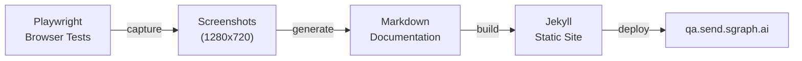
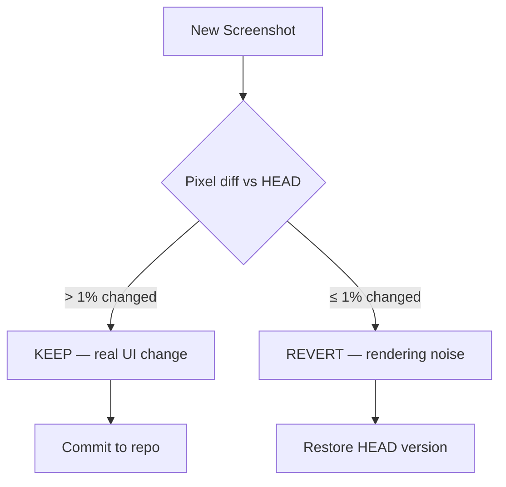

# SG/Send QA

Living documentation and automated test results for [SG/Send](https://send.sgraph.ai) — the encrypted file sharing platform by SGraph AI.

---

## What is SG/Send?

SG/Send is a **secure, encrypted file sharing platform** that enables controlled distribution of sensitive documents. Key security features include:

- **Beta Access gate** — users must present a valid token before accessing any functionality
- **Token-based authentication** — each sharing session is scoped to a unique access token
- **Encrypted file transfers** — files are protected in transit and at rest
- **Audit trail** — all access attempts (including invalid tokens) are logged

## What is This Site?

This documentation is **automatically generated** from Playwright browser tests that run against the live SG/Send platform. Every page documents a real user workflow, captured as screenshots and verified by automated assertions.



> Each test produces **two outputs**: a pass/fail result and a set of annotated screenshots that become the documentation you are reading now.

---

## Use Cases

These are the user workflows currently tested and documented:

| Use Case | What It Tests | Screenshots |
|----------|---------------|:-----------:|
| [Landing Page Loads](use-cases/landing_page_loads/) | SG/Send loads correctly, renders the Beta Access UI | 1 |
| [Access Gate Present](use-cases/landing_page_has_access_gate/) | The access gate with token input and Go button is visible | 1 |
| [Invalid Token Rejected](use-cases/invalid_token_rejected/) | Invalid tokens are rejected with proper error feedback | 3 |

---

## Architecture

### Test Pipeline

The QA pipeline runs on every push. Tests exercise the real SG/Send UI via headless Chromium, capture screenshots, generate documentation, and deploy to this site.

```
┌─────────────────────────────────────────────────────────────┐
│                     CI Pipeline                             │
│                                                             │
│  ┌───────────┐     ┌──────────────┐     ┌───────────────┐  │
│  │  pytest +  │────▶│  Screenshot  │────▶│  Markdown     │  │
│  │ Playwright │     │  Capture     │     │  Generator    │  │
│  └───────────┘     └──────────────┘     └───────────────┘  │
│       │                   │                     │           │
│       ▼                   ▼                     ▼           │
│  ┌───────────┐     ┌──────────────┐     ┌───────────────┐  │
│  │  Pass/Fail │     │ Visual Diff  │     │ Jekyll Build  │  │
│  │  Results   │     │ (noise gate) │     │ + Deploy      │  │
│  └───────────┘     └──────────────┘     └───────────────┘  │
└─────────────────────────────────────────────────────────────┘
```

### Visual Diff Noise Gate

Screenshots are compared pixel-by-pixel against their previous versions. Changes below a **1% threshold** are reverted — this filters out anti-aliasing jitter, sub-pixel rendering differences, and font hinting variations that would otherwise create noise commits.



### Content Bundle Structure

Each use case is a self-contained directory with its documentation and screenshots co-located:

```
sg_send_qa__site/pages/use-cases/
├── landing_page_loads/
│   ├── landing_page_loads.md      ← documentation page
│   └── screenshots/
│       └── 01_landing.png         ← captured during test
├── landing_page_has_access_gate/
│   ├── ...md + screenshots/
└── invalid_token_rejected/
    ├── ...md + screenshots/
```

---

## Test Targets

| Environment | URL | Used For |
|-------------|-----|----------|
| Production | [send.sgraph.ai](https://send.sgraph.ai) | CI smoke tests (default) |
| Local User Lambda | `localhost:10062` | Development testing |
| Local Admin Lambda | `localhost:10061` | Admin panel testing |

---

## Stack

| Layer | Technology |
|-------|-----------|
| Browser automation | Playwright for Python (headless Chromium) |
| Test framework | pytest |
| Web framework | FastAPI (test runner API) |
| Documentation | Jekyll + GitHub Pages |
| Screenshot diff | Pillow (pixel-level comparison) |
| CI/CD | GitHub Actions |
