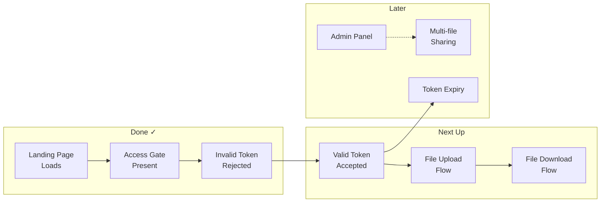
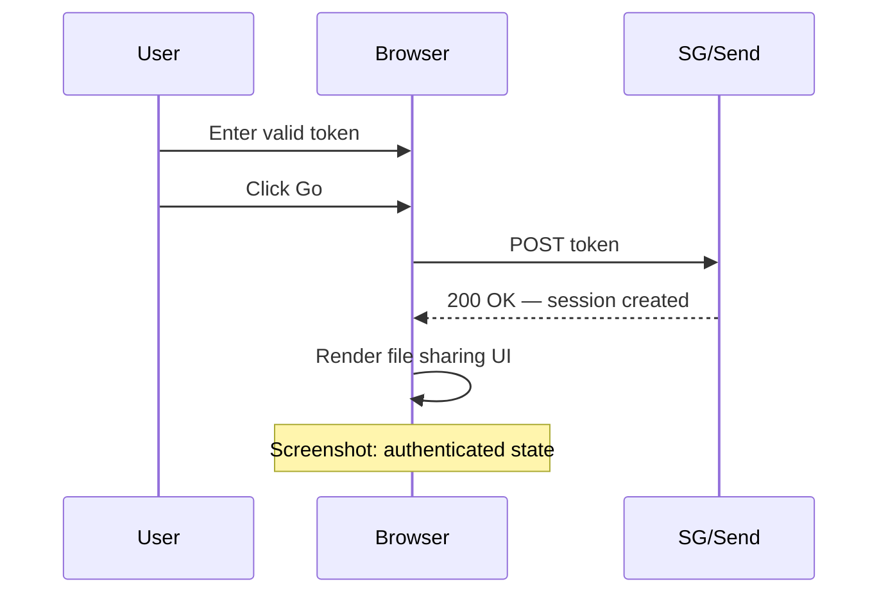
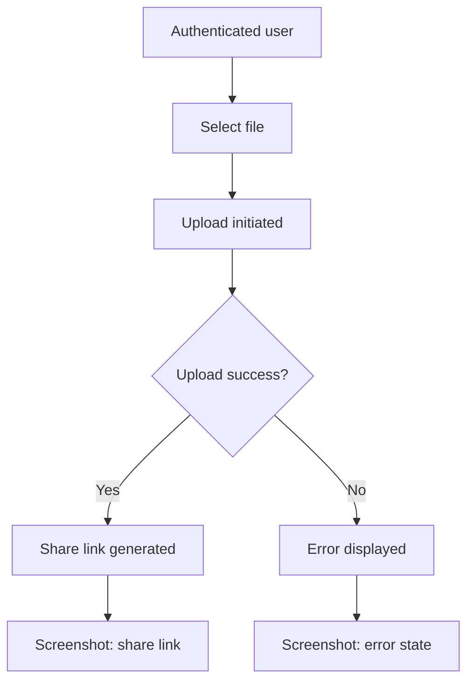
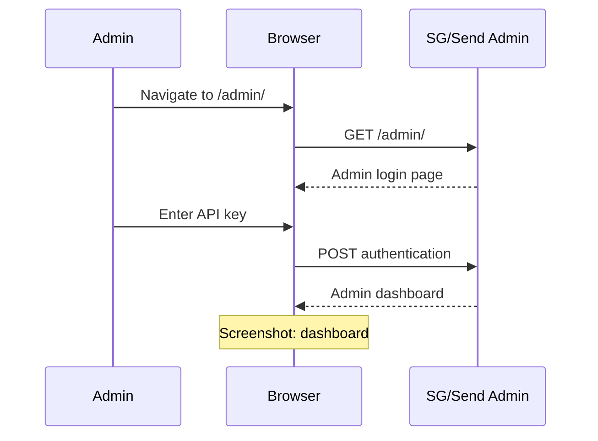
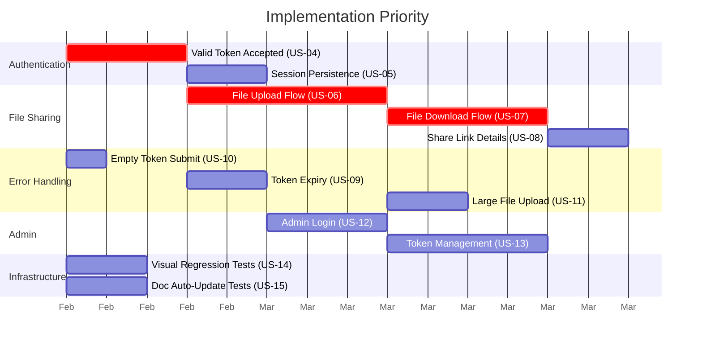
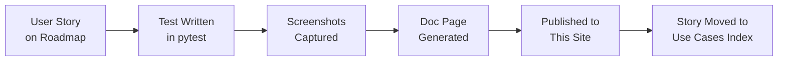

# Roadmap

Planned user stories and test scenarios for SG/Send QA. This page is the **living backlog** — each story will become a test, a set of screenshots, and a documentation page on this site.

---

## Current Coverage

---

## Next Up: Authentication Completion

These stories complete the token authentication flow — the foundation everything else builds on.

### US-04: Valid Token Accepted

| Field | Value |
|-------|-------|
| **Priority** | P0 — blocks all downstream stories |
| **Test file** | `tests/integration/user/test_valid_token.py` (new) |
| **Precondition** | `TEST_ACCESS_TOKEN` secret configured in CI |

**As a user** with a valid Beta Access token, **I want** to enter my token and be granted access, **so that** I can use the file sharing features.

**Acceptance criteria:**
- Navigate to `/send/`, enter valid token, click Go
- Page transitions from access gate to the main file sharing UI
- No error messages displayed
- Screenshot captures the authenticated state

**Implementation notes:**
- Requires a test token — use `TEST_ACCESS_TOKEN` env var (already wired in CI secrets)
- This is the **gate** for all file-operation stories — nothing below can be tested without a valid session
- Consider adding a `@pytest.fixture` for authenticated pages that other tests can reuse

---

### US-05: Session Persistence After Token Entry

| Field | Value |
|-------|-------|
| **Priority** | P1 |
| **Test file** | `tests/integration/user/test_session.py` (new) |
| **Precondition** | US-04 (valid token) |

**As an authenticated user**, **I want** my session to persist across page navigation, **so that** I don't have to re-enter my token on every action.

**Acceptance criteria:**
- Enter valid token, access granted
- Navigate away and back to `/send/`
- Session is still active (not prompted for token again)
- Screenshot captures the maintained session

---

## File Sharing Flow

The core functionality of SG/Send — uploading and downloading encrypted files.

### US-06: File Upload Flow

| Field | Value |
|-------|-------|
| **Priority** | P0 — core feature |
| **Test file** | `tests/integration/user/test_file_upload.py` (new) |
| **Precondition** | US-04 (valid token) |

**As an authenticated user**, **I want** to upload a file through the SG/Send interface, **so that** I can share it securely with others.

**Acceptance criteria:**
- Authenticate with valid token
- Upload a small test file (e.g., `test_payload.txt`)
- UI confirms successful upload
- A sharing link is generated
- Screenshots capture: pre-upload UI, file selected, upload in progress, upload complete with link

**Implementation notes:**
- Playwright supports file uploads via `page.set_input_files()` or `file_chooser` events
- Test file should be small (< 1KB) to keep CI fast
- Capture the generated share link for use in US-07

---

### US-07: File Download Flow

| Field | Value |
|-------|-------|
| **Priority** | P0 — core feature |
| **Test file** | `tests/integration/user/test_file_download.py` (new) |
| **Precondition** | US-06 (file uploaded, share link available) |

**As a recipient**, **I want** to download a shared file using the link I received, **so that** I can access the files shared with me.

**Acceptance criteria:**
- Navigate to the share link from US-06
- File download is initiated
- Downloaded content matches the original
- Screenshots capture: share link page, download prompt/progress, success

**Implementation notes:**
- May need a two-phase test: first upload (US-06), then download via generated link
- Consider making the upload a fixture that provides the share URL
- Verify file integrity by comparing content hash

---

### US-08: Share Link Details Page

| Field | Value |
|-------|-------|
| **Priority** | P1 |
| **Test file** | `tests/integration/user/test_share_link.py` (new) |
| **Precondition** | US-06 (share link exists) |

**As a user who uploaded a file**, **I want** to see details about my shared file (name, size, expiry), **so that** I can manage my shares.

**Acceptance criteria:**
- After uploading, the share details are visible
- File name, size, and any expiry information are displayed
- Screenshot captures the share details view

---

## Error Handling & Edge Cases

### US-09: Token Expiry Handling

| Field | Value |
|-------|-------|
| **Priority** | P2 |
| **Test file** | `tests/integration/user/test_token_expiry.py` (new) |
| **Precondition** | An expired token available for testing |

**As a user** with an expired token, **I want** to see a clear expiry message, **so that** I know to request a new token.

**Acceptance criteria:**
- Enter an expired token
- System shows a specific "expired" message (not the generic "invalid" error)
- User remains at the access gate

---

### US-10: Empty Token Submission

| Field | Value |
|-------|-------|
| **Priority** | P2 |
| **Test file** | `tests/integration/user/test_landing_page.py` (extend) |
| **Precondition** | None |

**As a user** who clicks Go without entering a token, **I want** to see a validation message, **so that** I know a token is required.

**Acceptance criteria:**
- Leave token field empty, click Go
- Client-side or server-side validation message appears
- No server request is made (if client-side validation)
- Screenshot captures the empty-field validation state

---

### US-11: Large File Upload Behaviour

| Field | Value |
|-------|-------|
| **Priority** | P3 |
| **Test file** | `tests/integration/user/test_file_upload_large.py` (new) |
| **Precondition** | US-04 (valid token) |

**As a user**, **I want** to understand the upload size limits, **so that** I know what files I can share.

**Acceptance criteria:**
- Attempt to upload a file exceeding the size limit
- UI shows a clear error about the limit
- Screenshot captures the size-limit error

---

## Admin Panel

### US-12: Admin Login

| Field | Value |
|-------|-------|
| **Priority** | P1 |
| **Test file** | `tests/integration/admin/test_admin_login.py` (new) |
| **Target URL** | `https://send.sgraph.ai/admin/` |
| **Precondition** | `ADMIN_API_KEY` secret configured |

**As an admin**, **I want** to log into the admin panel, **so that** I can manage tokens, view usage, and configure the platform.

**Acceptance criteria:**
- Navigate to admin URL
- Enter admin credentials
- Dashboard is displayed
- Screenshots capture: admin login page, authenticated dashboard

---

### US-13: Admin Token Management

| Field | Value |
|-------|-------|
| **Priority** | P2 |
| **Test file** | `tests/integration/admin/test_token_management.py` (new) |
| **Precondition** | US-12 (admin authenticated) |

**As an admin**, **I want** to create, view, and revoke access tokens, **so that** I can control who has access to the platform.

**Acceptance criteria:**
- View list of existing tokens
- Create a new token
- Revoke an existing token
- Screenshots capture each state

---

## QA Infrastructure

### US-14: Visual Regression Baseline

| Field | Value |
|-------|-------|
| **Priority** | P1 |
| **Test file** | `tests/unit/ci/test_diff_screenshots.py` (new) |

**As a QA engineer**, **I want** the visual diff system to reliably detect real UI changes and ignore rendering noise, **so that** screenshot commits are meaningful.

**Acceptance criteria:**
- Unit tests for `diff_screenshots.py` with known-good and known-different images
- Threshold of 1% correctly distinguishes noise from real changes
- Test with identical images, slightly-different images, and completely-different images

---

### US-15: Documentation Auto-Update

| Field | Value |
|-------|-------|
| **Priority** | P2 |
| **Test file** | `tests/unit/cli/test_generate_docs.py` (new) |

**As a QA engineer**, **I want** the doc generator to scaffold new use-case pages automatically, **so that** new tests get documentation without manual work.

**Acceptance criteria:**
- New test creates a use-case directory with screenshots
- `generate_docs.py` detects it and scaffolds a markdown page
- Existing hand-crafted pages are not overwritten
- Index page is updated to include the new use case

---

## Priority Summary

| Priority | Stories | What It Unlocks |
|----------|---------|----------------|
| **P0** | US-04, US-06, US-07 | Core flow: authenticate → upload → download |
| **P1** | US-05, US-08, US-12, US-14 | Session handling, share details, admin access, visual regression |
| **P2** | US-09, US-10, US-13, US-15 | Edge cases, admin management, doc tooling |
| **P3** | US-11 | Size limits and constraints |

---

## How Stories Become Documentation

Each user story above will follow this lifecycle:

When a story is implemented:
1. A new test file is created under `tests/integration/`
2. The test captures screenshots during execution
3. `generate_docs.py` scaffolds a documentation page
4. The page is enriched with context, diagrams, and annotations
5. The story moves from this Roadmap to the [Use Cases](../use-cases/) index
