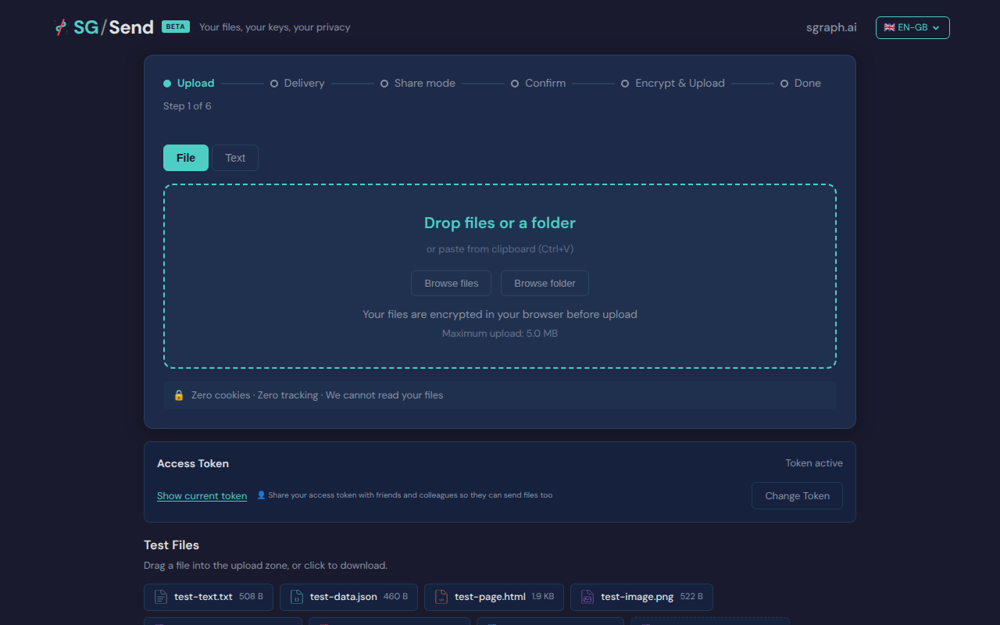
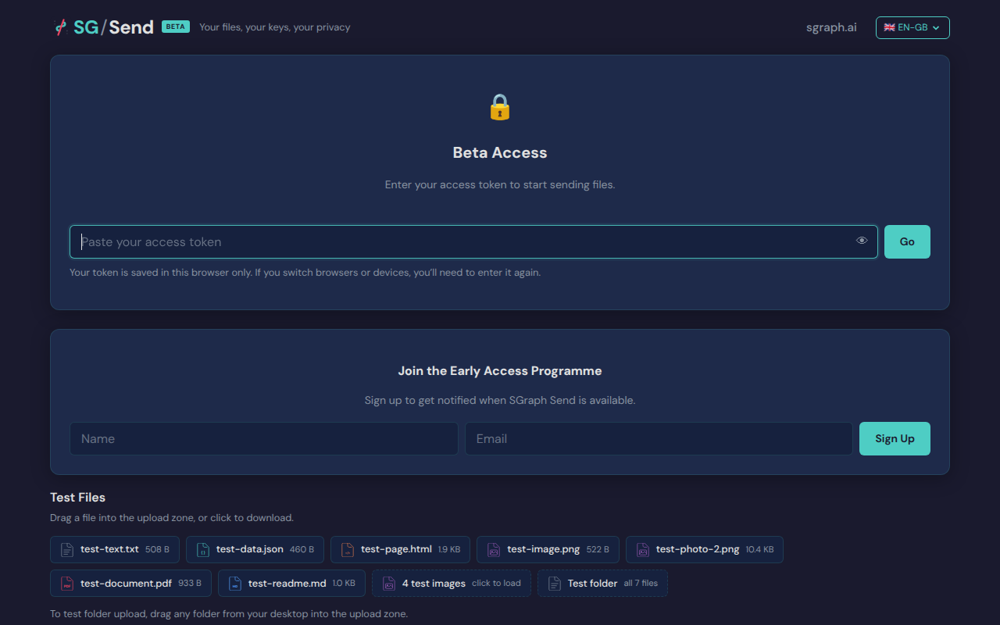
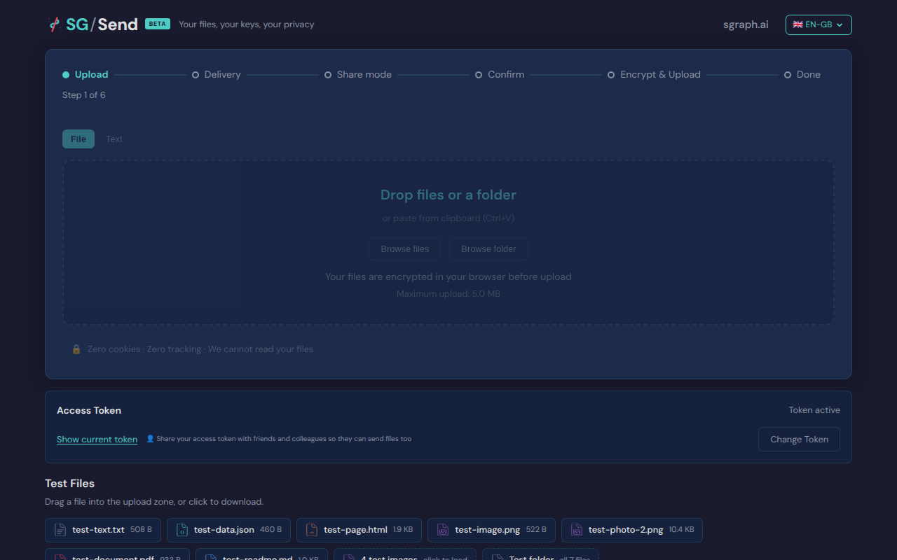

# Access Gate

> Test source at commit [`d9cf0f4e`](https://github.com/the-cyber-boardroom/SG_Send__QA/commit/d9cf0f4e) · v0.2.38

Automated browser test for the **access gate** workflow.

[View source on GitHub](https://github.com/the-cyber-boardroom/SG_Send__QA/blob/dev/tests/qa/v030/p1__access_gate__httpx/test__access_gate.py) — `tests/qa/v030/p1__access_gate__httpx/test__access_gate.py`

---

## Test Methods

| Method | Description | Screenshots |
|--------|-------------|:-----------:|
| `upload_accessible_with_token` | Providing the correct access token grants access to the upload zone. | 1 |
| `wrong_token_shows_error` | Providing a wrong access token shows an error. | 0 |
| `upload_zone_visible_without_gate` | If no gate is configured, upload zone is immediately visible. | 1 |
| `upload_accessible_with_token` | Providing the correct access token grants access to the upload zone. | 2 |
| `wrong_token_shows_error` | Providing a wrong access token shows an error. | 0 |
| `upload_zone_visible_without_gate` | If no gate is configured, upload zone is immediately visible. | 1 |

## Screenshots

### 02 After Token

After entering access token



### 03 Wrong Token

Wrong token response


### 02 After Token

After entering access token


### 02 After Token

After entering access token


### 02 After Token

After entering access token


### 02 After Token

After entering access token


### 01 Landing

Landing page (may show gate or upload zone)



### 04 No Gate

Upload zone without gate



### 01 Landing

Landing page (may show gate or upload zone)


### 02 After Token

After entering access token


### 04 No Gate

Upload zone without gate


---

<details>
<summary>View test source — <code>tests/qa/v030/p1__access_gate__httpx/test__access_gate.py</code></summary>

```python
"""UC-10: Access token gate — API-level tests (P1).

Tests that verify access gate behaviour via direct HTTP calls,
without a browser.
"""

import httpx
import pytest

pytestmark = pytest.mark.p1


class TestBug__AccessGateTokenPersistence:
    """Document known/discovered bug: access token counter behaviour.

    Bug: If the access token counter reaches zero, subsequent requests
    with the same token should be denied.  This class documents the
    expected behaviour so we can detect regressions.
    """

    def test_token_counter_in_response(self, send_server):
        """Access token info endpoint returns remaining count (if implemented)."""
        # Hit the health or info endpoint to see if token info is exposed
        r = httpx.get(f"{send_server.server_url}/info/health")
        assert r.status_code == 200, f"Health check failed: {r.status_code}"
        # Document: counter management is server-side, not client-side

```

</details>

