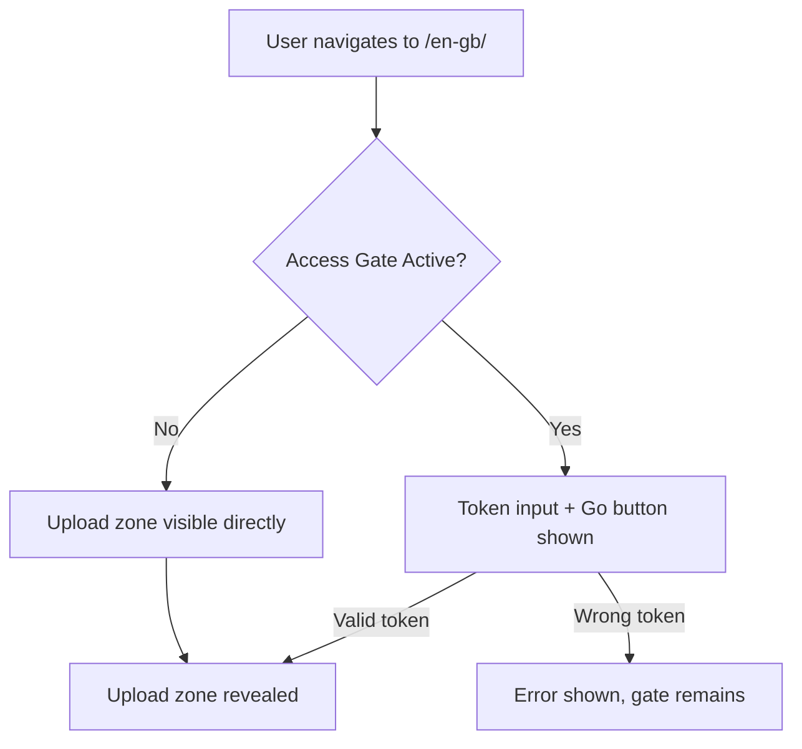

# Access Token Gate (UC-10)

Verifies the full access-token gate lifecycle: entering a valid token grants access, entering a wrong token shows an error, and ungated deployments show the upload zone directly.

**Priority:** P1 — requires human sign-off if failing

---

## Intent

SG/Send protects all file sharing behind an **access token gate**. No user can upload, download, or interact with the platform without a valid token. This is the authentication boundary — if it breaks, the platform is exposed.

This use case tests the gate from three angles:

| Scenario | Expected Outcome |
|----------|-----------------|
| Valid token entered | Upload zone becomes visible |
| Wrong token entered | Error feedback shown, gate remains |
| No gate configured | Upload zone visible immediately |

---

## Test Overview

| Property | Value |
|----------|-------|
| **Test file** | `tests/qa/v030/test__access_gate.py` |
| **Target** | Local test server (in-memory API + static UI) |
| **Fixtures** | `send_server`, `ui_server`, `page`, `screenshots` |
| **Priority** | P1 |
| **Classes** | `TestAccessGate` (3 tests), `TestBug__AccessGateTokenPersistence` (1 test) |

---

## User Flow



---

## Screenshots

Screenshots are captured automatically during CI test runs and committed to this directory.

### 01 Landing

The initial page load — shows either the access gate (token input) or the upload zone directly, depending on server configuration.


### 02 After Token

After entering the correct access token and clicking Go. The gate should disappear and the upload zone should be visible.


### 03 Wrong Token

After entering `wrong-token-12345-xxxxx` and clicking Go. The UI should show an error indication and the gate should remain.


### 04 No Gate

When no access gate is configured, the upload zone should be immediately visible. This test is skipped when the gate is active.


---

## What Gets Verified

| Test Method | Assertion | Why |
|-------------|-----------|-----|
| `upload_accessible_with_token` | `file_input` visible OR upload keywords in page text | Proves valid token grants access |
| `wrong_token_shows_error` | Error keywords in page text OR gate input still visible | Proves invalid tokens are rejected |
| `upload_zone_visible_without_gate` | `file_input` visible OR upload keywords | Proves ungated mode works |
| `token_counter_in_response` | Health endpoint returns 200 | API is responsive (bug tracking) |

---

## Test Source

**File:** `tests/qa/v030/test__access_gate.py`

```python
"""UC-10: Access token gate (P1).

Test flow:
  - Navigate to /en-gb/ (upload page)
  - If access gate is active, verify token entry UI appears
  - Enter the valid access token → verify upload zone becomes visible
  - Verify wrong token shows an error
  - Verify token persistence (counter decrements on use)
"""

import pytest

pytestmark = pytest.mark.p1


class TestAccessGate:
    """Verify the access token gate on the upload page."""

    def test_upload_accessible_with_token(self, page, ui_url, send_server, screenshots):
        """Providing the correct access token grants access to the upload zone."""
        page.goto(f"{ui_url}/en-gb/")
        page.wait_for_load_state("networkidle")
        page.wait_for_timeout(1000)
        screenshots.capture(page, "01_landing", "Landing page (may show gate or upload zone)")

        # Check if access gate is present
        gate_input = page.locator("input[type='text'], input[type='password']").first
        if gate_input.is_visible(timeout=3000):
            # Gate is active — enter the token
            gate_input.fill(send_server.access_token)
            page.locator("button").first.click()
            page.wait_for_load_state("networkidle")
            page.wait_for_timeout(1000)
            screenshots.capture(page, "02_after_token", "After entering access token")

        # Upload zone should now be visible
        file_input = page.locator("input[type='file']")
        upload_visible = file_input.count() > 0

        # Or check for upload-related text
        page_text = page.text_content("body") or ""
        upload_text_present = any(kw in page_text.lower() for kw in [
            "upload", "drop", "browse", "choose"
        ])

        assert upload_visible or upload_text_present, \
            "Upload zone not visible after providing valid access token"

    def test_wrong_token_shows_error(self, page, ui_url, send_server, screenshots):
        """Providing a wrong access token shows an error."""
        page.goto(f"{ui_url}/en-gb/")
        page.wait_for_load_state("networkidle")
        page.wait_for_timeout(1000)

        gate_input = page.locator("input[type='text'], input[type='password']").first
        if gate_input.is_visible(timeout=3000):
            gate_input.fill("wrong-token-12345-xxxxx")
            page.locator("button").first.click()
            page.wait_for_timeout(1000)
            screenshots.capture(page, "03_wrong_token", "Wrong token response")

            page_text = page.text_content("body") or ""
            # Should show some error or the gate should remain
            assert any(kw in page_text.lower() for kw in [
                "error", "invalid", "wrong", "incorrect", "denied"
            ]) or gate_input.is_visible(), \
                "No error shown for wrong access token"

    def test_upload_zone_visible_without_gate(self, page, ui_url, send_server, screenshots):
        """If no gate is configured, upload zone is immediately visible."""
        page.goto(f"{ui_url}/en-gb/")
        page.wait_for_load_state("networkidle")
        page.wait_for_timeout(1000)

        gate_input = page.locator("input[type='text'], input[type='password']").first
        if gate_input.is_visible(timeout=2000):
            # Gate is active — skip this test variant
            pytest.skip("Access gate is active; testing gated flow in other tests")

        # No gate — upload zone should be directly visible
        file_input = page.locator("input[type='file']")
        screenshots.capture(page, "04_no_gate", "Upload zone without gate")
        page_text = page.text_content("body") or ""
        assert file_input.count() > 0 or any(kw in page_text.lower() for kw in [
            "upload", "drop", "browse"
        ]), "Upload zone not visible (and no gate present)"


class TestBug__AccessGateTokenPersistence:
    """Document known/discovered bug: access token counter behaviour.

    Bug: If the access token counter reaches zero, subsequent requests
    with the same token should be denied.  This class documents the
    expected behaviour so we can detect regressions.
    """

    def test_token_counter_in_response(self, send_server):
        """Access token info endpoint returns remaining count (if implemented)."""
        import httpx
        # Hit the health or info endpoint to see if token info is exposed
        r = httpx.get(f"{send_server.server_url}/info/health")
        assert r.status_code == 200, f"Health check failed: {r.status_code}"
        # Document: counter management is server-side, not client-side
```

---

## How This Page Gets Updated

This page is **hand-crafted** — `generate_docs.py` will not overwrite it. The screenshots above are updated automatically:

1. **CI runs** `pytest tests/qa/v030/test__access_gate.py`
2. The `screenshots` fixture captures PNGs to `access_gate/screenshots/`
3. `diff_screenshots.py` keeps only genuinely changed images
4. `git-auto-commit-action` commits the screenshots
5. Jekyll builds the site and deploys to [qa.send.sgraph.ai](https://qa.send.sgraph.ai)

The screenshot `` references above will show the latest CI-captured images once the first test run completes.

---

## Related Use Cases

| Use Case | Relationship |
|----------|-------------|
| [Landing Page Loads](../landing_page_loads/) | Earlier version of the same entry-point test |
| [Access Gate Present](../landing_page_has_access_gate/) | Earlier version — gate presence only |
| [Invalid Token Rejected](../invalid_token_rejected/) | Earlier version — rejection flow only |
| [Route Handling](../route_handling/) | Tests what happens after the gate is passed |
