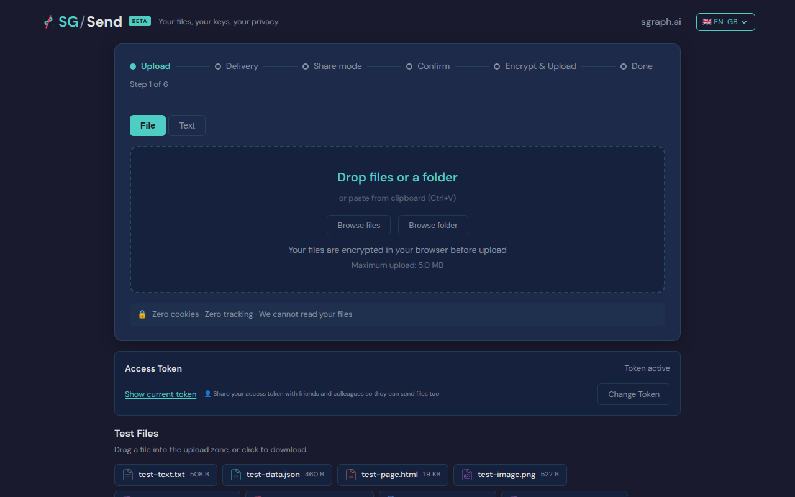
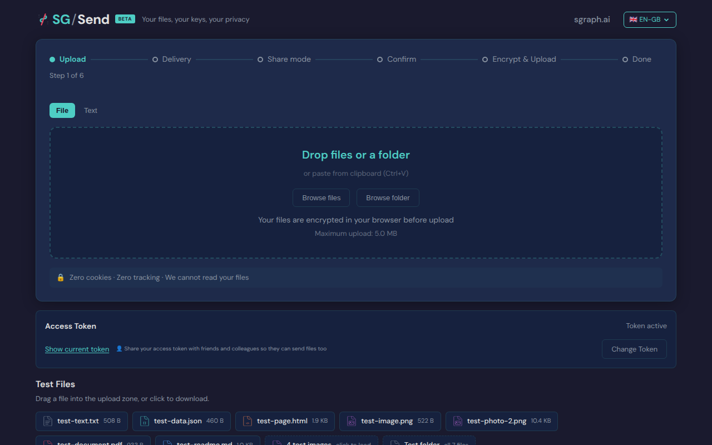

# Access Gate Standalone

> Test source at commit [`2dad394c`](https://github.com/the-cyber-boardroom/SG_Send__QA/commit/2dad394c) · v0.2.44

Standalone access gate test: UC-10 (P1).

Merged from tests/standalone/ into v030 as part of Phase 2 refactoring.
Uses the shared v030 fixtures (QA server, UI server, screenshots).

Screenshots are saved to:
    sg_send_qa__site/pages/use-cases/access_gate_standalone/screenshots/

[View source on GitHub](https://github.com/the-cyber-boardroom/SG_Send__QA/blob/dev/tests/qa/v030/p1__access_gate__standalone/test__access_gate_standalone.py) — `tests/qa/v030/p1__access_gate__standalone/test__access_gate_standalone.py`

---

## Test Methods

| Method | Description | Screenshots |
|--------|-------------|:-----------:|
| `upload_accessible_with_token` | Providing the correct access token grants access to the upload zone. | 1 |
| `wrong_token_shows_error` | Providing a wrong access token shows an error. | 0 |
| `upload_zone_visible_without_gate` | If no gate is configured, upload zone is immediately visible. | 1 |

## Screenshots

### 01 Landing

Landing page (may show gate or upload zone)



### 04 No Gate

Upload zone without gate



---

<details>
<summary>View test source — <code>tests/qa/v030/p1__access_gate__standalone/test__access_gate_standalone.py</code></summary>

```python
"""Standalone access gate test: UC-10 (P1).

Merged from tests/standalone/ into v030 as part of Phase 2 refactoring.
Uses the shared v030 fixtures (QA server, UI server, screenshots).

Screenshots are saved to:
    sg_send_qa__site/pages/use-cases/access_gate_standalone/screenshots/
"""

import pytest

pytestmark = pytest.mark.p1


class TestAccessGate:
    """Verify the access token gate on the upload page."""

    def test_upload_accessible_with_token(self, page, ui_url, send_server, screenshots):
        """Providing the correct access token grants access to the upload zone."""
        page.goto(f"{ui_url}/en-gb/")
        page.wait_for_load_state("networkidle")
        page.wait_for_timeout(1000)
        screenshots.capture(page, "01_landing", "Landing page (may show gate or upload zone)")

        # Check if access gate is present
        gate_input = page.locator("#access-token-input")
        if gate_input.is_visible(timeout=3000):
            gate_input.fill(send_server.access_token)
            page.locator("#access-token-submit").click()
            page.wait_for_load_state("networkidle")
            page.wait_for_timeout(1000)
            screenshots.capture(page, "02_after_token", "After entering access token")

        # Upload zone should now be visible
        file_input  = page.locator("#file-input")
        page_text   = page.text_content("body") or ""
        has_upload  = file_input.count() > 0
        has_keyword = any(kw in page_text.lower() for kw in ["upload", "drop", "browse", "choose"])

        assert has_upload or has_keyword, \
            "Upload zone not visible after providing valid access token"

    def test_wrong_token_shows_error(self, page, ui_url, send_server, screenshots):
        """Providing a wrong access token shows an error."""
        page.goto(f"{ui_url}/en-gb/")
        page.wait_for_load_state("networkidle")
        page.wait_for_timeout(1000)

        gate_input = page.locator("#access-token-input")
        if gate_input.is_visible(timeout=3000):
            gate_input.fill("wrong-token-12345-xxxxx")
            page.locator("#access-token-submit").click()
            page.wait_for_timeout(1000)
            screenshots.capture(page, "03_wrong_token", "Wrong token response")

            page_text = page.text_content("body") or ""
            assert any(kw in page_text.lower() for kw in [
                "error", "invalid", "wrong", "incorrect", "denied"
            ]) or gate_input.is_visible(), \
                "No error shown for wrong access token"

    def test_upload_zone_visible_without_gate(self, page, ui_url, send_server, screenshots):
        """If no gate is configured, upload zone is immediately visible."""
        page.goto(f"{ui_url}/en-gb/")
        page.wait_for_load_state("networkidle")
        page.wait_for_timeout(1000)

        gate_input = page.locator("#access-token-input")
        if gate_input.is_visible(timeout=2000):
            pytest.skip("Access gate is active; testing gated flow in other tests")

        file_input = page.locator("#file-input")
        screenshots.capture(page, "04_no_gate", "Upload zone without gate")
        page_text = page.text_content("body") or ""
        assert file_input.count() > 0 or any(kw in page_text.lower() for kw in [
            "upload", "drop", "browse"
        ]), "Upload zone not visible (and no gate present)"


class TestAccessGateHealthCheck:
    """API health check — no browser needed."""

    def test_health_endpoint(self, send_server):
        """Health endpoint returns 200."""
        import httpx
        r = httpx.get(f"{send_server.server_url}/info/health")
        assert r.status_code == 200, f"Health check failed: {r.status_code}"

```

</details>

