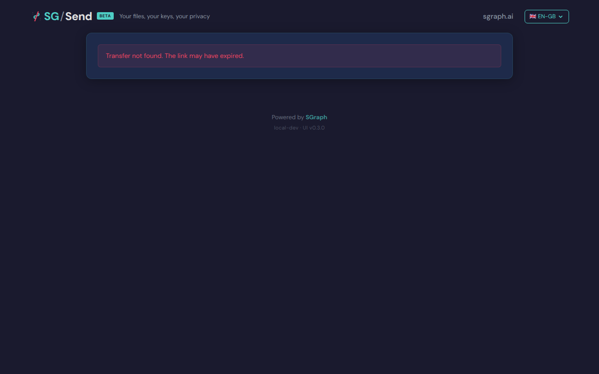

# Bogus Token Shows Error

> Generated at commit [`e5e045f9`](https://github.com/the-cyber-boardroom/SG_Send__QA/commit/e5e045f9) · v0.2.37 · 2026-03-26 11:04 UTC

Entering a bogus token shows an error (not a crash).

---

## Screenshots

### 03 Bogus Token Error

Error after bogus token

