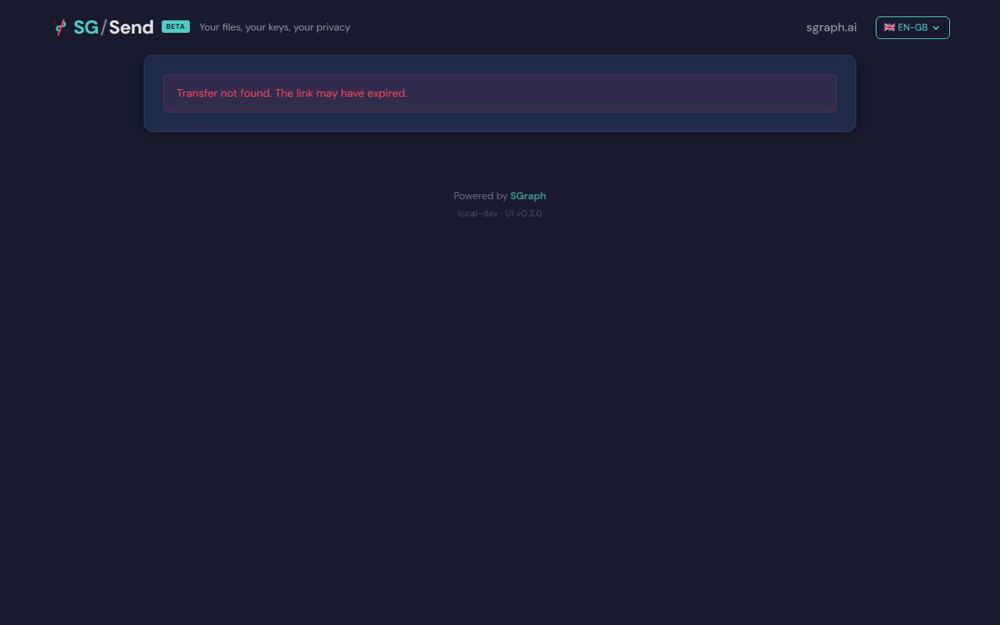

# Bogus Token Shows Error

> Test source at commit [`d7917483`](https://github.com/the-cyber-boardroom/SG_Send__QA/commit/d7917483) · v0.2.51

Entering a bogus token shows an error (not a crash).

---

## Screenshots

### 03 Bogus Token Error

Error after bogus token

