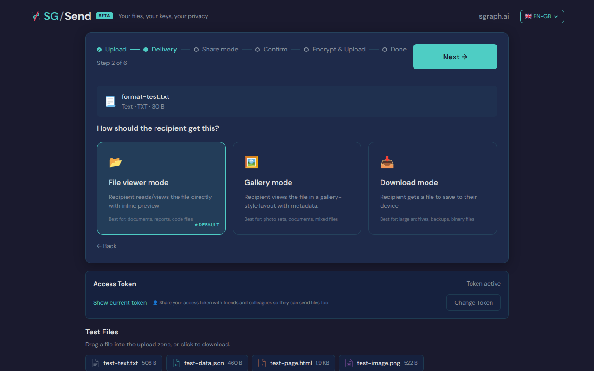
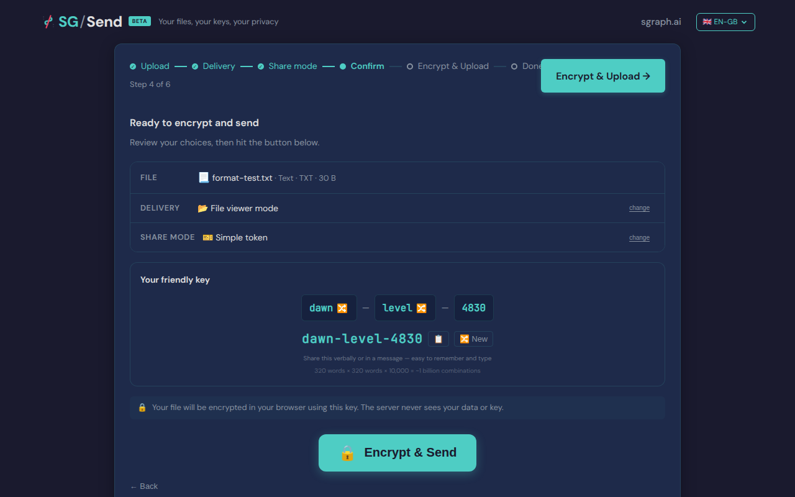
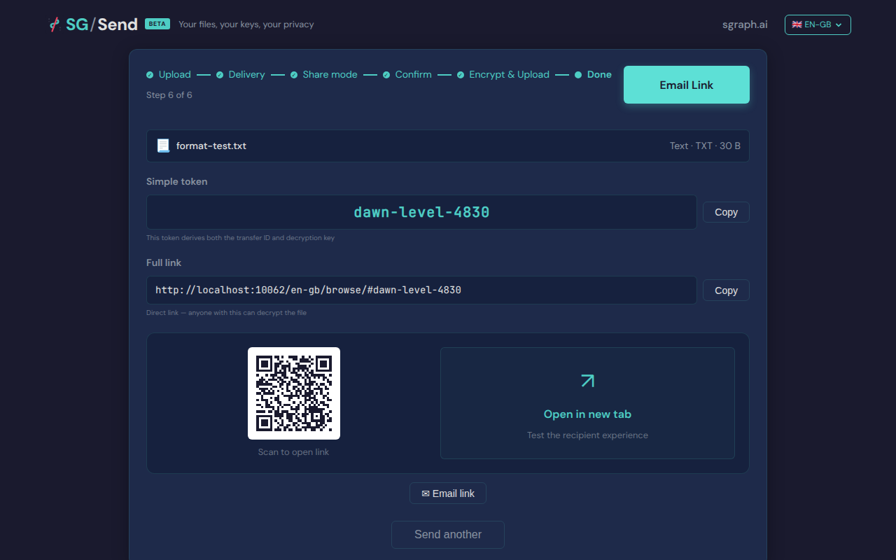

# Friendly Token Format

Verify the friendly token matches the word-word-NNNN pattern.

---

## Screenshots

### 01 File Selected

File selected (delivery step active)

### 02 Simple Token Selected

Simple Token selected

### 03 Upload Complete

Upload complete

