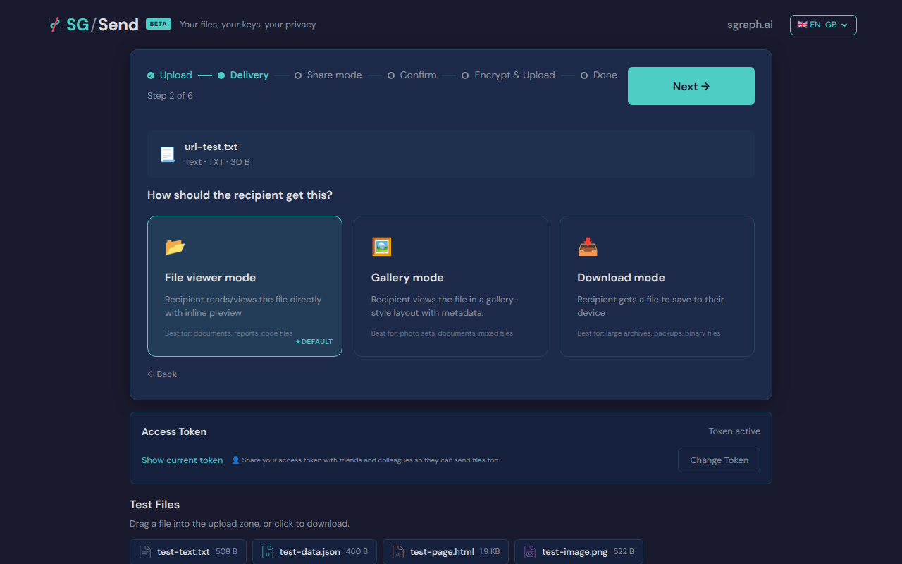
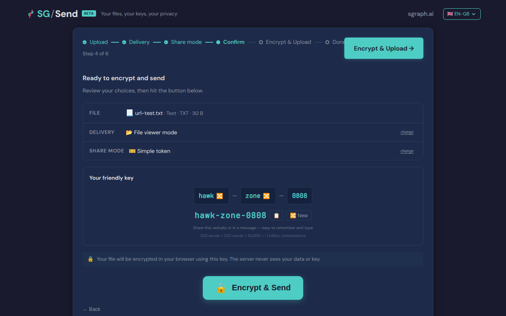
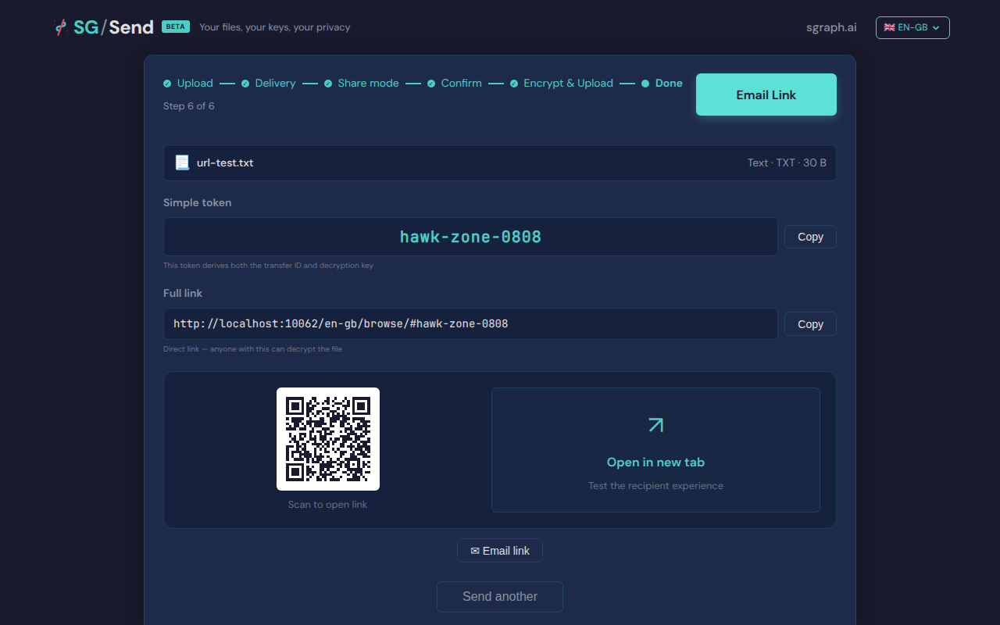

# Friendly Token No Key In Url After Decrypt

After decryption, the hash should be cleared from the URL.

---

## Screenshots

### 01 File Selected

File selected (delivery step active)

### 02 Simple Token Selected

Simple Token selected

### 03 Upload Complete

Upload complete

