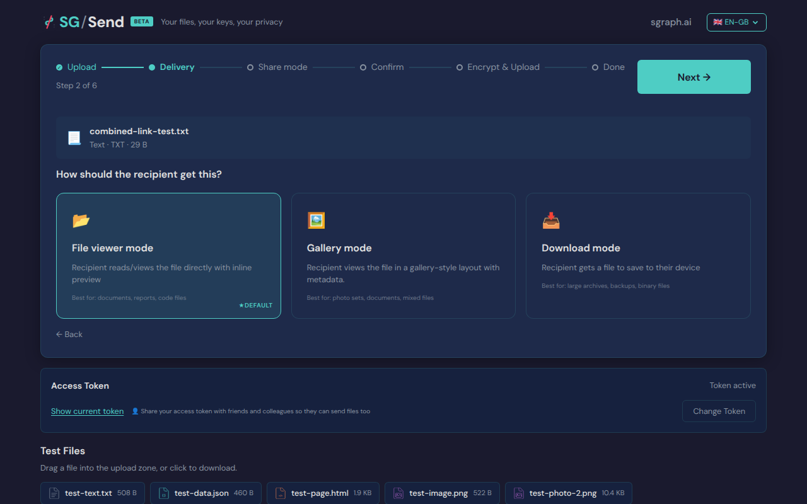
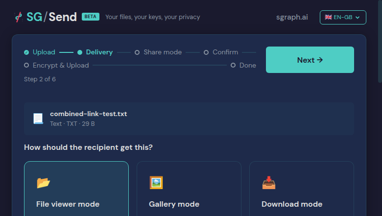
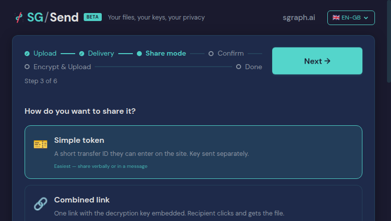
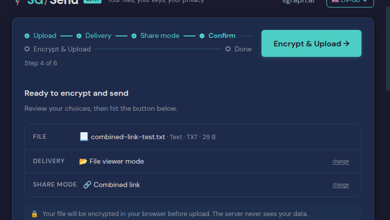
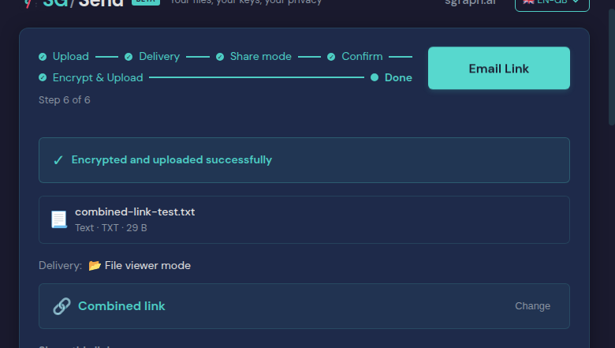
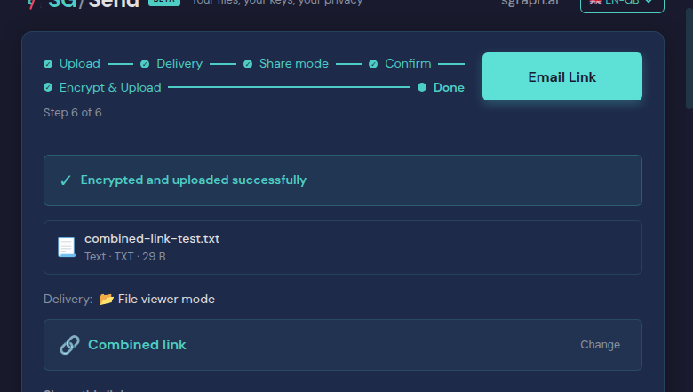
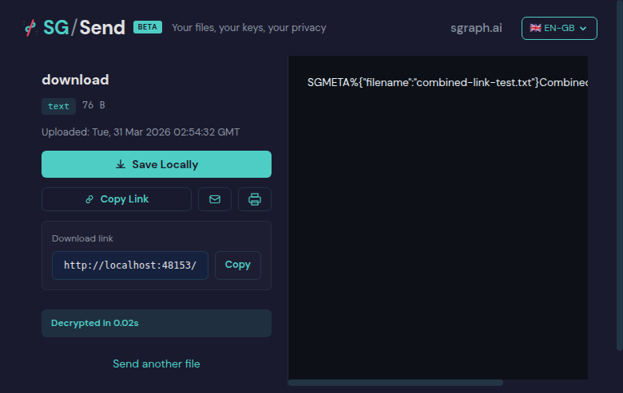
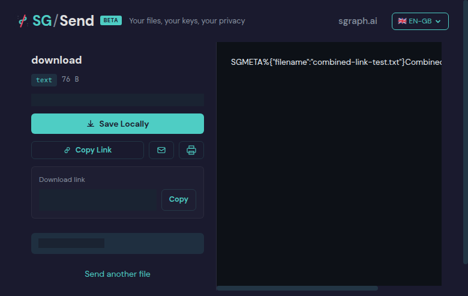
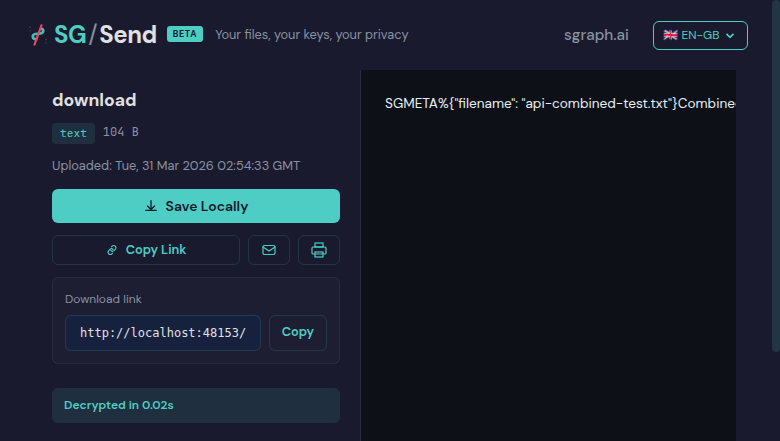
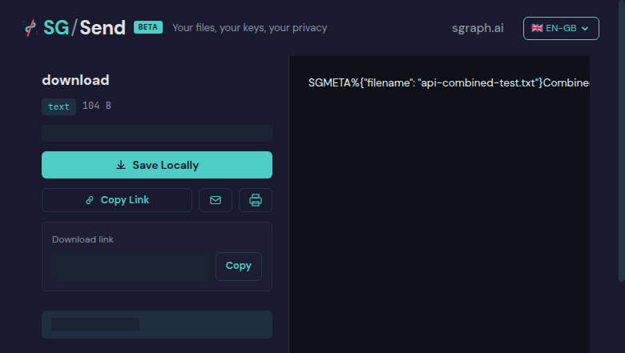

# Combined Link

> Test source at commit [`2a0f9775`](https://github.com/the-cyber-boardroom/SG_Send__QA/commit/2a0f9775) · v0.2.31

UC-04: Combined Link share mode (P0).

Flow:
  1. Upload a file with Combined Link share mode
  2. Capture the full link (contains #transferId/base64key)
  3. Open the link in a new tab
  4. Verify auto-decrypt and content display

[View source on GitHub](https://github.com/the-cyber-boardroom/SG_Send__QA/blob/dev/tests/qa/v030/p0__combined_link/test__combined_link.py) — `tests/qa/v030/p0__combined_link/test__combined_link.py`

---

## Test Methods

| Method | Description | Screenshots |
|--------|-------------|:-----------:|
| `combined_link_upload_and_auto_decrypt` | Upload with Combined Link, open the link, verify auto-decryption. | 6 |
| `combined_link_via_api_helper` | Create an encrypted transfer via API helper, then open the combined link in browser. | 1 |
| `_01__combined_link_upload_and_auto_decrypt` | Upload with Combined Link, open the link, verify auto-decryption. | 6 |
| `_02__combined_link_via_api_helper` | Create an encrypted transfer via API helper, then open the combined link in browser. | 1 |

## Screenshots

### 01 File Selected

File selected (delivery step active)



<details>
<summary>Deterministic view (non-dynamic areas only)</summary>



</details>

### 02 Share Step

Share mode step


<details>
<summary>Deterministic view (non-dynamic areas only)</summary>



</details>

### 03 Mode Selected

Combined link selected


<details>
<summary>Deterministic view (non-dynamic areas only)</summary>



</details>

### 04 Upload Complete

Upload complete



<details>
<summary>Deterministic view (non-dynamic areas only)</summary>


</details>

### 06 Link Captured

Combined link: http://localhost:48153/en-gb/browse/#880c0346fea7/dS_Rabvi6WPFdMFylnXpe_sxiKyUvk


<details>
<summary>Deterministic view (non-dynamic areas only)</summary>



</details>

### 07 Auto Decrypted

Auto-decrypted content



<details>
<summary>Deterministic view (non-dynamic areas only)</summary>



</details>

### 01 Api Created Decrypt

Decrypted content from API-created transfer



<details>
<summary>Deterministic view (non-dynamic areas only)</summary>



</details>

---

<details>
<summary>View test source — <code>tests/qa/v030/p0__combined_link/test__combined_link.py</code></summary>

```python
"""UC-04: Combined Link share mode (P0).

Flow:
  1. Upload a file with Combined Link share mode
  2. Capture the full link (contains #transferId/base64key)
  3. Open the link in a new tab
  4. Verify auto-decrypt and content display
"""
from pathlib                                                    import Path
from unittest                                                   import TestCase
import pytest
from sg_send_qa.browser.SG_Send__Browser__Test_Harness         import SG_Send__Browser__Test_Harness
from sg_send_qa.utils.QA_Screenshot_Capture                    import ScreenshotCapture
from sg_send_qa.utils.QA_Transfer_Helper                       import QA_Transfer_Helper

pytestmark = pytest.mark.p0

SAMPLE_CONTENT = "Combined link test — UC-04."

_BASE  = Path(__file__).parent.parent.parent.parent.parent / "sg_send_qa__site" / "pages" / "use-cases"
_GROUP = "02-upload-share"
_UC    = "combined_link"


class test_Combined_Link(TestCase):
    """Validate the Combined Link share mode end-to-end."""

    @classmethod
    def setUpClass(cls):
        cls.harness = SG_Send__Browser__Test_Harness().headless(True).setup()
        cls.sg_send = cls.harness.sg_send
        cls.harness.set_access_token()

    @classmethod
    def tearDownClass(cls):
        cls.harness.teardown()

    def _shots(self, method_name, method_doc=""):
        shots_dir = _BASE / _GROUP / _UC / "screenshots"
        return ScreenshotCapture(
            use_case    = _UC,
            module_name = "test__combined_link",
            module_doc  = __doc__,
            method_name = method_name,
            method_doc  = method_doc,
            shots_dir   = shots_dir,
        )

    def test__01__combined_link_upload_and_auto_decrypt(self):
        """Upload with Combined Link, open the link, verify auto-decryption."""
        shots = self._shots("test__01__combined_link_upload_and_auto_decrypt",
                            self.test__01__combined_link_upload_and_auto_decrypt.__doc__)
        self.sg_send.page__root()
        self.sg_send.upload__set_file("combined-link-test.txt", SAMPLE_CONTENT.encode())
        shots.capture(self.sg_send.raw_page(), "01_file_selected", "File selected (delivery step active)")

        self.sg_send.upload__click_next()
        shots.capture(self.sg_send.raw_page(), "02_share_step", "Share mode step")

        self.sg_send.upload__select_share_mode("combined")
        shots.capture(self.sg_send.raw_page(), "03_mode_selected", "Combined link selected")

        self.sg_send.upload__click_next()
        self.sg_send.upload__wait_for_complete()
        shots.capture(self.sg_send.raw_page(), "04_upload_complete", "Upload complete")

        model = self.sg_send.extract__upload_page()
        assert model.share_link, "No combined link found after upload"
        assert "#" in model.share_link, f"Combined link missing hash fragment: {model.share_link}"

        hash_part = model.share_link.split("#", 1)[1]
        parts     = hash_part.split("/", 1)
        assert len(parts) == 2 and len(parts[0]) >= 8 and parts[1], \
            f"Hash should be #<transferId>/<base64key>: #{hash_part}"
        shots.capture(self.sg_send.raw_page(), "06_link_captured",
                      f"Combined link: {model.share_link[:80]}")

        # Open in new page and verify auto-decrypt
        download_url = model.share_link
        if download_url.startswith("/"):
            download_url = self.harness.ui_url().rstrip("/") + download_url

        new_page = self.sg_send.raw_page().context.new_page()
        try:
            from tests.qa.v030.browser_helpers import goto, wait_for_download_states
            goto(new_page, download_url)
            wait_for_download_states(new_page, ["complete", "error"])
            shots.capture(new_page, "07_auto_decrypted", "Auto-decrypted content")
            body_text = new_page.text_content("body") or ""
            assert SAMPLE_CONTENT in body_text, \
                f"Decrypted content not found. Page snippet: {body_text[:300]}"
        finally:
            new_page.close()
        shots.save_metadata()

    def test__02__combined_link_via_api_helper(self):
        """Create an encrypted transfer via API helper, then open the combined link in browser."""
        shots = self._shots("test__02__combined_link_via_api_helper",
                            self.test__02__combined_link_via_api_helper.__doc__)
        transfer_helper = self.harness.transfer_helper()
        tid, key_b64    = transfer_helper.upload_encrypted(
            plaintext = SAMPLE_CONTENT.encode(),
            filename  = "api-combined-test.txt",
        )
        self.sg_send.page__browse_with_hash(tid, key_b64)
        self.sg_send.wait_for_download_states(["complete", "error"])
        shots.capture(self.sg_send.raw_page(), "01_api_created_decrypt",
                      "Decrypted content from API-created transfer")

        body_text = self.sg_send.visible_text()
        assert SAMPLE_CONTENT in body_text, \
            f"API-created transfer did not decrypt. Transfer ID: {tid}"
        shots.save_metadata()

```

</details>

