# Friendly Token

> Generated at commit [`e5e045f9`](https://github.com/the-cyber-boardroom/SG_Send__QA/commit/e5e045f9) · v0.2.37 · 2026-03-26 11:04 UTC

UC-03: Friendly Token — Simple Token share mode (P0).

This was a P0 bug — critical to test.

Flow:
  1. Upload a file with Simple Token share mode
  2. Capture the friendly token (word-word-NNNN format)
  3. Open a new tab to /en-gb/browse/#<friendly-token>
  4. Verify the token resolves and content decrypts

[View source on GitHub](https://github.com/the-cyber-boardroom/SG_Send__QA/blob/dev/tests/qa/v030/p0__friendly_token/test__friendly_token.py) — `tests/qa/v030/p0__friendly_token/test__friendly_token.py`

---

## Test Methods

| Method | Description | Screenshots |
|--------|-------------|:-----------:|
| `friendly_token_upload_and_resolve` | Upload with Simple Token mode, then resolve the friendly token in a new tab. | 5 |
| `friendly_token_format` | Verify the friendly token matches the word-word-NNNN pattern. | 3 |
| `friendly_token_resolves_in_new_tab` | Upload with Simple Token, then open the token in a new browser tab. | 4 |
| `friendly_token_no_key_in_url_after_decrypt` | After decryption, the friendly token remains in the URL (by design). | 4 |
| `_01__friendly_token_upload_and_resolve` | Upload with Simple Token mode, then resolve the friendly token in a new tab. | 5 |
| `_02__friendly_token_format` | Verify the friendly token matches the word-word-NNNN pattern. | 3 |
| `_03__friendly_token_resolves_in_new_tab` | Upload with Simple Token, then open the token in a new browser tab. | 4 |
| `_04__friendly_token_no_key_in_url_after_decrypt` | After decryption, the friendly token remains in the URL (by design). | 4 |

## Screenshots

### 05 Hash Cleared

URL after decrypt: http://localhost:10062/en-gb/browse/#terra-chain-5022

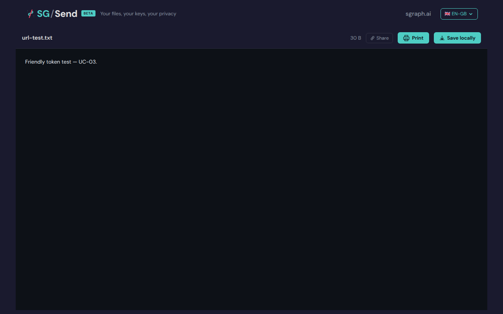

### 05 Token Captured

Token: pearl-cabin-4605

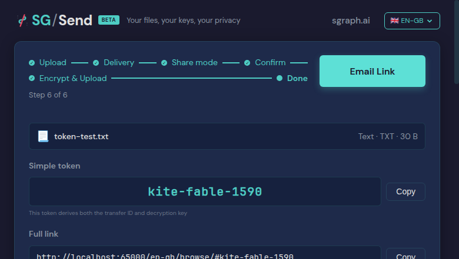

<details>
<summary>Deterministic view (non-dynamic areas only)</summary>

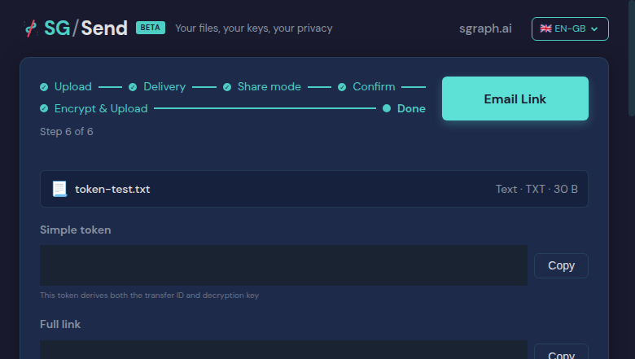

</details>

### 06 Token Resolved

Token 'pearl-cabin-4605' resolved


<details>
<summary>Deterministic view (non-dynamic areas only)</summary>

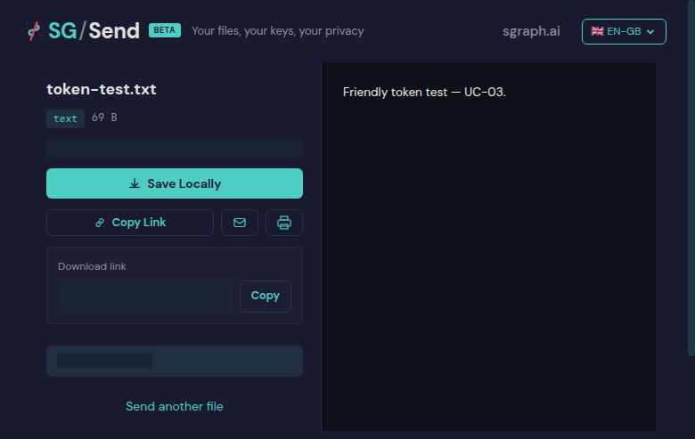

</details>

### 05 Token Resolved

Token 'tiger-ribbon-0479'

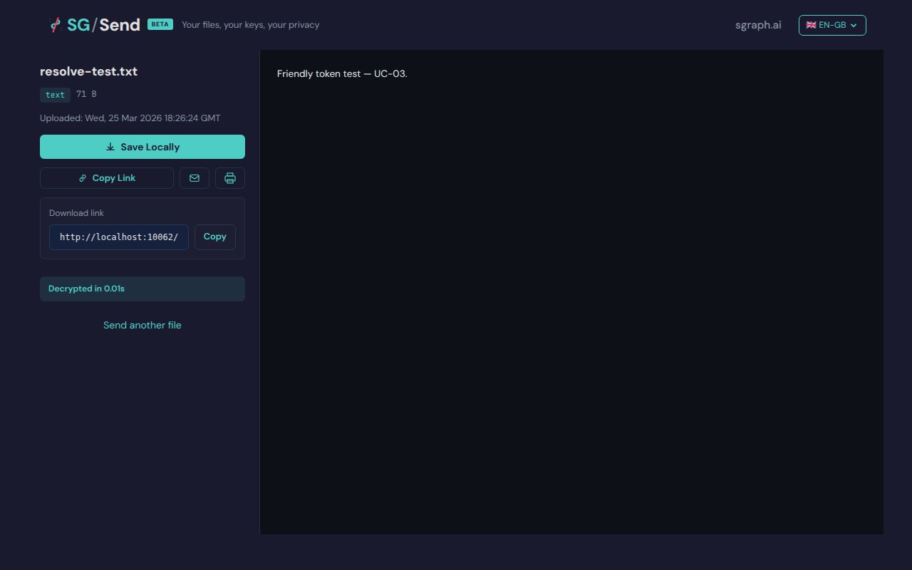

<details>
<summary>Deterministic view (non-dynamic areas only)</summary>

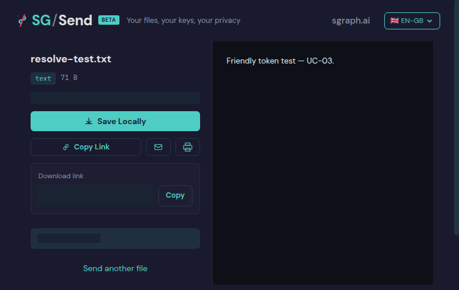

</details>

### 01 File Selected

File selected (delivery step active)


<details>
<summary>Deterministic view (non-dynamic areas only)</summary>

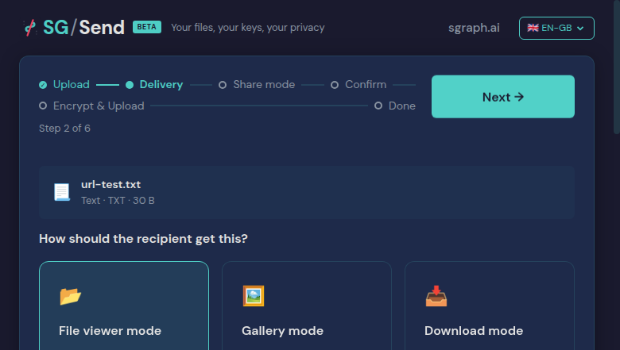

</details>

### 02 Simple Token Selected

Simple Token selected

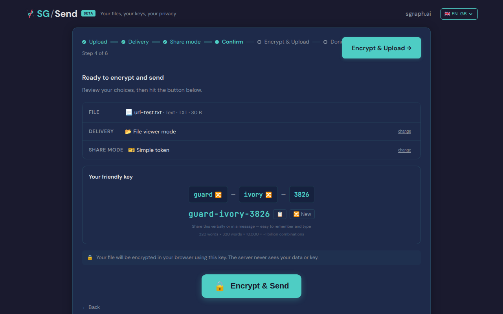

<details>
<summary>Deterministic view (non-dynamic areas only)</summary>

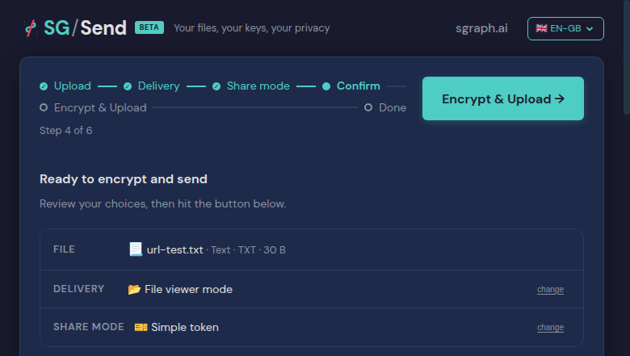

</details>

### 03 Upload Complete

Upload complete

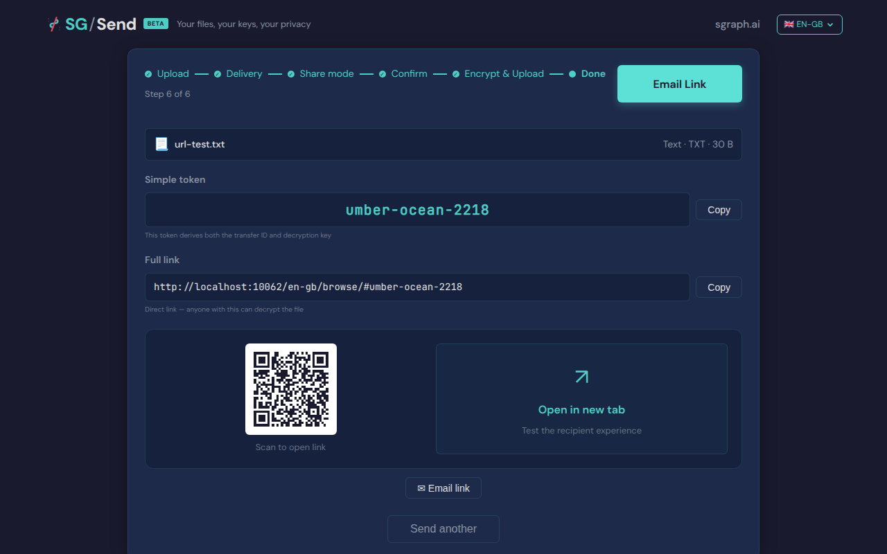

<details>
<summary>Deterministic view (non-dynamic areas only)</summary>

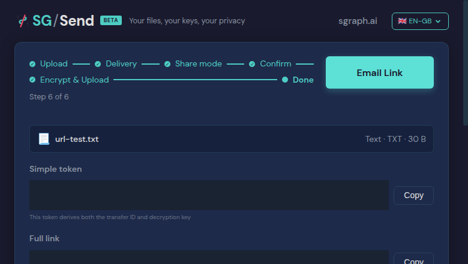

</details>

### 05 Hash After Decrypt

URL after decrypt: http://localhost:26031//en-gb/browse/#marsh-moss-0555

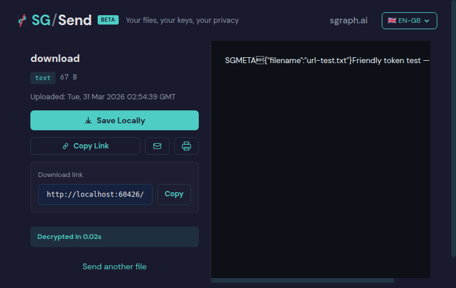

<details>
<summary>Deterministic view (non-dynamic areas only)</summary>

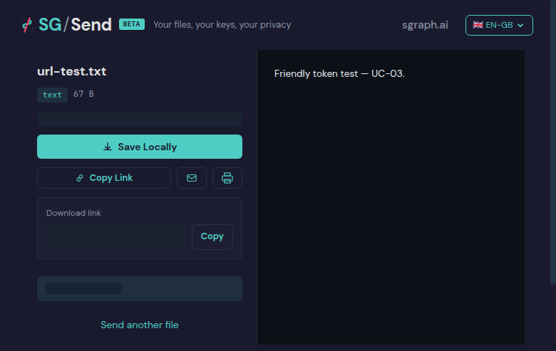

</details>

---

<details>
<summary>View test source — <code>tests/qa/v030/p0__friendly_token/test__friendly_token.py</code></summary>

```python
"""UC-03: Friendly Token — Simple Token share mode (P0).

This was a P0 bug — critical to test.

Flow:
  1. Upload a file with Simple Token share mode
  2. Capture the friendly token (word-word-NNNN format)
  3. Open a new tab to /en-gb/browse/#<friendly-token>
  4. Verify the token resolves and content decrypts
"""
import re
from pathlib                                                    import Path
from unittest                                                   import TestCase
import pytest
from sg_send_qa.browser.SG_Send__Browser__Test_Harness         import SG_Send__Browser__Test_Harness
from sg_send_qa.utils.QA_Screenshot_Capture                    import ScreenshotCapture

pytestmark = pytest.mark.p0

SAMPLE_CONTENT = "Friendly token test — UC-03."
TOKEN_PATTERN  = re.compile(r"\b[a-z]+-[a-z]+-\d{4}\b")

_BASE  = Path(__file__).parent.parent.parent.parent.parent / "sg_send_qa__site" / "pages" / "use-cases"
_GROUP = "02-upload-share"
_UC    = "friendly_token"


class test_Friendly_Token(TestCase):
    """Validate the Simple Token (friendly token) share mode end-to-end."""

    @classmethod
    def setUpClass(cls):
        cls.harness = SG_Send__Browser__Test_Harness().headless(True).setup()
        cls.sg_send = cls.harness.sg_send
        cls.harness.set_access_token()

    @classmethod
    def tearDownClass(cls):
        cls.harness.teardown()

    def _shots(self, method_name, method_doc=""):
        shots_dir = _BASE / _GROUP / _UC / "screenshots"
        return ScreenshotCapture(
            use_case    = _UC,
            module_name = "test__friendly_token",
            module_doc  = __doc__,
            method_name = method_name,
            method_doc  = method_doc,
            shots_dir   = shots_dir,
        )

    def _upload_with_simple_token(self, shots, filename="token-test.txt"):
        """Upload a file with Simple Token mode and return the friendly token string."""
        self.sg_send.page__root()
        self.sg_send.upload__set_file(filename, SAMPLE_CONTENT.encode())
        shots.capture(self.sg_send.raw_page(), "01_file_selected", "File selected (delivery step active)")

        self.sg_send.upload__click_next()
        self.sg_send.upload__select_share_mode("token")
        shots.capture(self.sg_send.raw_page(), "02_simple_token_selected", "Simple Token selected")

        self.sg_send.upload__click_next()
        self.sg_send.upload__wait_for_complete()
        shots.capture(self.sg_send.raw_page(), "03_upload_complete", "Upload complete")

        return self.sg_send.upload__get_friendly_token()

    def test__01__friendly_token_upload_and_resolve(self):
        """Upload with Simple Token mode, then resolve the friendly token in a new tab."""
        shots         = self._shots("test__01__friendly_token_upload_and_resolve",
                                    self.test__01__friendly_token_upload_and_resolve.__doc__)
        friendly_token = self._upload_with_simple_token(shots)

        assert friendly_token, "No friendly token found after upload"
        assert TOKEN_PATTERN.search(friendly_token), \
            f"Token does not match word-word-NNNN pattern: {friendly_token!r}"
        shots.capture(self.sg_send.raw_page(), "05_token_captured",
                      f"Token: {friendly_token}")

        # Resolve in new page
        new_page = self.sg_send.raw_page().context.new_page()
        try:
            from tests.qa.v030.browser_helpers import goto, wait_for_download_states
            goto(new_page, f"{self.harness.ui_url()}/en-gb/browse/#{friendly_token}")
            wait_for_download_states(new_page, ["complete", "error"])
            shots.capture(new_page, "06_token_resolved", f"Token '{friendly_token}' resolved")
            resolve_text = new_page.text_content("body") or ""
            assert "not found" not in resolve_text.lower(), \
                f"Token resolution failed — 'not found' error. Token: {friendly_token}"
        finally:
            new_page.close()
        shots.save_metadata()

    def test__02__friendly_token_format(self):
        """Verify the friendly token matches the word-word-NNNN pattern."""
        shots          = self._shots("test__02__friendly_token_format",
                                     self.test__02__friendly_token_format.__doc__)
        friendly_token = self._upload_with_simple_token(shots, filename="format-test.txt")

        assert friendly_token, "No friendly token found after upload"
        parts = friendly_token.strip().split("-")
        assert len(parts) == 3,        f"Token should have 3 parts: {friendly_token}"
        assert parts[0].isalpha(),     f"First part should be a word: {parts[0]}"
        assert parts[1].isalpha(),     f"Second part should be a word: {parts[1]}"
        assert parts[2].isdigit(),     f"Third part should be digits: {parts[2]}"
        assert len(parts[2]) == 4,     f"Third part should be 4 digits: {parts[2]}"
        shots.save_metadata()

    def test__03__friendly_token_resolves_in_new_tab(self):
        """Upload with Simple Token, then open the token in a new browser tab."""
        shots          = self._shots("test__03__friendly_token_resolves_in_new_tab",
                                     self.test__03__friendly_token_resolves_in_new_tab.__doc__)
        friendly_token = self._upload_with_simple_token(shots, filename="resolve-test.txt")

        assert friendly_token, "No friendly token found after upload"
        new_page = self.sg_send.raw_page().context.new_page()
        try:
            from tests.qa.v030.browser_helpers import goto, wait_for_download_states
            goto(new_page, f"{self.harness.ui_url()}/en-gb/browse/#{friendly_token}")
            wait_for_download_states(new_page, ["complete", "error"])
            shots.capture(new_page, "05_token_resolved", f"Token '{friendly_token}'")
            resolve_text = new_page.text_content("body") or ""
            assert "not found" not in resolve_text.lower(), \
                f"Token resolution failed — this is the P0 bug. Token: {friendly_token}"
            assert SAMPLE_CONTENT in resolve_text or len(resolve_text) > 100, \
                "Token did not resolve to decrypted content"
        finally:
            new_page.close()
        shots.save_metadata()

    def test__04__friendly_token_no_key_in_url_after_decrypt(self):
        """After decryption, the friendly token remains in the URL (by design)."""
        shots          = self._shots("test__04__friendly_token_no_key_in_url_after_decrypt",
                                     self.test__04__friendly_token_no_key_in_url_after_decrypt.__doc__)
        friendly_token = self._upload_with_simple_token(shots, filename="url-test.txt")

        assert friendly_token, "No friendly token found"
        new_page = self.sg_send.raw_page().context.new_page()
        try:
            from tests.qa.v030.browser_helpers import goto, wait_for_download_states
            goto(new_page, f"{self.harness.ui_url()}/en-gb/browse/#{friendly_token}")
            wait_for_download_states(new_page, ["complete", "error"])
            final_url = new_page.url
            shots.capture(new_page, "05_hash_after_decrypt", f"URL after decrypt: {final_url}")
            if "#" in final_url:
                hash_fragment = final_url.split("#", 1)[1]
                assert TOKEN_PATTERN.match(hash_fragment) or hash_fragment == "", \
                    f"URL hash is neither a friendly token nor empty: {hash_fragment}"
        finally:
            new_page.close()
        shots.save_metadata()

```

</details>

