# Upload  Single File

> Test source at commit [`2a0f9775`](https://github.com/the-cyber-boardroom/SG_Send__QA/commit/2a0f9775) · v0.2.40

UC-01: Single file upload → download → content matches (P0).

Happy-path end-to-end test:
  1. Navigate to the upload page
  2. Drop a text file onto the upload zone
  3. Walk through the 6-step wizard
  4. Capture the download link
  5. Open the download link in a new page
  6. Verify decrypted content matches the original

[View source on GitHub](https://github.com/the-cyber-boardroom/SG_Send__QA/blob/dev/tests/qa/v030/p0__upload__single_file/test__upload__single_file.py) — `tests/qa/v030/p0__upload__single_file/test__upload__single_file.py`

---

## Test Methods

| Method | Description | Screenshots |
|--------|-------------|:-----------:|
| `upload_page_loads` | Navigate to /en-gb/ and verify the upload zone is visible. | 1 |
| `single_file_upload_flow` | Upload a text file through the wizard and verify the download link works. | 6 |
| `download_link_format` | Verify the download link contains transfer ID and key in the hash. | 5 |
| `footer_version` | Verify the footer shows v0.3.0. | 1 |
| `_01__upload_page_loads` | Navigate to /en-gb/ and verify the upload zone is visible. | 1 |
| `_02__single_file_upload_flow` | Upload a text file through the wizard and verify the download link works. | 6 |
| `_03__download_link_format` | Verify the download link contains transfer ID and key in the hash. | 1 |
| `_04__footer_version` | Verify the footer shows v0.3.0. | 1 |

## Screenshots

### 01 Upload Page

Upload page loaded

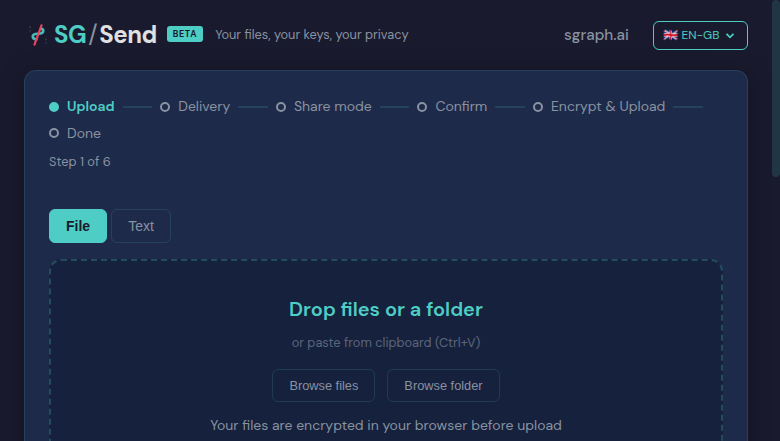

<details>
<summary>Deterministic view (non-dynamic areas only)</summary>


</details>

### 01 File Selected

File selected — delivery step

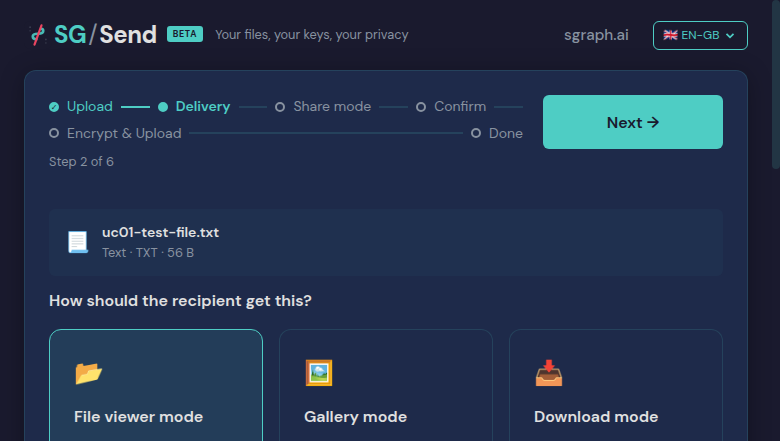

<details>
<summary>Deterministic view (non-dynamic areas only)</summary>


</details>

### 02 Share Step

Share mode step

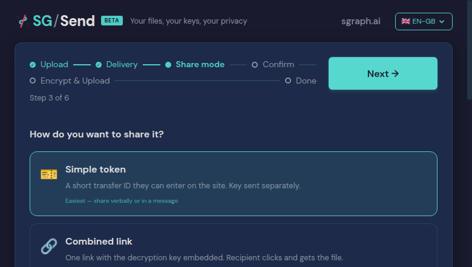

<details>
<summary>Deterministic view (non-dynamic areas only)</summary>

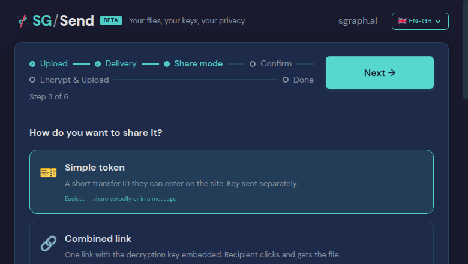

</details>

### 03 Mode Selected

Combined link selected

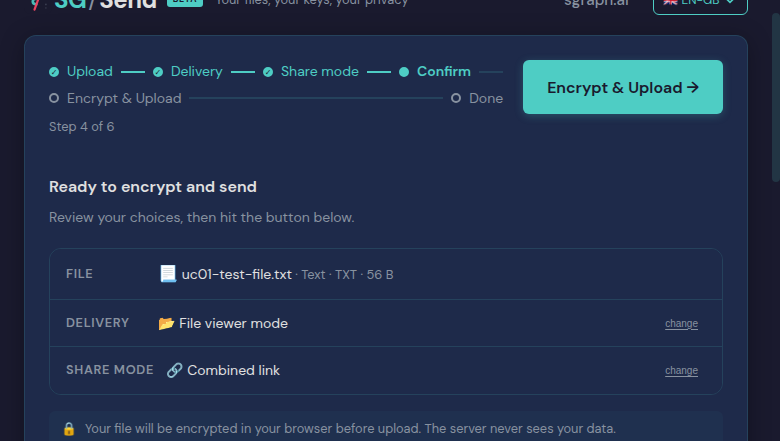

<details>
<summary>Deterministic view (non-dynamic areas only)</summary>


</details>

### 04 Upload Done

Upload complete — link shown

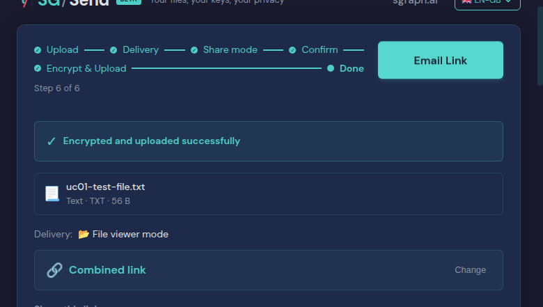

<details>
<summary>Deterministic view (non-dynamic areas only)</summary>

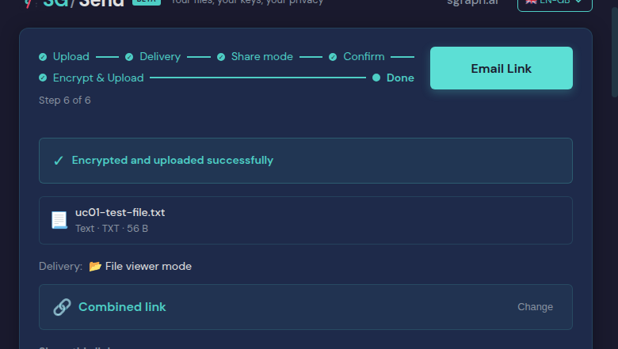

</details>

### 05 Download Page

Download page — awaiting decrypt


<details>
<summary>Deterministic view (non-dynamic areas only)</summary>


</details>

### 06 Decrypted

Content decrypted and visible

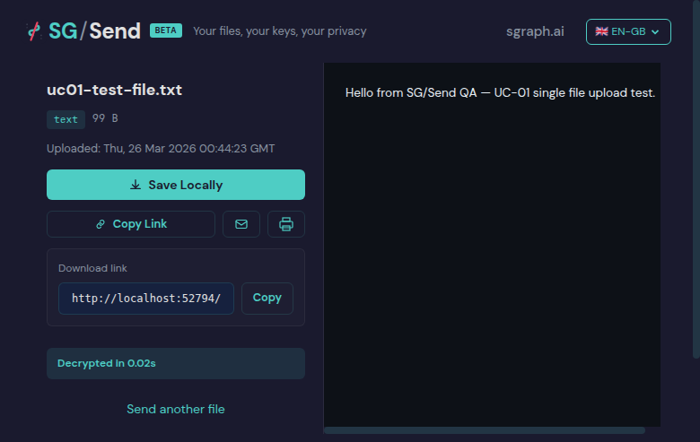

<details>
<summary>Deterministic view (non-dynamic areas only)</summary>

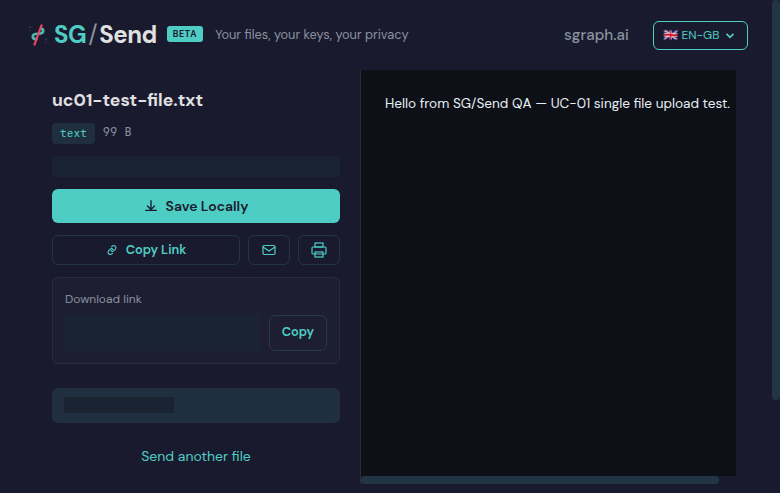

</details>

### 07 Link Format

Link verified: http://localhost:32709/en-gb/browse/#a6d25de40b8b/q7br-bLtcZZyffzRzHkEaWFpPDWEF4

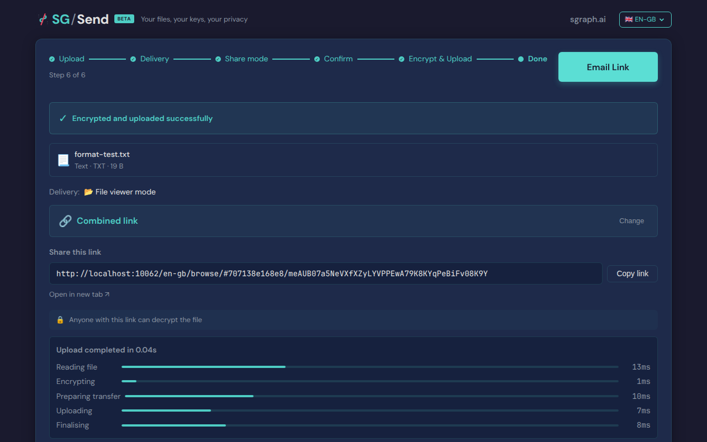

<details>
<summary>Deterministic view (non-dynamic areas only)</summary>


</details>

### 01 Footer

Footer showing version

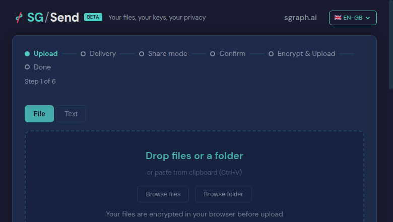

<details>
<summary>Deterministic view (non-dynamic areas only)</summary>


</details>

---

<details>
<summary>View test source — <code>tests/qa/v030/p0__upload__single_file/test__upload__single_file.py</code></summary>

```python
"""UC-01: Single file upload → download → content matches (P0).

Happy-path end-to-end test:
  1. Navigate to the upload page
  2. Drop a text file onto the upload zone
  3. Walk through the 6-step wizard
  4. Capture the download link
  5. Open the download link in a new page
  6. Verify decrypted content matches the original
"""
from pathlib                                                    import Path
from unittest                                                   import TestCase
import pytest
from sg_send_qa.browser.SG_Send__Browser__Test_Harness         import SG_Send__Browser__Test_Harness
from sg_send_qa.utils.QA_Screenshot_Capture                    import ScreenshotCapture

pytestmark = pytest.mark.p0

SAMPLE_CONTENT  = "Hello from SG/Send QA — UC-01 single file upload test."
SAMPLE_FILENAME = "uc01-test-file.txt"

_BASE   = Path(__file__).parent.parent.parent.parent.parent / "sg_send_qa__site" / "pages" / "use-cases"
_GROUP  = "02-upload-share"
_UC     = "upload__single_file"


class test_Single_File_Upload(TestCase):
    """Upload a single text file and verify round-trip decryption."""

    @classmethod
    def setUpClass(cls):
        cls.harness = SG_Send__Browser__Test_Harness().headless(True).setup()
        cls.sg_send = cls.harness.sg_send
        cls.harness.set_access_token()

    @classmethod
    def tearDownClass(cls):
        cls.harness.teardown()

    def _shots(self, method_name, method_doc=""):
        shots_dir = _BASE / _GROUP / _UC / "screenshots"
        return ScreenshotCapture(
            use_case    = _UC,
            module_name = "test__upload__single_file",
            module_doc  = __doc__,
            method_name = method_name,
            method_doc  = method_doc,
            shots_dir   = shots_dir,
        )

    def test__01__upload_page_loads(self):
        """Navigate to /en-gb/ and verify the upload zone is visible."""
        shots = self._shots("test__01__upload_page_loads", self.test__01__upload_page_loads.__doc__)
        self.sg_send.page__root()
        shots.capture(self.sg_send.raw_page(), "01_upload_page", "Upload page loaded")
        assert (self.sg_send.is_upload_zone_visible() or
                self.sg_send.is_access_gate_visible()), \
            "Upload zone not found on landing page"
        shots.save_metadata()

    def test__02__single_file_upload_flow(self):
        """Upload a text file through the wizard and verify the download link works."""
        shots = self._shots("test__02__single_file_upload_flow", self.test__02__single_file_upload_flow.__doc__)
        self.sg_send.page__root()
        self.sg_send.upload__set_file(SAMPLE_FILENAME, SAMPLE_CONTENT.encode())
        shots.capture(self.sg_send.raw_page(), "01_file_selected", "File selected — delivery step")

        self.sg_send.upload__click_next()
        shots.capture(self.sg_send.raw_page(), "02_share_step", "Share mode step")

        self.sg_send.upload__select_share_mode("combined")
        shots.capture(self.sg_send.raw_page(), "03_mode_selected", "Combined link selected")

        self.sg_send.upload__click_next()
        self.sg_send.upload__wait_for_complete()
        shots.capture(self.sg_send.raw_page(), "04_upload_done", "Upload complete — link shown")

        model = self.sg_send.extract__upload_page()
        assert model.share_link, "No download link found after upload"
        assert "#" in model.share_link, f"Download URL missing hash fragment: {model.share_link}"

        # Open link and verify content
        download_url = model.share_link
        if download_url.startswith("/"):
            download_url = self.harness.ui_url().rstrip("/") + download_url

        new_page = self.sg_send.raw_page().context.new_page()
        try:
            from tests.qa.v030.browser_helpers import goto, wait_for_download_states
            goto(new_page, download_url)
            shots.capture(new_page, "05_download_page", "Download page — awaiting decrypt")
            wait_for_download_states(new_page, ["complete", "error"])
            body_text = new_page.text_content("body") or ""
            assert SAMPLE_CONTENT in body_text, \
                f"Decrypted content not found. Snippet: {body_text[:300]}"
            shots.capture(new_page, "06_decrypted", "Content decrypted and visible")
        finally:
            new_page.close()
        shots.save_metadata()

    def test__03__download_link_format(self):
        """Verify the download link contains transfer ID and key in the hash."""
        shots = self._shots("test__03__download_link_format", self.test__03__download_link_format.__doc__)
        self.sg_send.page__root()
        self.sg_send.upload__set_file("format-test.txt", b"format test content")
        self.sg_send.upload__click_next()
        self.sg_send.upload__select_share_mode("combined")
        self.sg_send.upload__click_next()
        self.sg_send.upload__wait_for_complete()

        model = self.sg_send.extract__upload_page()
        assert model.share_link, "No download link found after upload"
        assert "#" in model.share_link

        hash_part = model.share_link.split("#", 1)[1]
        parts = hash_part.split("/", 1)
        assert len(parts) == 2 and len(parts[0]) >= 8 and parts[1], \
            f"Hash should be #<transferId>/<base64key>, got: #{hash_part}"
        shots.capture(self.sg_send.raw_page(), "07_link_format",
                      f"Link verified: {model.share_link[:80]}")
        shots.save_metadata()

    def test__04__footer_version(self):
        """Verify the footer shows v0.3.0."""
        shots = self._shots("test__04__footer_version", self.test__04__footer_version.__doc__)
        self.sg_send.page__root()
        page_text = self.sg_send.visible_text()
        assert "v0.3.0" in page_text, "Footer does not show v0.3.0"
        shots.capture(self.sg_send.raw_page(), "01_footer", "Footer showing version")
        shots.save_metadata()

```

</details>

