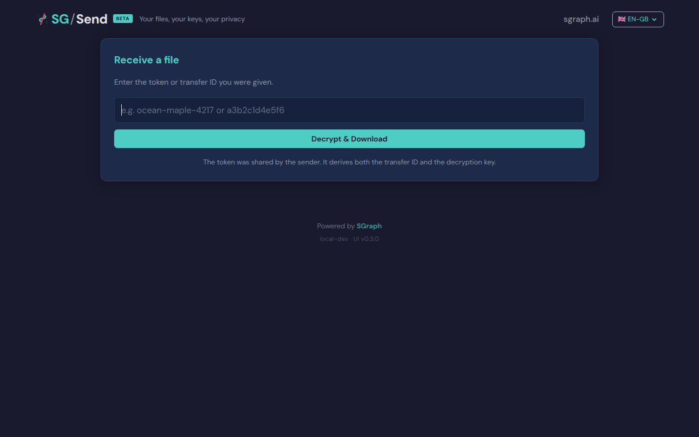
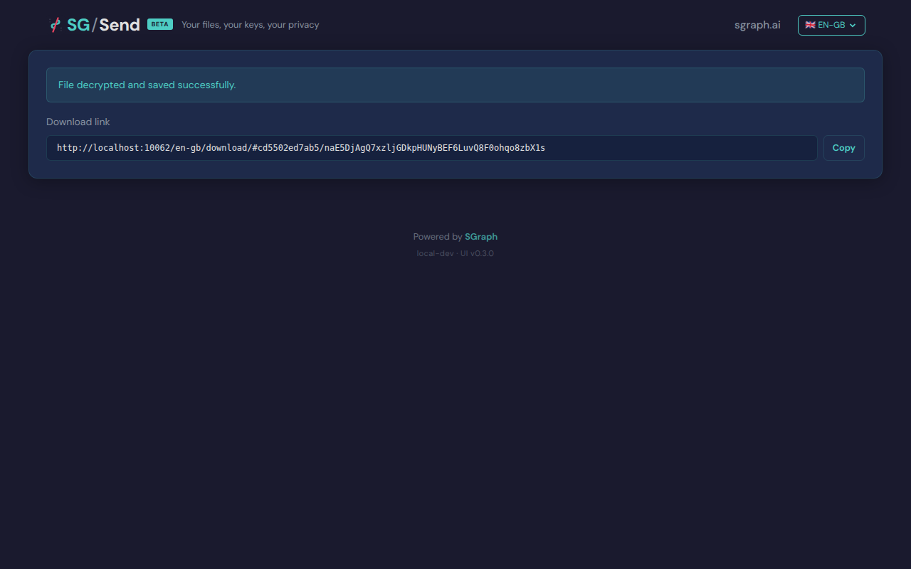
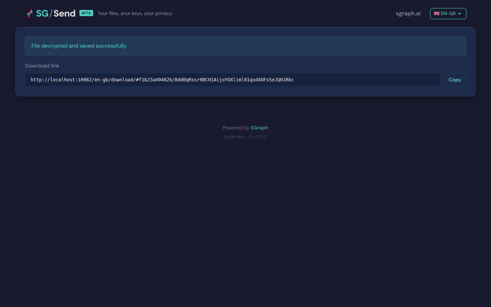

# Manual Entry

> Test source at commit [`17d0c5af`](https://github.com/the-cyber-boardroom/SG_Send__QA/commit/17d0c5af) · v0.2.43

UC-09: Manual token/ID entry form (P1).

Test flow:
  - Navigate to /en-gb/download/ with no hash fragment
  - Verify entry form appears (input + "Decrypt & Download" button)
  - Enter a valid friendly token (from a previous upload)
  - Verify it resolves and decrypts
  - Enter a bogus token → verify error message

[View source on GitHub](https://github.com/the-cyber-boardroom/SG_Send__QA/blob/dev/tests/qa/v030/p1__manual_entry/test__manual_entry.py) — `tests/qa/v030/p1__manual_entry/test__manual_entry.py`

---

## Test Methods

| Method | Description | Screenshots |
|--------|-------------|:-----------:|
| `entry_form_shown_without_hash` | Navigating to /en-gb/download/ with no hash shows the entry form. | 1 |
| `entry_form_has_decrypt_button` | Entry form has a Decrypt & Download (or similar) button. | 1 |
| `bogus_token_shows_error` | Entering a bogus token shows an error (not a crash). | 1 |
| `valid_transfer_id_resolves` | Entering a valid transfer ID resolves and shows the file. | 1 |
| `hash_navigation_to_download` | Navigating directly to /en-gb/download/#id/key auto-decrypts (P1). | 1 |

## Screenshots

### 01 Entry Form

Manual entry form without hash



### 02 Decrypt Button

Entry form with decrypt button


### 03 Bogus Token Error

Error after bogus token


### 04 Valid Id Resolved

Valid transfer ID resolved



### 05 Direct Hash Nav

Direct hash navigation to download



---

<details>
<summary>View test source — <code>tests/qa/v030/p1__manual_entry/test__manual_entry.py</code></summary>

```python
"""UC-09: Manual token/ID entry form (P1).

Test flow:
  - Navigate to /en-gb/download/ with no hash fragment
  - Verify entry form appears (input + "Decrypt & Download" button)
  - Enter a valid friendly token (from a previous upload)
  - Verify it resolves and decrypts
  - Enter a bogus token → verify error message
"""

import pytest
import re

from playwright.sync_api import expect
from tests.qa.v030.browser_helpers import goto

pytestmark = pytest.mark.p1

SAMPLE_CONTENT = b"UC-09 manual entry test content."


class TestManualEntryForm:
    """Verify the manual token/ID entry form at /en-gb/download/ with no hash."""

    def test_entry_form_shown_without_hash(self, page, ui_url, screenshots):
        """Navigating to /en-gb/download/ with no hash shows the entry form."""
        goto(page, f"{ui_url}/en-gb/download/")
        # Wait for form to render
        entry_input = page.locator("input[type='text'], input[type='search'], input").first
        entry_input.wait_for(state="visible", timeout=5000)
        screenshots.capture(page, "01_entry_form", "Manual entry form without hash")

        assert entry_input.is_visible(), \
            "Entry form input not visible at /en-gb/download/ without hash"

    def test_entry_form_has_decrypt_button(self, page, ui_url, screenshots):
        """Entry form has a Decrypt & Download (or similar) button."""
        goto(page, f"{ui_url}/en-gb/download/")
        page.locator("body").wait_for(state="visible")
        screenshots.capture(page, "02_decrypt_button", "Entry form with decrypt button")

        page_text = page.text_content("body") or ""
        assert any(kw in page_text.lower() for kw in ["decrypt", "download", "open"]), \
            "No decrypt/download button found on entry form"

    def test_bogus_token_shows_error(self, page, ui_url, screenshots):
        """Entering a bogus token shows an error (not a crash)."""
        goto(page, f"{ui_url}/en-gb/download/")

        entry_input = page.locator("input[type='text'], input").first
        if entry_input.is_visible(timeout=5000):
            entry_input.fill("bogus-token-9999")
            entry_input.press("Enter")
            # Wait for error feedback to appear
            error_locator = page.locator(
                "[class*='error'], [class*='alert'], [role='alert'], "
                "p:has-text('error'), p:has-text('not found'), p:has-text('invalid')"
            ).first
            try:
                error_locator.wait_for(state="visible", timeout=5000)
            except Exception:
                pass  # fallback: check body text below
            screenshots.capture(page, "03_bogus_token_error", "Error after bogus token")

            page_text = page.text_content("body") or ""
            # Should show some kind of error feedback
            assert any(kw in page_text.lower() for kw in [
                "error", "not found", "invalid", "failed", "wrong"
            ]), f"No error shown for bogus token. Page text: {page_text[:300]}"

    def test_valid_transfer_id_resolves(self, page, ui_url, transfer_helper, screenshots):
        """Entering a valid transfer ID resolves and shows the file."""
        # Create a real transfer via API
        tid, key_b64 = transfer_helper.upload_encrypted(SAMPLE_CONTENT, "uc09-test.txt")

        # Navigate to entry form and type the transfer ID
        goto(page, f"{ui_url}/en-gb/download/")

        entry_input = page.locator("input[type='text'], input").first
        if entry_input.is_visible(timeout=5000):
            # Try the combined hash format (id/key) — what the user would paste
            entry_input.fill(f"{tid}/{key_b64}")
            entry_input.press("Enter")
            # Wait for page to advance past the entry form
            try:
                expect(page.locator("body")).to_contain_text(
                    SAMPLE_CONTENT.decode(), timeout=10_000
                )
            except Exception:
                pass  # content might render differently; assertion below handles it
            screenshots.capture(page, "04_valid_id_resolved", "Valid transfer ID resolved")

            page_text = page.text_content("body") or ""
            # Page should advance (no longer just the entry form)
            assert "not found" not in page_text.lower() or len(page_text) > 200, \
                f"Transfer ID did not resolve. Page text: {page_text[:300]}"

    def test_hash_navigation_to_download(self, page, ui_url, transfer_helper, screenshots):
        """Navigating directly to /en-gb/download/#id/key auto-decrypts (P1)."""
        tid, key_b64 = transfer_helper.upload_encrypted(SAMPLE_CONTENT, "uc09-direct.txt")

        page.goto(f"{ui_url}/en-gb/download/#{tid}/{key_b64}")
        page.wait_for_load_state("networkidle")
        page.wait_for_timeout(2000)
        screenshots.capture(page, "05_direct_hash_nav", "Direct hash navigation to download")

        # inner_text avoids false positive from inline JS scripts containing "error"
        page_text = page.inner_text("body") or ""
        assert "error" not in page_text.lower() or len(page_text) > 200, \
            "Direct hash navigation failed"

```

</details>

