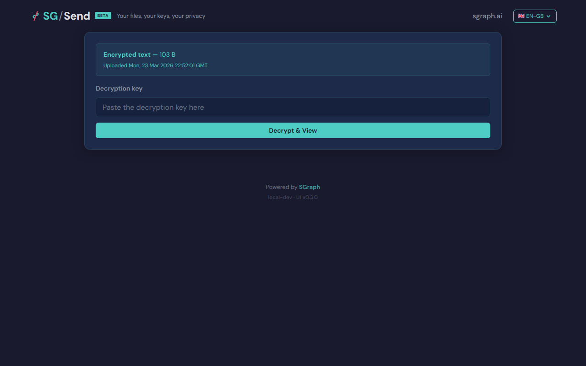
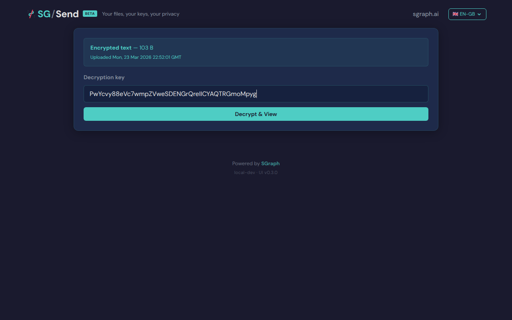
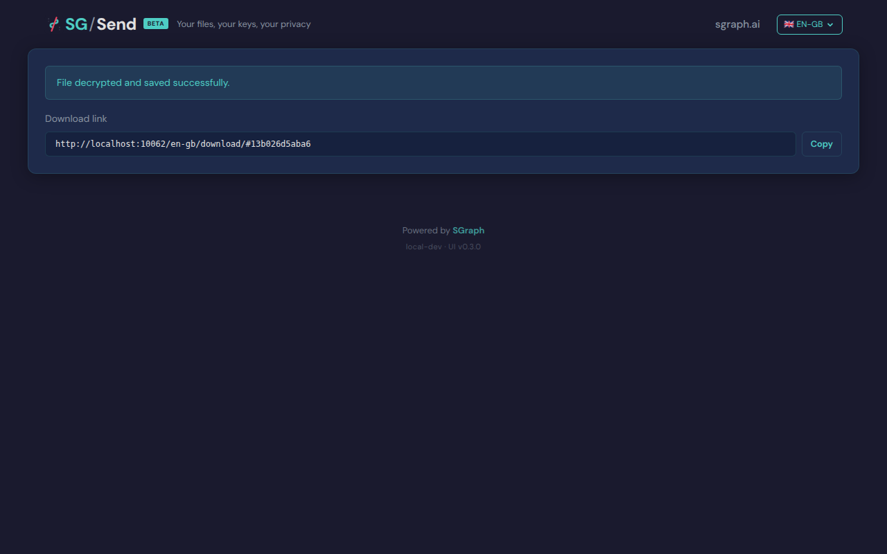
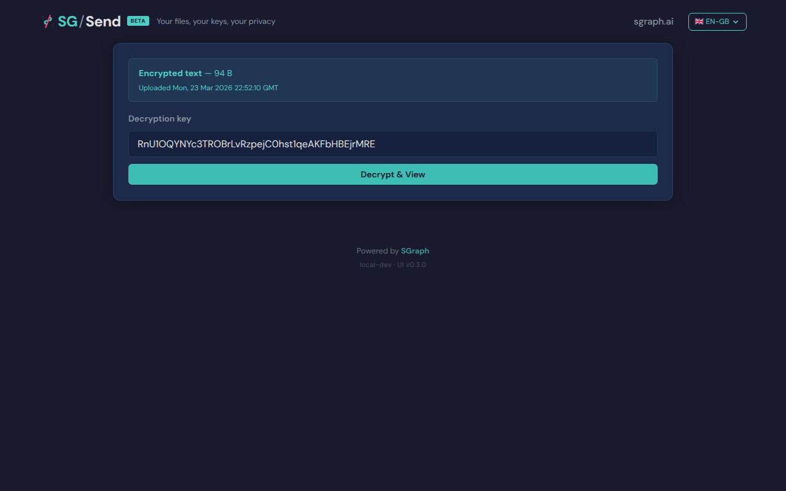
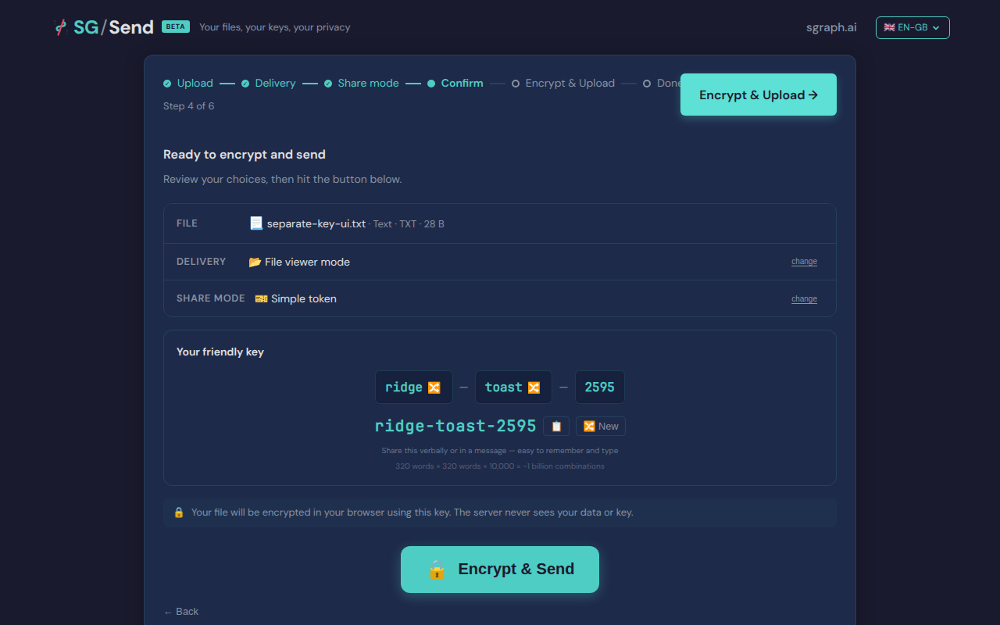
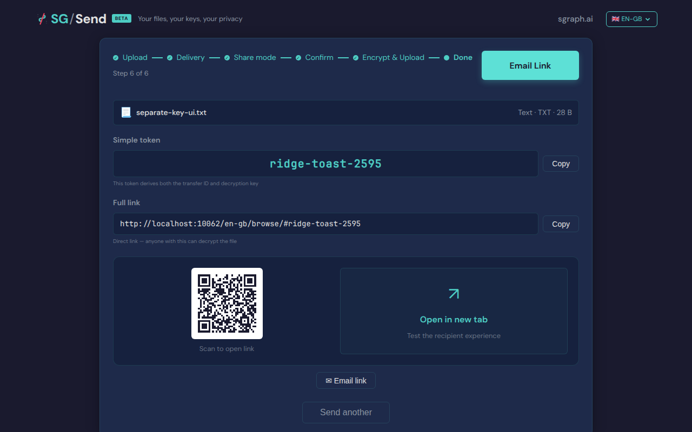

# Separate Key

> Test source at commit [`5274a75a`](https://github.com/the-cyber-boardroom/SG_Send__QA/commit/5274a75a) · v0.2.44

UC-05: Separate Key share mode (P0).

Flow:
  1. Upload a file with Separate Key share mode
  2. Get a link (no key in hash) and the key separately
  3. Open the link → verify "ready" state with key input
  4. Paste the key, click Decrypt
  5. Verify content displays
  6. Try a wrong key → verify error message

[View source on GitHub](https://github.com/the-cyber-boardroom/SG_Send__QA/blob/dev/tests/qa/v030/p0__separate_key/test__separate_key.py) — `tests/qa/v030/p0__separate_key/test__separate_key.py`

---

## Test Methods

| Method | Description | Screenshots |
|--------|-------------|:-----------:|
| `separate_key_decrypt_via_api` | Create a transfer via API, open link without key, enter key manually. | 0 |
| `wrong_key_shows_error` | Enter an incorrect key and verify an error message appears. | 0 |
| `separate_key_ui_flow` | Full UI flow: upload with Separate Key mode, extract link + key, verify. | 0 |

## Screenshots

### 01 Ready State

Download page — ready state, key input visible



### 02 Transfer Info

Transfer info displayed before key entry


### 03 Key Entered

Encryption key entered



### 04 Decrypted

Content decrypted with separate key



### 05 Wrong Key Error

Error message after wrong key



### 06 Separate Key Selected

Separate Key mode selected



### 07 Separate Key Done

Upload complete — link and key shown separately



---

<details>
<summary>View test source — <code>tests/qa/v030/p0__separate_key/test__separate_key.py</code></summary>

```python
"""UC-05: Separate Key share mode (P0).

Flow:
  1. Upload a file with Separate Key share mode
  2. Get a link (no key in hash) and the key separately
  3. Open the link → verify "ready" state with key input
  4. Paste the key, click Decrypt
  5. Verify content displays
  6. Try a wrong key → verify error message
"""

import pytest
import base64
import os

pytestmark = pytest.mark.p0

SAMPLE_CONTENT = "Separate key test — UC-05."


class TestSeparateKey:
    """Validate the Separate Key share mode end-to-end."""

    @pytest.mark.xfail(
        reason=(
            "BUG: After entering the correct key and clicking Decrypt, the decrypted "
            "file content is not visible in page.text_content('body'). The app likely "
            "renders the viewer in a shadow DOM or triggers a download rather than "
            "showing content inline. See: pages/known-bugs/separate_key_decrypt_content/"
        ),
        strict=True,
    )
    def test_separate_key_decrypt_via_api(self, page, ui_url, transfer_helper, screenshots):
        """Create a transfer via API, open link without key, enter key manually."""
        tid, key_b64 = transfer_helper.upload_encrypted(
            plaintext=SAMPLE_CONTENT.encode(),
            filename="separate-key-test.txt",
        )

        # --- Open the download link WITHOUT the key in the hash ---
        page.goto(f"{ui_url}/en-gb/download/#{tid}")
        page.wait_for_selector("body[data-ready]", timeout=10_000)
        page.wait_for_timeout(3000)
        screenshots.capture(page, "01_ready_state", "Download page — ready state, key input visible")

        # --- Verify the key input is visible ---
        key_input = page.locator(
            "input[type='password'], input[type='text'][placeholder*='key'], "
            "input[placeholder*='Key'], input[placeholder*='decrypt']"
        ).first
        assert key_input.is_visible(timeout=5000), "Key input field not visible on download page"

        # --- Verify transfer info is shown (size, upload time) ---
        body_text = page.text_content("body") or ""
        # The page should show some transfer metadata
        screenshots.capture(page, "02_transfer_info", "Transfer info displayed before key entry")

        # --- Enter the correct key and decrypt ---
        key_input.fill(key_b64)
        screenshots.capture(page, "03_key_entered", "Encryption key entered")

        decrypt_btn = page.locator(
            "button:has-text('Decrypt'), button:has-text('Download'), "
            "button:has-text('Unlock')"
        ).first
        assert decrypt_btn.is_visible(timeout=3000), "Decrypt button not found"
        decrypt_btn.click()

        page.wait_for_timeout(5000)
        screenshots.capture(page, "04_decrypted", "Content decrypted with separate key")

        # Verify decrypted content
        body_text = page.text_content("body") or ""
        assert SAMPLE_CONTENT in body_text, (
            f"Content not found after decryption. Transfer ID: {tid}"
        )

    def test_wrong_key_shows_error(self, page, ui_url, transfer_helper, screenshots):
        """Enter an incorrect key and verify an error message appears."""
        tid, _correct_key = transfer_helper.upload_encrypted(
            plaintext=b"wrong key test content",
            filename="wrong-key-test.txt",
        )

        # Generate a wrong key (random 32 bytes, base64url encoded)
        wrong_key = base64.urlsafe_b64encode(os.urandom(32)).rstrip(b"=").decode()

        page.goto(f"{ui_url}/en-gb/download/#{tid}")
        page.wait_for_selector("body[data-ready]", timeout=10_000)
        page.wait_for_timeout(3000)

        # Enter wrong key
        key_input = page.locator(
            "input[type='password'], input[type='text'][placeholder*='key'], "
            "input[placeholder*='Key'], input[placeholder*='decrypt']"
        ).first
        assert key_input.is_visible(timeout=5000), "Key input not visible"
        key_input.fill(wrong_key)

        decrypt_btn = page.locator(
            "button:has-text('Decrypt'), button:has-text('Download'), "
            "button:has-text('Unlock')"
        ).first
        decrypt_btn.click()

        page.wait_for_timeout(3000)
        screenshots.capture(page, "05_wrong_key_error", "Error message after wrong key")

        # Verify error message (AES-GCM authentication failure)
        body_text = (page.text_content("body") or "").lower()
        error_indicators = ["error", "failed", "invalid", "incorrect", "wrong", "unable"]
        has_error = any(indicator in body_text for indicator in error_indicators)
        assert has_error, (
            f"No error message shown for wrong key. "
            f"AES-GCM should reject authentication. Body: {body_text[:300]}"
        )

    def test_separate_key_ui_flow(self, page, ui_url, send_server, screenshots):
        """Full UI flow: upload with Separate Key mode, extract link + key, verify."""
        page.goto(f"{ui_url}/en-gb/")
        page.wait_for_selector("body[data-ready]", timeout=10_000)

        # Handle access gate
        access_input = page.locator("input[type='text'], input[type='password']").first
        if access_input.is_visible(timeout=2000):
            access_input.fill(send_server.access_token)
            page.locator("button").first.click()
            page.wait_for_selector("body[data-ready]", timeout=10_000)

        # Upload file
        file_input = page.locator("#file-input")
        file_input.set_input_files({
            "name"    : "separate-key-ui.txt",
            "mimeType": "text/plain",
            "buffer"  : SAMPLE_CONTENT.encode(),
        })
        page.wait_for_timeout(1000)

        # Navigate to share mode step
        for _ in range(3):
            btn = page.locator("button:has-text('Next'), button:has-text('Continue')").first
            if btn.is_visible(timeout=2000):
                btn.click()
                page.wait_for_timeout(500)

        # Select Separate Key
        sep_key = page.locator("text=Separate key, text=Separate Key").first
        if sep_key.is_visible(timeout=3000):
            sep_key.click()
            page.wait_for_timeout(500)
        screenshots.capture(page, "06_separate_key_selected", "Separate Key mode selected")

        # Complete wizard
        for _ in range(5):
            btn = page.locator(
                "button:has-text('Next'), button:has-text('Continue'), "
                "button:has-text('Upload'), button:has-text('Encrypt'), "
                "button:has-text('Confirm')"
            ).first
            if btn.is_visible(timeout=2000):
                btn.click()
                page.wait_for_timeout(1000)

        page.wait_for_timeout(3000)
        screenshots.capture(page, "07_separate_key_done", "Upload complete — link and key shown separately")

        # The page should show a link AND a separate key
        body_text = page.text_content("body") or ""

        # Verify there's a download link (without key in hash)
        link_el = page.locator("a[href*='download'], a[href*='/en-gb/']").first
        link_url = ""
        if link_el.is_visible(timeout=3000):
            link_url = link_el.get_attribute("href") or ""

        if not link_url:
            for input_el in page.locator("input[readonly]").all():
                val = input_el.get_attribute("value") or ""
                if "download" in val or "/en-gb/" in val:
                    link_url = val
                    break

        # The separate key link should NOT contain the key in the hash
        # (unlike combined link which has #id/key)
        if link_url and "#" in link_url:
            hash_part = link_url.split("#", 1)[1]
            assert "/" not in hash_part, (
                f"Separate key link should NOT have key in hash: {link_url}"
            )

```

</details>

