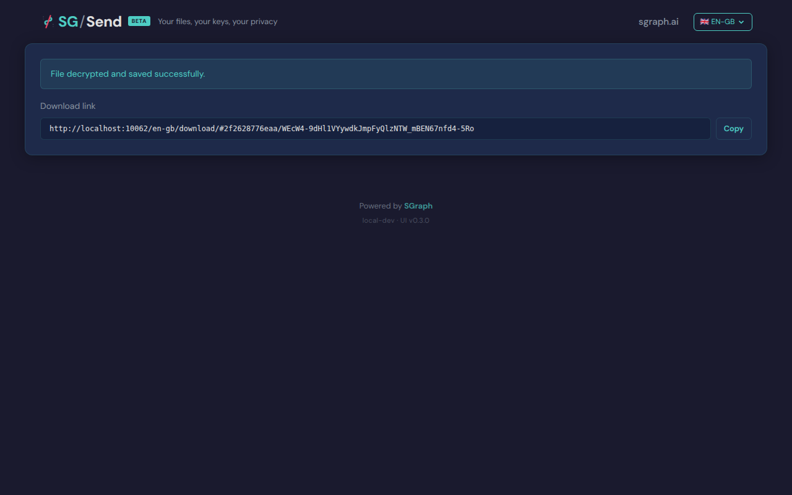

# Valid Transfer Id Resolves

> Test source at commit [`d7917483`](https://github.com/the-cyber-boardroom/SG_Send__QA/commit/d7917483) · v0.2.51

Entering a valid transfer ID resolves and shows the file.

---

## Screenshots

### 04 Valid Id Resolved

Valid transfer ID resolved

