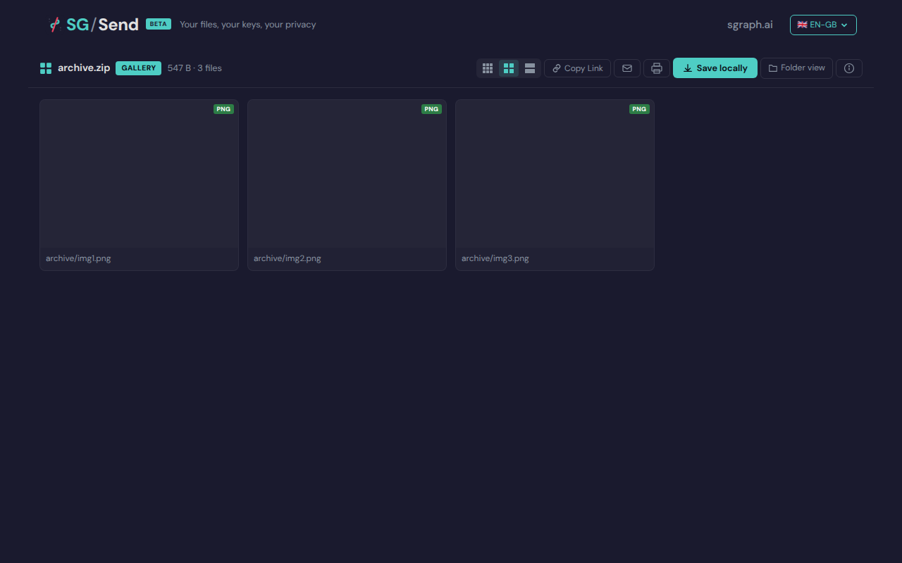
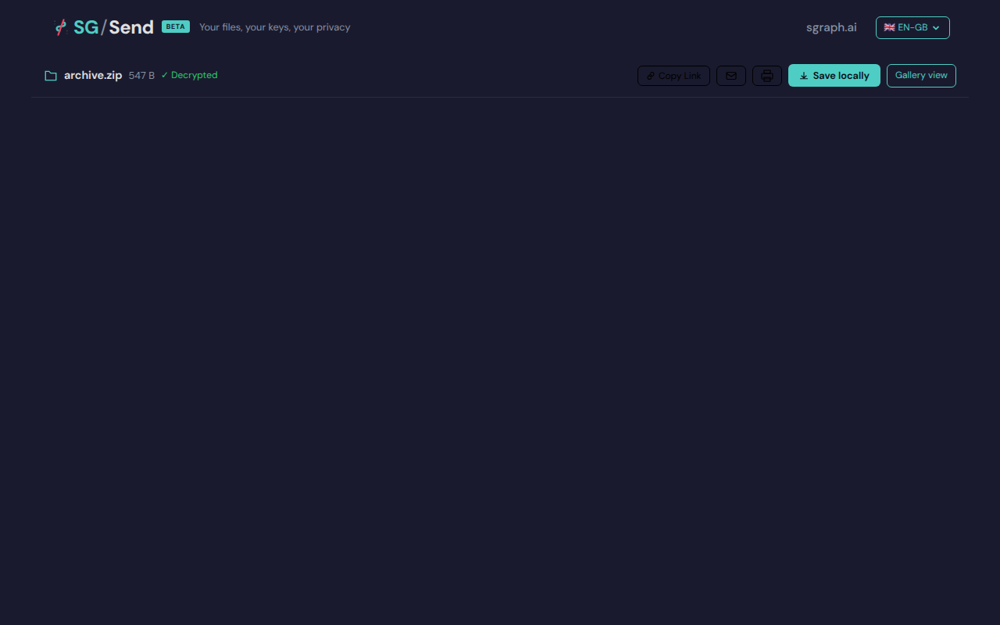
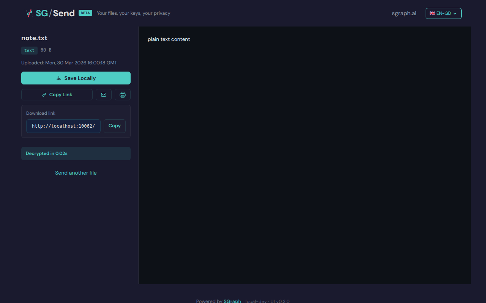
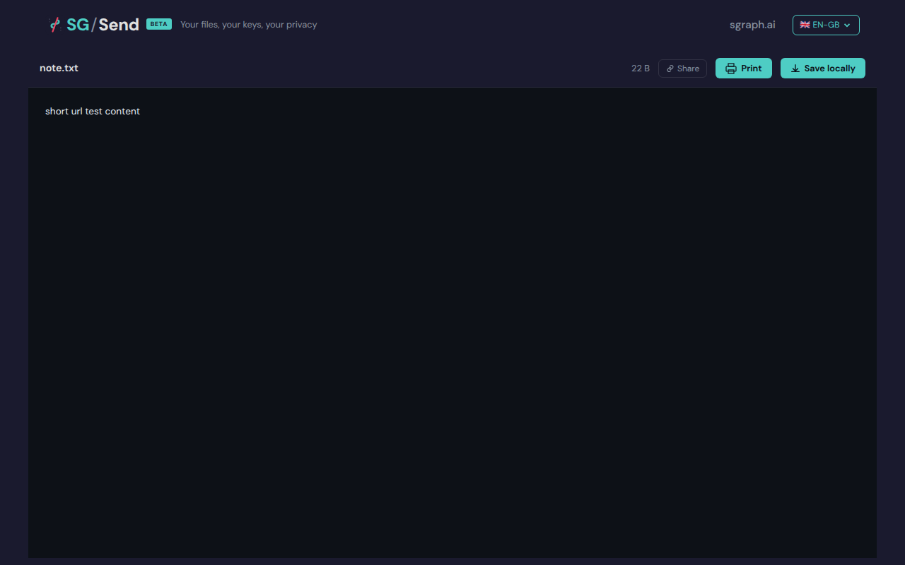
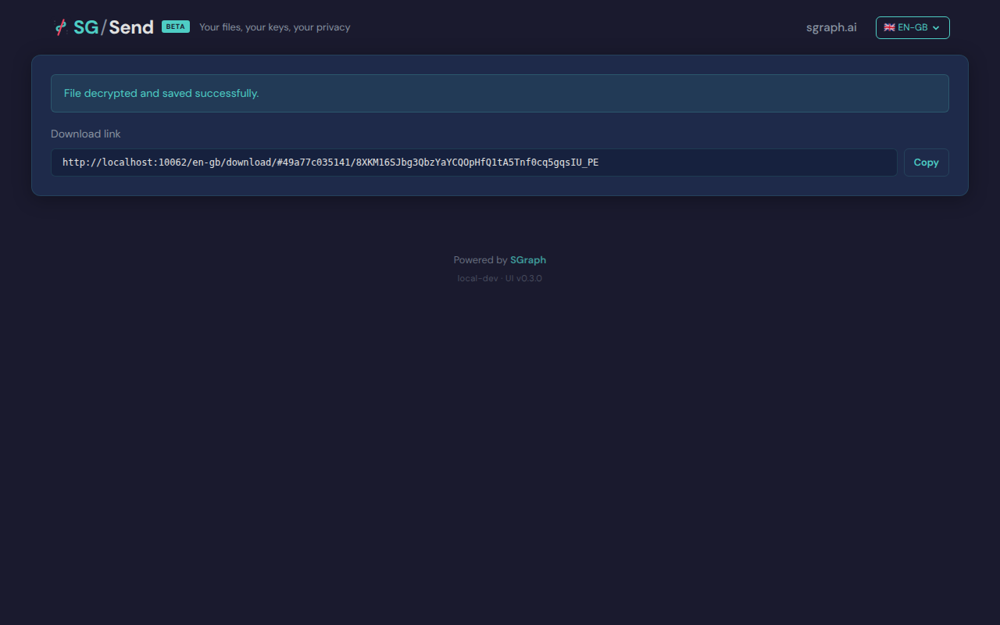
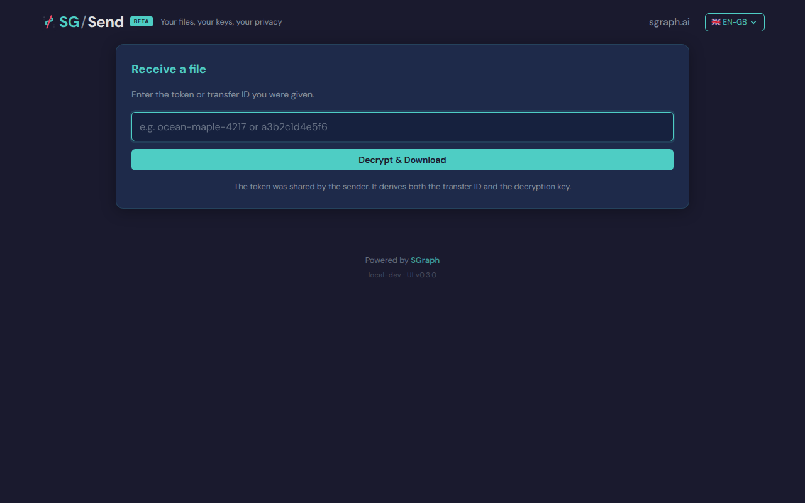
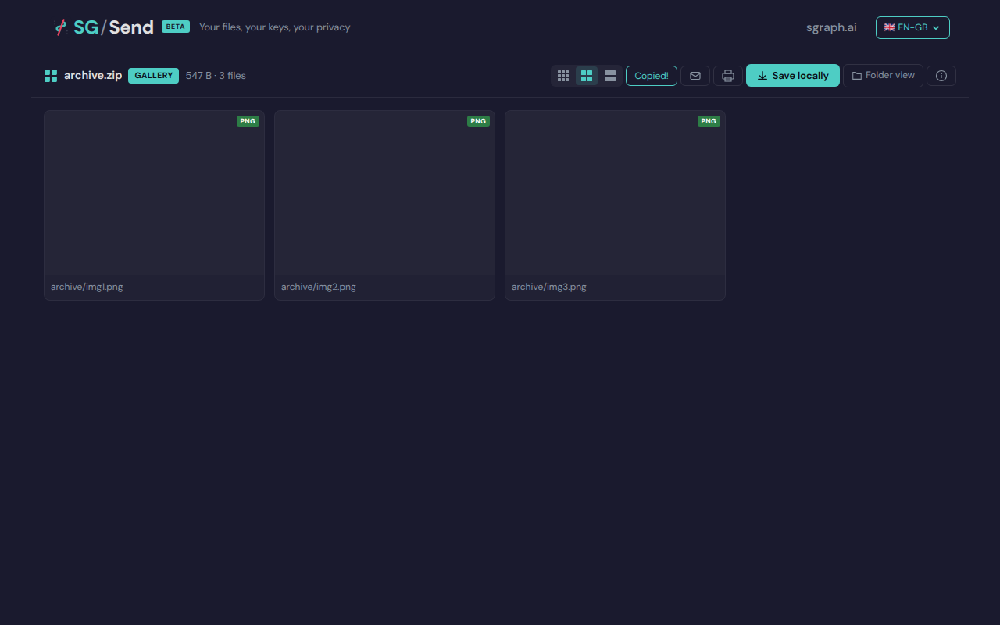

# Navigation

UC-11: Route handling + mode switching (P1).

Test flow:
  - Upload a zip with images via API
  - Navigate to /gallery/#hash → verify gallery view
  - Navigate to /browse/#hash → verify browse view
  - Navigate to /view/#hash → verify single file view
  - Navigate to /v/#hash → verify same as /view/ (short URL)
  - Navigate to /download/#hash → verify auto-detect mode
  - Verify gallery "Folder view" link → navigates to /browse/ preserving hash
  - Verify browse "Gallery view" link → navigates to /gallery/ preserving hash

---

## Test Methods

| Method | Description | Screenshots |
|--------|-------------|:-----------:|
| `gallery_route` | GET /en-gb/gallery/#hash loads gallery view. | 1 |
| `browse_route` | GET /en-gb/browse/#hash loads browse view. | 1 |
| `view_route` | GET /en-gb/view/#hash loads single-file viewer. | 1 |
| `short_v_route` | /en-gb/v/#hash is equivalent to /en-gb/view/#hash. | 1 |
| `download_route_auto_detect` | /en-gb/download/#hash auto-detects mode and decrypts. | 1 |
| `gallery_to_browse_hash_preserved` | Gallery 'Folder view' link navigates to /browse/ (hash preserved if supported). | 1 |
| `browse_to_gallery_hash_preserved` | Browse 'Gallery view' link navigates to /gallery/ (hash preserved if supported). | 1 |
| `copy_link_includes_key` | Copy Link button in gallery/browse includes the key in the URL (P1). | 1 |

## Screenshots

### 01 Gallery Route

Gallery route loaded

### 02 Browse Route

Browse route loaded

### 03 View Route

View route loaded

### 04 Short V Route

Short /v/ route loaded

### 05 Download Auto

Download route auto-detect

### 06 Gallery To Browse

Gallery → browse

### 07 Browse To Gallery

Browse → gallery

### 08 Copy Link

Copy Link button clicked

