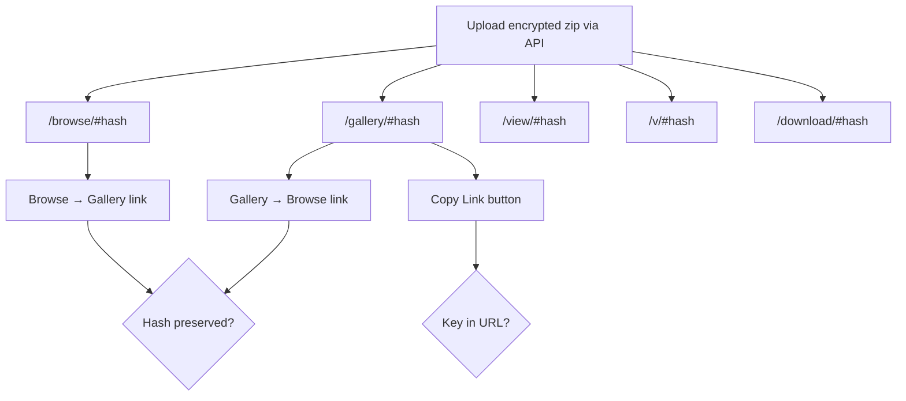

# Route Handling & Mode Switching (UC-11)

Verifies that all SG/Send download routes load correctly, preserve the encryption key hash, and allow switching between view modes.

**Priority:** P1 — requires human sign-off if failing

---

## Overview

SG/Send supports multiple download routes, each presenting content in a different view mode. The encryption key is carried in the URL hash fragment (never sent to the server). This use case tests that all routes work and mode-switching preserves the key.

| Property | Value |
|----------|-------|
| **Test file** | `tests/qa/v030/test__navigation.py` |
| **Target** | Local test server (in-memory API + static UI) |
| **Fixtures** | `send_server`, `ui_server`, `transfer_helper`, `page`, `screenshots` |
| **Priority** | P1 |

## Why This Test Matters

The URL hash carries the **decryption key** — if it's lost during navigation or mode-switching, the user loses access to their files with no recovery path. These tests catch:

- **Broken routes** — a deployment broke one of the download endpoints
- **Hash loss** — mode-switching strips the key from the URL
- **Short URL regression** — `/v/` stops working as an alias for `/view/`
- **Auto-detect failure** — `/download/` fails to pick the right mode
- **Copy Link bug** — shared URLs don't include the decryption key

## Routes Tested

| Route | View Mode | Content |
|-------|-----------|---------|
| `/en-gb/gallery/#hash` | Gallery | Image thumbnails grid |
| `/en-gb/browse/#hash` | Browse | File/folder tree listing |
| `/en-gb/view/#hash` | Viewer | Single file display |
| `/en-gb/v/#hash` | Viewer (short) | Same as `/view/` |
| `/en-gb/download/#hash` | Auto-detect | Chooses best mode |

## Test Flow



### Screenshots Produced

| Screenshot | Description |
|------------|-------------|
| `01_gallery_route.png` | Gallery view loaded with image grid |
| `02_browse_route.png` | Browse view loaded with file listing |
| `03_view_route.png` | Single-file viewer with text content |
| `04_short_v_route.png` | Short `/v/` route — same as viewer |
| `05_download_auto.png` | Auto-detect mode from `/download/` |
| `06_gallery_to_browse.png` | After clicking "Folder view" link |
| `07_browse_to_gallery.png` | After clicking "Gallery view" link |
| `08_copy_link.png` | After clicking Copy Link button |

## Test Data

The tests create real encrypted transfers via the API:

- **Zip archive** with 3 valid 1x1 PNG images (for gallery/browse/download tests)
- **Plain text file** (for view/v route tests)

Encryption uses AES-256-GCM matching the browser's Web Crypto implementation:
- 32-byte random key
- 12-byte random IV prepended to ciphertext
- SGMETA envelope with filename metadata

---

## Technical Details

```
Viewport:   1280 x 800
Browser:    Chromium (headless)
Screenshot: CDP Page.captureScreenshot
API:        In-memory SG/Send User Lambda (no network)
Encryption: AES-256-GCM via cryptography library
```

---

## Related Use Cases

| Use Case | Relationship |
|----------|-------------|
| [Access Token Gate](../access_gate/) | Gate must be passed before these routes are accessible |
| [Landing Page Loads](../landing_page_loads/) | Basic page load — prerequisite |
