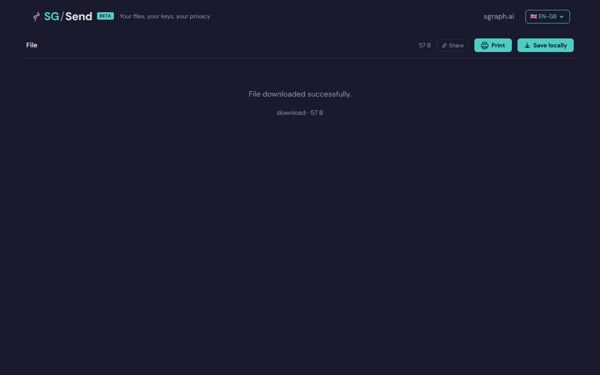

# Short V Route

> Generated at commit [`6e8ee11b`](https://github.com/the-cyber-boardroom/SG_Send__QA/commit/6e8ee11b) · v0.2.37 · 2026-03-26 01:41 UTC

/en-gb/v/#hash is equivalent to /en-gb/view/#hash.

---

## Screenshots

### 04 Short V Route

Short /v/ route loaded

