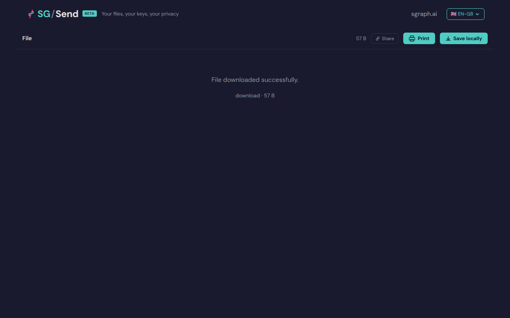

# Short V Route

> Test source at commit [`d7917483`](https://github.com/the-cyber-boardroom/SG_Send__QA/commit/d7917483) · v0.2.51

/en-gb/v/#hash is equivalent to /en-gb/view/#hash.

---

## Screenshots

### 04 Short V Route

Short /v/ route loaded

