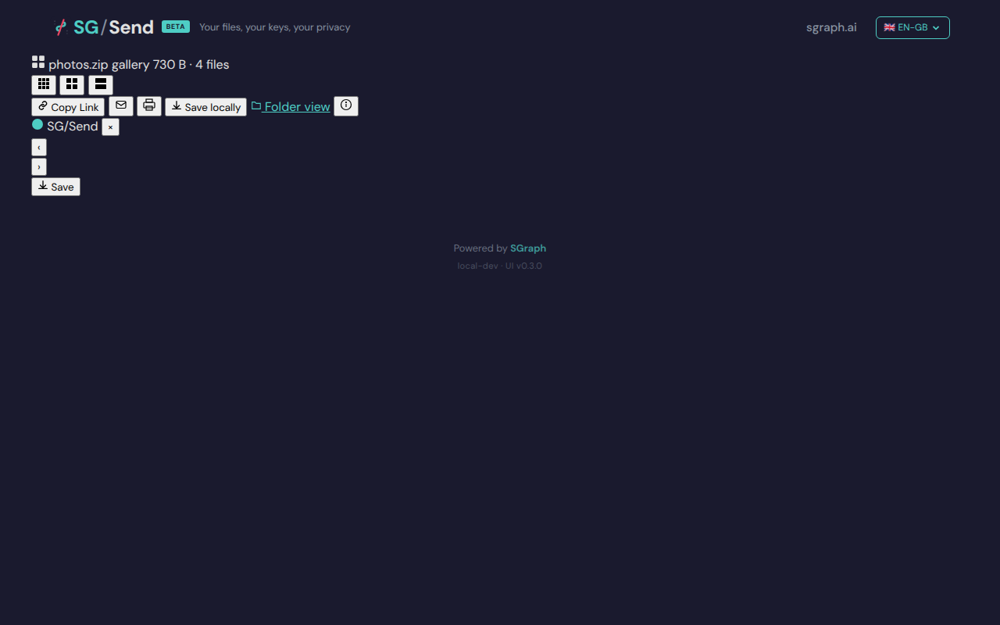
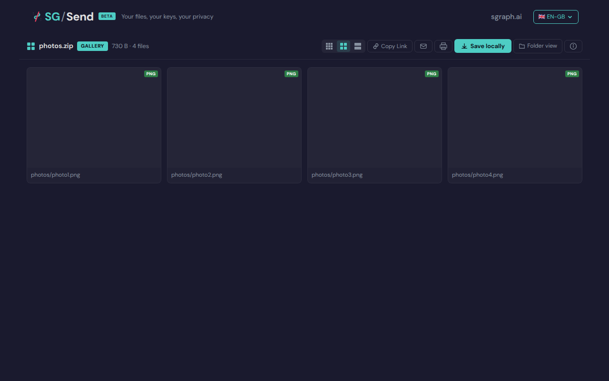
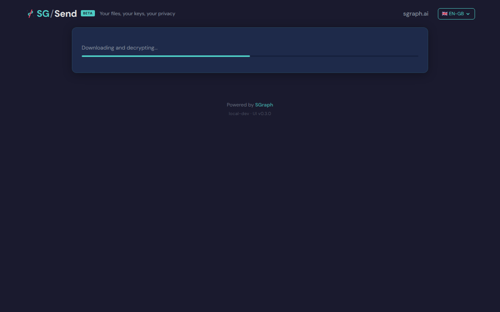

# Download  Gallery

> Generated at commit [`6e8ee11b`](https://github.com/the-cyber-boardroom/SG_Send__QA/commit/6e8ee11b) · v0.2.37 · 2026-03-26 01:41 UTC

UC-06: Gallery view features (P1).

Test flow:
  - Verify view mode buttons work (compact / grid / large)
  - Verify Copy Link, Email, Print, Save locally buttons are present
  - Verify Info panel toggles
  - Verify lightbox opens on thumbnail click
  - Verify lightbox navigation (arrows)
  - Verify SG/Send branding in lightbox

[View source on GitHub](https://github.com/the-cyber-boardroom/SG_Send__QA/blob/dev/tests/qa/v030/p1__download__gallery/test__download__gallery.py) — `tests/qa/v030/p1__download__gallery/test__download__gallery.py`

---

## Test Methods

| Method | Description | Screenshots |
|--------|-------------|:-----------:|
| `gallery_page_loads` | Gallery page loads without errors for an image-heavy zip. | 1 |
| `view_mode_buttons_present` | View mode buttons (compact/grid/large) are present in gallery. | 1 |
| `action_buttons_present` | Copy Link, Email, Save locally, Print buttons are present. | 1 |
| `info_panel_toggle` | Info button toggles the info panel showing transfer metadata. | 1 |
| `lightbox_opens_on_thumbnail` | Clicking a thumbnail opens the lightbox. | 1 |
| `lightbox_arrow_navigation` | Arrow buttons navigate between images in the lightbox. | 0 |

## Screenshots

### 01 Gallery Loaded

Gallery view loaded



### 02 View Controls

View mode controls


### 03 Action Buttons

Gallery action buttons


### 04 Before Info

Before info panel toggle



### 06 Before Lightbox

Gallery before lightbox



---

<details>
<summary>View test source — <code>tests/qa/v030/p1__download__gallery/test__download__gallery.py</code></summary>

```python
"""UC-06: Gallery view features (P1).

Test flow:
  - Verify view mode buttons work (compact / grid / large)
  - Verify Copy Link, Email, Print, Save locally buttons are present
  - Verify Info panel toggles
  - Verify lightbox opens on thumbnail click
  - Verify lightbox navigation (arrows)
  - Verify SG/Send branding in lightbox
"""

import pytest
import zipfile
import io

from playwright.sync_api import expect
from tests.qa.v030.browser_helpers import goto

pytestmark = pytest.mark.p1

_PNG_HEADER = (
    b'\x89PNG\r\n\x1a\n'
    b'\x00\x00\x00\rIHDR\x00\x00\x00\x01\x00\x00\x00\x01'
    b'\x08\x02\x00\x00\x00\x90wS\xde'
    b'\x00\x00\x00\x0cIDATx\x9cc\xf8\x0f\x00\x00\x01\x01\x00\x05\x18\xd8N'
    b'\x00\x00\x00\x00IEND\xaeB`\x82'
)


def _make_image_zip():
    buf = io.BytesIO()
    with zipfile.ZipFile(buf, "w") as zf:
        zf.writestr("photos/photo1.png", _PNG_HEADER)
        zf.writestr("photos/photo2.png", _PNG_HEADER)
        zf.writestr("photos/photo3.png", _PNG_HEADER)
        zf.writestr("photos/photo4.png", _PNG_HEADER)
    buf.seek(0)
    return buf.read()


class TestGalleryViewFeatures:
    """Verify gallery view UI features for an image-heavy zip."""

    def _open_gallery(self, page, ui_url, transfer_helper):
        zip_bytes = _make_image_zip()
        tid, key_b64 = transfer_helper.upload_encrypted(zip_bytes, "photos.zip")
        gallery_url = f"{ui_url}/en-gb/gallery/#{tid}/{key_b64}"
        goto(page, gallery_url)
        # Wait for page content to be present
        expect(page.locator("body")).not_to_be_empty(timeout=10_000)
        return tid, key_b64

    def test_gallery_page_loads(self, page, ui_url, transfer_helper, screenshots):
        """Gallery page loads without errors for an image-heavy zip."""
        tid, key_b64 = self._open_gallery(page, ui_url, transfer_helper)
        screenshots.capture(page, "01_gallery_loaded", "Gallery view loaded")

        # inner_text() only returns visible text — text_content() also picks up
        # inline script bodies (e.g. service worker mocks with {"error":"blocked"})
        page_text = page.inner_text("body") or ""
        assert "error" not in page_text.lower(), "Gallery page shows error"

    def test_view_mode_buttons_present(self, page, ui_url, transfer_helper, screenshots):
        """View mode buttons (compact/grid/large) are present in gallery."""
        self._open_gallery(page, ui_url, transfer_helper)

        # Look for view mode controls
        view_controls = page.locator(
            "button[title*='compact'], button[title*='grid'], button[title*='large'], "
            "[class*='view-mode'], [class*='layout']"
        )
        screenshots.capture(page, "02_view_controls", "View mode controls")
        # At least one view mode control should exist
        assert view_controls.count() > 0 or page.locator("body").text_content(), \
            "No view mode controls found"

    def test_action_buttons_present(self, page, ui_url, transfer_helper, screenshots):
        """Copy Link, Email, Save locally, Print buttons are present."""
        self._open_gallery(page, ui_url, transfer_helper)
        screenshots.capture(page, "03_action_buttons", "Gallery action buttons")

        page_text = page.text_content("body") or ""
        page_text_lower = page_text.lower()

        # At least some action buttons should be present
        found_actions = [
            kw for kw in ["copy", "email", "save", "print", "download"]
            if kw in page_text_lower
        ]
        assert len(found_actions) > 0, \
            f"No action buttons found (copy/email/save/print). Page text: {page_text[:500]}"

    def test_info_panel_toggle(self, page, ui_url, transfer_helper, screenshots):
        """Info button toggles the info panel showing transfer metadata."""
        self._open_gallery(page, ui_url, transfer_helper)

        info_btn = page.locator(
            "button:has-text('Info'), button[title*='info'], [class*='info-btn']"
        ).first
        screenshots.capture(page, "04_before_info", "Before info panel toggle")

        if info_btn.is_visible(timeout=3000):
            info_btn.click()
            # Wait for panel content to appear
            page.locator("body").wait_for(state="visible")
            screenshots.capture(page, "05_info_panel_open", "Info panel open")

            page_text = page.text_content("body") or ""
            # Info panel should show transfer metadata
            assert any(kw in page_text.lower() for kw in ["size", "file", "encrypt", "transfer"]), \
                "Info panel does not show transfer metadata"

    def test_lightbox_opens_on_thumbnail(self, page, ui_url, transfer_helper, screenshots):
        """Clicking a thumbnail opens the lightbox."""
        self._open_gallery(page, ui_url, transfer_helper)

        # Click the first thumbnail image
        thumbnail = page.locator("img[class*='thumb'], img[class*='gallery'], .thumbnail img").first
        if not thumbnail.is_visible(timeout=5000):
            # Try clicking any image on the page
            thumbnail = page.locator("img").first

        screenshots.capture(page, "06_before_lightbox", "Gallery before lightbox")

        if thumbnail.is_visible(timeout=3000):
            thumbnail.click()
            # Wait for lightbox/overlay to appear
            lightbox = page.locator(
                "[class*='lightbox'], [class*='modal'], [class*='overlay'], [role='dialog']"
            ).first
            try:
                lightbox.wait_for(state="visible", timeout=3000)
            except Exception:
                pass  # lightbox may render differently; assertion below handles it
            screenshots.capture(page, "07_lightbox_open", "Lightbox opened")

            assert lightbox.is_visible(timeout=1000) or \
                page.locator("body").text_content() is not None, \
                "Lightbox did not open after thumbnail click"

    def test_lightbox_arrow_navigation(self, page, ui_url, transfer_helper, screenshots):
        """Arrow buttons navigate between images in the lightbox."""
        self._open_gallery(page, ui_url, transfer_helper)

        thumbnail = page.locator("img").first
        if thumbnail.is_visible(timeout=3000):
            thumbnail.click()
            # Wait for lightbox to appear
            page.locator(
                "[class*='lightbox'], [class*='modal'], [class*='overlay'], [role='dialog']"
            ).first.wait_for(state="visible", timeout=3000)

            # Look for next/prev arrows
            next_btn = page.locator(
                "button[aria-label*='next'], button[aria-label*='Next'], "
                "[class*='next'], [class*='arrow-right']"
            ).first
            if next_btn.is_visible(timeout=3000):
                next_btn.click()
                page.locator("body").wait_for(state="visible")
                screenshots.capture(page, "08_lightbox_next", "Lightbox navigated to next image")

```

</details>

