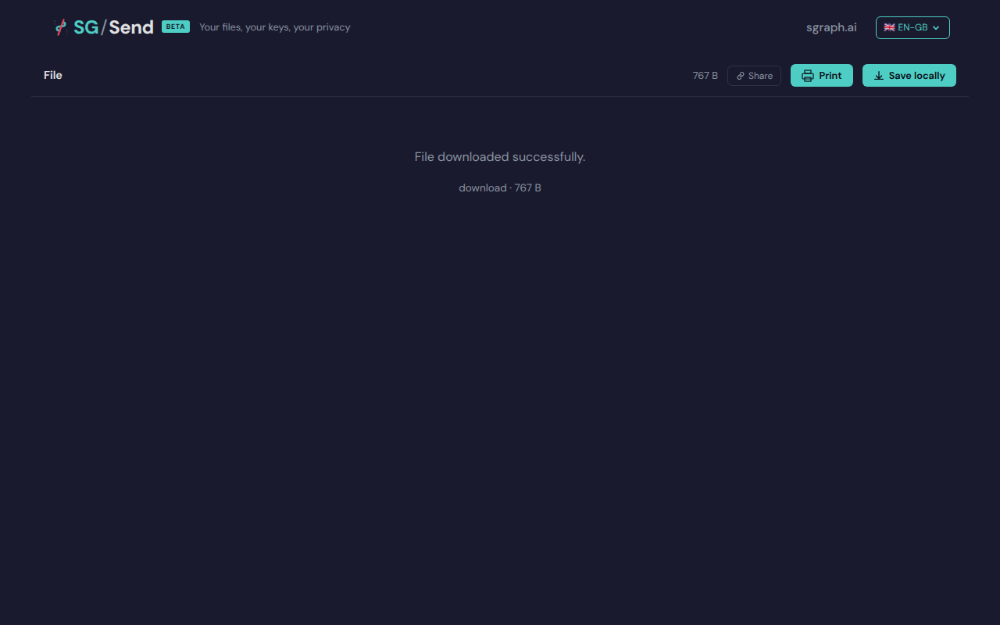

# Info Panel Toggle

> Test source at commit [`d7917483`](https://github.com/the-cyber-boardroom/SG_Send__QA/commit/d7917483) · v0.2.51

Info button toggles the info panel showing transfer metadata.

---

## Screenshots

### 04 Before Info

Before info panel toggle

