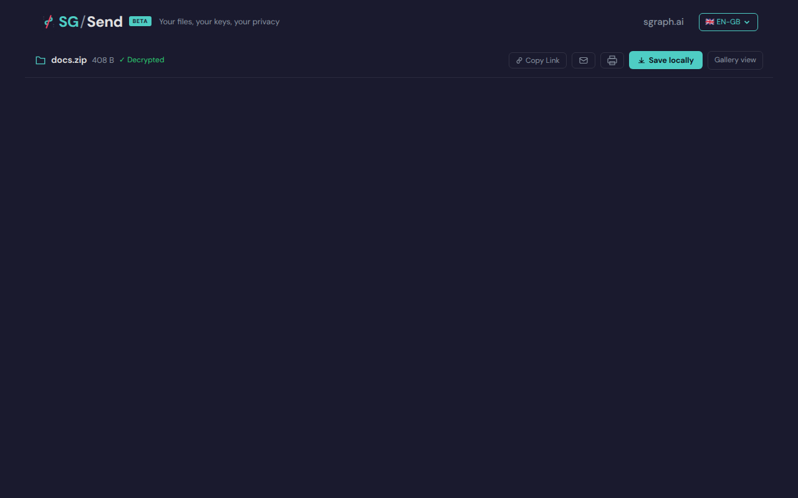

# Download  Browse

> Test source at commit [`5274a75a`](https://github.com/the-cyber-boardroom/SG_Send__QA/commit/5274a75a) · v0.2.44

UC-07: Browse view features (P1).

Test flow:
  - Verify folder tree renders with expand/collapse controls
  - Verify file click opens preview tab in right panel
  - Verify keyboard navigation: j/k moves through files, s saves
  - Verify Share tab shows URL + copy + email
  - Verify Info tab shows file counts by type, encryption info
  - Verify "Save locally" downloads the zip
  - Verify print button is present

[View source on GitHub](https://github.com/the-cyber-boardroom/SG_Send__QA/blob/dev/tests/qa/v030/p1__download__browse/test__download__browse.py) — `tests/qa/v030/p1__download__browse/test__download__browse.py`

---

## Test Methods

| Method | Description | Screenshots |
|--------|-------------|:-----------:|
| `browse_page_loads` | Browse page loads without errors. | 0 |
| `folder_tree_present` | Folder tree is rendered in the left panel. | 0 |
| `file_click_opens_preview` | Clicking a file in the tree opens a preview in the right panel. | 0 |
| `share_tab_present` | Share tab shows URL, copy, and email actions. | 0 |
| `info_tab_present` | Info tab shows file counts and encryption info. | 0 |
| `save_locally_button_present` | Save locally button is present in browse view. | 0 |
| `keyboard_navigation_j_k` | Keyboard j/k navigate through files in browse view (P2). | 0 |

## Screenshots

### 01 Browse Loaded

Browse view loaded


<details>
<summary>Deterministic view (non-dynamic areas only)</summary>



</details>

### 02 Folder Tree

Folder tree in browse view


<details>
<summary>Deterministic view (non-dynamic areas only)</summary>


</details>

### 06 Save Button

Save locally button


<details>
<summary>Deterministic view (non-dynamic areas only)</summary>


</details>

### 07 Keyboard J

After pressing j


<details>
<summary>Deterministic view (non-dynamic areas only)</summary>


</details>

### 08 Keyboard K

After pressing k


<details>
<summary>Deterministic view (non-dynamic areas only)</summary>


</details>

---

<details>
<summary>View test source — <code>tests/qa/v030/p1__download__browse/test__download__browse.py</code></summary>

```python
"""UC-07: Browse view features (P1).

Test flow:
  - Verify folder tree renders with expand/collapse controls
  - Verify file click opens preview tab in right panel
  - Verify keyboard navigation: j/k moves through files, s saves
  - Verify Share tab shows URL + copy + email
  - Verify Info tab shows file counts by type, encryption info
  - Verify "Save locally" downloads the zip
  - Verify print button is present

v0.3.1 notes:
  - BRW-001: Folder tree now shows basenames only (not full zip paths).
    test_folder_tree_present asserts the new correct behaviour.
  - BRW-002: PDF Present mode is now also in browse view (tested in v031 suite).
  - Use body[data-ready] (CR-001) instead of wait_for_timeout for page load.
  - Data-testid selectors (CR-003) used where available.
"""

import pytest
import zipfile
import io

pytestmark = pytest.mark.p1


def _make_folder_zip():
    buf = io.BytesIO()
    with zipfile.ZipFile(buf, "w") as zf:
        zf.writestr("docs/readme.md", "# Readme\n\nThis is the readme.")
        zf.writestr("docs/notes.txt", "Some notes here.")
        zf.writestr("docs/sub/extra.md", "# Extra\n\nExtra content.")
    buf.seek(0)
    return buf.read()


class TestBrowseViewFeatures:
    """Verify browse view UI features for a folder zip."""

    def _open_browse(self, page, ui_url, transfer_helper):
        zip_bytes = _make_folder_zip()
        tid, key_b64 = transfer_helper.upload_encrypted(zip_bytes, "docs.zip")
        browse_url = f"{ui_url}/en-gb/browse/#{tid}/{key_b64}"
        page.goto(browse_url)
        # CR-001: body[data-ready] is set when the UI finishes initialising —
        # more reliable than networkidle (which never resolves due to background API calls).
        page.wait_for_selector("body[data-ready]", timeout=10_000)
        page.wait_for_timeout(1_500)   # allow JS to render the tree
        return tid, key_b64

    def test_browse_page_loads(self, page, ui_url, transfer_helper, screenshots):
        """Browse page loads without errors."""
        tid, key_b64 = self._open_browse(page, ui_url, transfer_helper)
        screenshots.capture(page, "01_browse_loaded", "Browse view loaded")

        page_text = page.text_content("body") or ""
        assert "error" not in page_text.lower() or any(
            kw in page_text.lower() for kw in ["browse", "folder", "file", "tree"]
        ), "Browse page shows error"

    def test_folder_tree_present(self, page, ui_url, transfer_helper, screenshots):
        """Folder tree is rendered in the left panel.

        v0.3.1 / BRW-001: files in subfolders show basename only, not the full
        zip path. The zip has docs/sub/extra.md — the tree should show "extra.md",
        not "docs/sub/extra.md".
        """
        self._open_browse(page, ui_url, transfer_helper)
        screenshots.capture(page, "02_folder_tree", "Folder tree in browse view")

        # v0.3.1: tree file labels use .sb-tree__file-name class
        file_name_els = page.locator(".sb-tree__file-name").all()
        if file_name_els:
            # BRW-001 assertion: no file label contains a "/" (no full-path names)
            for el in file_name_els:
                name = el.text_content() or ""
                assert "/" not in name, (
                    f"BRW-001: Tree file label '{name}' contains '/' — "
                    "showing full zip path instead of basename. "
                    "This was fixed in v0.3.1 send-browse-v031.js."
                )
        else:
            # Fallback for environments where the component uses different selectors
            tree = page.locator(
                ".sb-tree__file, [class*='tree'], [class*='sidebar'], nav li"
            ).first
            assert tree.count() > 0 or page.locator("body").text_content() is not None, \
                "No tree elements found — browse view did not render"

    def test_file_click_opens_preview(self, page, ui_url, transfer_helper, screenshots):
        """Clicking a file in the tree opens a preview in the right panel."""
        self._open_browse(page, ui_url, transfer_helper)

        # Click the first file link in the tree
        file_link = page.locator("a[href*='#'], [class*='file'], [class*='tree-item']").first
        if file_link.is_visible(timeout=5000):
            file_link.click()
            page.wait_for_timeout(1000)
            screenshots.capture(page, "03_file_preview", "File preview after click")

    def test_share_tab_present(self, page, ui_url, transfer_helper, screenshots):
        """Share tab shows URL, copy, and email actions."""
        self._open_browse(page, ui_url, transfer_helper)

        share_tab = page.locator(
            "button:has-text('Share'), a:has-text('Share'), [class*='share-tab']"
        ).first
        if share_tab.is_visible(timeout=5000):
            share_tab.click()
            page.wait_for_timeout(500)
            screenshots.capture(page, "04_share_tab", "Share tab content")

            page_text = page.text_content("body") or ""
            assert any(kw in page_text.lower() for kw in ["copy", "email", "link", "url"]), \
                "Share tab does not show copy/email/link options"

    def test_info_tab_present(self, page, ui_url, transfer_helper, screenshots):
        """Info tab shows file counts and encryption info."""
        self._open_browse(page, ui_url, transfer_helper)

        info_tab = page.locator(
            "button:has-text('Info'), a:has-text('Info'), [class*='info-tab']"
        ).first
        if info_tab.is_visible(timeout=5000):
            info_tab.click()
            page.wait_for_timeout(500)
            screenshots.capture(page, "05_info_tab", "Info tab content")

            page_text = page.text_content("body") or ""
            assert any(kw in page_text.lower() for kw in ["file", "size", "encrypt"]), \
                "Info tab does not show file/size/encryption info"

    def test_save_locally_button_present(self, page, ui_url, transfer_helper, screenshots):
        """Save locally button is present in browse view."""
        self._open_browse(page, ui_url, transfer_helper)
        screenshots.capture(page, "06_save_button", "Save locally button")

        page_text = page.text_content("body") or ""
        assert any(kw in page_text.lower() for kw in ["save", "download"]), \
            "No save/download button found in browse view"

    def test_keyboard_navigation_j_k(self, page, ui_url, transfer_helper, screenshots):
        """Keyboard j/k navigate through files in browse view (P2)."""
        self._open_browse(page, ui_url, transfer_helper)

        # Focus the page body and press j/k
        page.locator("body").click()
        page.keyboard.press("j")
        page.wait_for_timeout(300)
        screenshots.capture(page, "07_keyboard_j", "After pressing j")

        page.keyboard.press("k")
        page.wait_for_timeout(300)
        screenshots.capture(page, "08_keyboard_k", "After pressing k")
        # Keyboard nav may or may not be implemented — test is documentation

```

</details>

