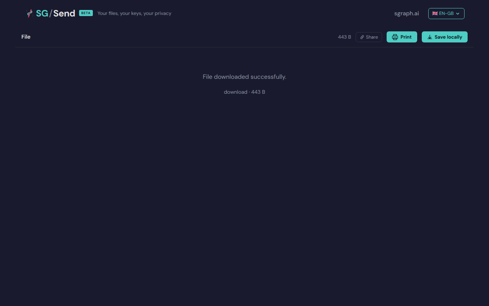

# Folder Tree Present

> Test source at commit [`d7917483`](https://github.com/the-cyber-boardroom/SG_Send__QA/commit/d7917483) · v0.2.51

Folder tree is rendered in the left panel.

---

## Screenshots

### 02 Folder Tree

Folder tree in browse view

