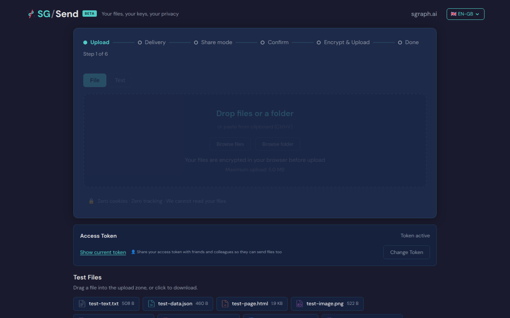
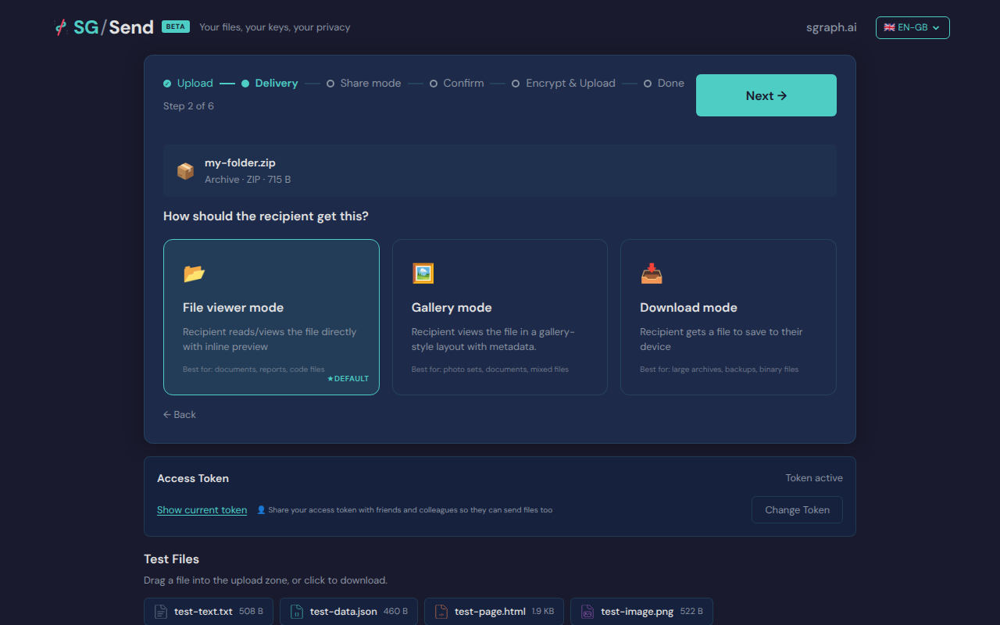
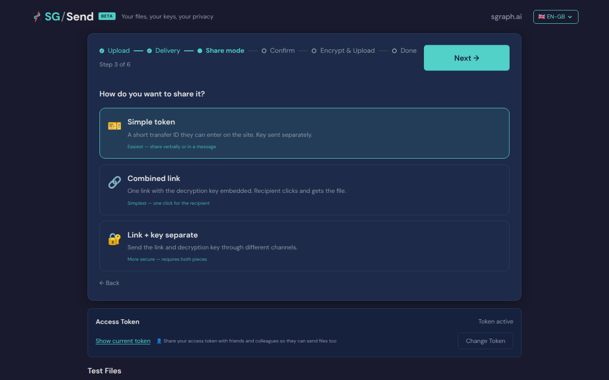
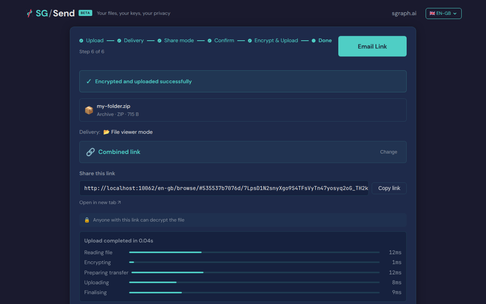
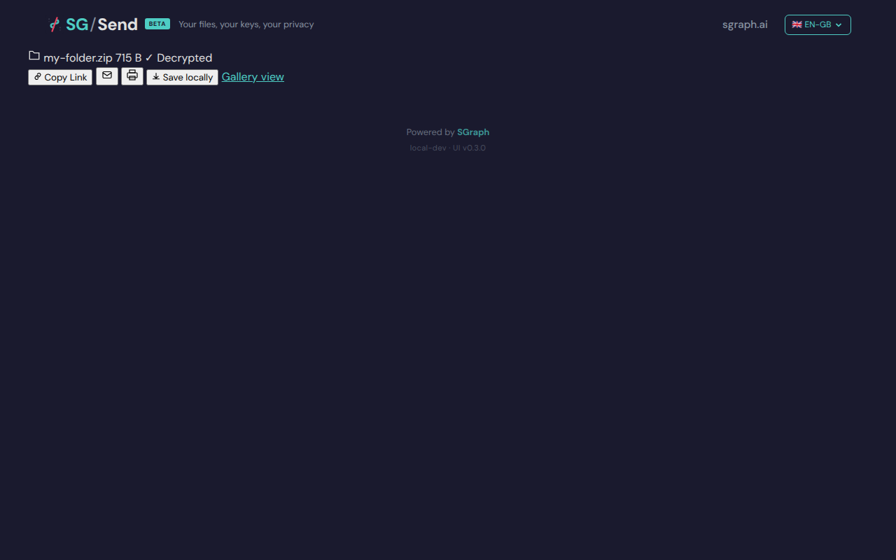
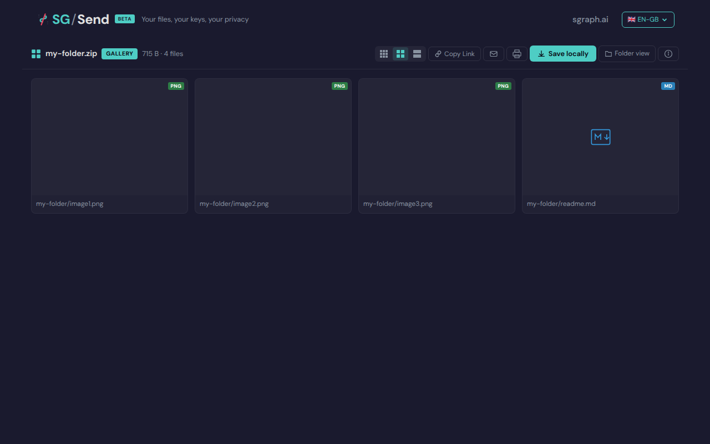
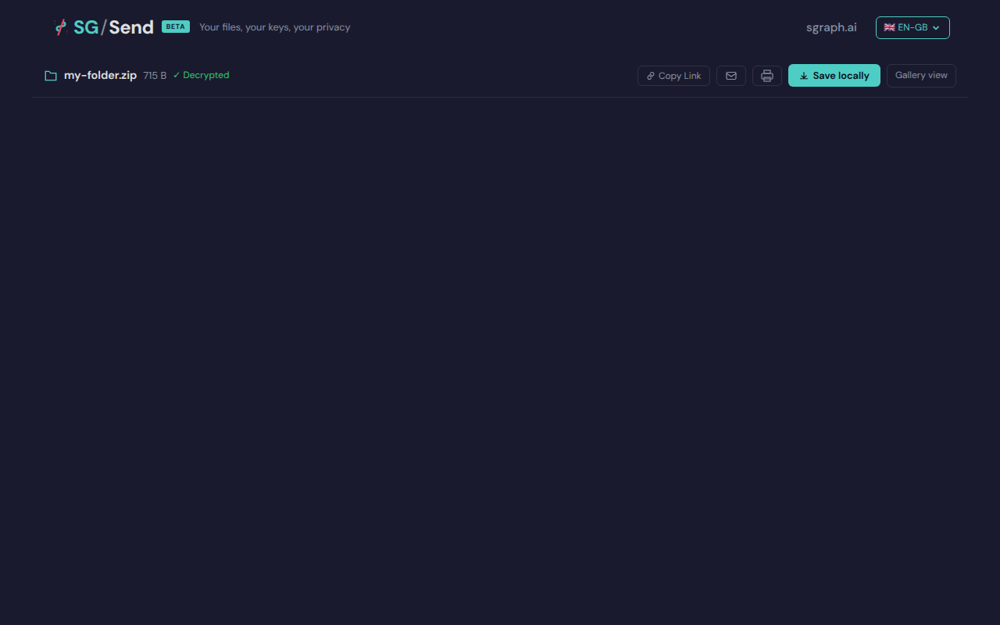
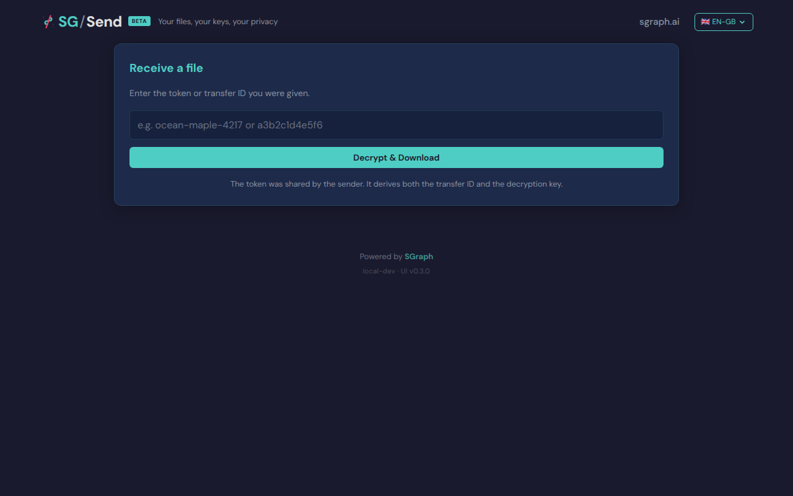

# Upload  Folder

> Test source at commit [`807336ab`](https://github.com/the-cyber-boardroom/SG_Send__QA/commit/807336ab) · v0.2.38

UC-02: Folder upload → gallery + browse view (P1).

Test flow:
  1. Upload a folder containing 3+ images and a markdown file
  2. Verify gallery mode is auto-selected (3+ images triggers gallery)
  3. Verify thumbnail grid renders with correct file count
  4. Click a thumbnail → verify lightbox opens
  5. Close lightbox → click "Folder view" link
  6. Verify browse view loads with folder tree
  7. Click a file in the tree → verify it opens in preview
  8. Click "Gallery view" → verify it switches back

[View source on GitHub](https://github.com/the-cyber-boardroom/SG_Send__QA/blob/dev/tests/qa/v030/p1__upload__folder/test__upload__folder.py) — `tests/qa/v030/p1__upload__folder/test__upload__folder.py`

---

## Test Methods

| Method | Description | Screenshots |
|--------|-------------|:-----------:|
| `upload_zip_and_gallery_view` | Upload a zip with 3+ images; verify gallery mode is shown. | 5 |
| `gallery_thumbnail_grid` | Create a zip upload via API, open gallery, verify thumbnail grid. | 1 |
| `browse_view_folder_tree` | Open browse view for the zip; verify folder tree is present. | 1 |
| `mode_switch_preserves_hash` | Gallery ↔ browse mode switching preserves the hash fragment. | 1 |

## Screenshots

### 01 Upload Page

Upload page loaded



### 02 File Selected

Zip file selected — delivery step



### 03 Share Step

Share mode step



### 04 Upload Done

Upload complete — link shown



### 05 Download Gallery

Gallery view after zip download



### 06 Gallery Thumbnails

Gallery thumbnail grid



### 07 Browse View

Browse view with folder tree



### 08 Switched To Browse

Switched to browse view



---

<details>
<summary>View test source — <code>tests/qa/v030/p1__upload__folder/test__upload__folder.py</code></summary>

```python
"""UC-02: Folder upload → gallery + browse view (P1).

Test flow:
  1. Upload a folder containing 3+ images and a markdown file
  2. Verify gallery mode is auto-selected (3+ images triggers gallery)
  3. Verify thumbnail grid renders with correct file count
  4. Click a thumbnail → verify lightbox opens
  5. Close lightbox → click "Folder view" link
  6. Verify browse view loads with folder tree
  7. Click a file in the tree → verify it opens in preview
  8. Click "Gallery view" → verify it switches back
"""

import pytest
import zipfile
import io

from playwright.sync_api import expect
from tests.qa.v030.browser_helpers import goto, handle_access_gate

pytestmark = pytest.mark.p1

# Minimal 1×1 PNG bytes (valid PNG, tiny file)
_PNG_HEADER = (
    b'\x89PNG\r\n\x1a\n'
    b'\x00\x00\x00\rIHDR\x00\x00\x00\x01\x00\x00\x00\x01'
    b'\x08\x02\x00\x00\x00\x90wS\xde'
    b'\x00\x00\x00\x0cIDATx\x9cc\xf8\x0f\x00\x00\x01\x01\x00\x05\x18\xd8N'
    b'\x00\x00\x00\x00IEND\xaeB`\x82'
)


def _make_folder_zip():
    """Build an in-memory zip with 3 PNG images + 1 markdown file."""
    buf = io.BytesIO()
    with zipfile.ZipFile(buf, "w") as zf:
        zf.writestr("my-folder/image1.png", _PNG_HEADER)
        zf.writestr("my-folder/image2.png", _PNG_HEADER)
        zf.writestr("my-folder/image3.png", _PNG_HEADER)
        zf.writestr("my-folder/readme.md", "# Test folder\n\nThis is a test.")
    buf.seek(0)
    return buf.read()


class TestFolderUpload:
    """Upload a folder zip and verify gallery + browse views."""

    def test_upload_zip_and_gallery_view(self, page, ui_url, send_server, screenshots):
        """Upload a zip with 3+ images; verify gallery mode is shown."""
        goto(page, f"{ui_url}/en-gb/")
        handle_access_gate(page, send_server.access_token)
        screenshots.capture(page, "01_upload_page", "Upload page loaded")

        # Feed the zip file
        zip_bytes = _make_folder_zip()
        page.locator("#file-input").set_input_files({
            "name"    : "my-folder.zip",
            "mimeType": "application/zip",
            "buffer"  : zip_bytes,
        })
        # Wait for wizard to auto-advance to delivery step
        page.locator("#upload-next-btn").wait_for(state="visible")
        screenshots.capture(page, "02_file_selected", "Zip file selected — delivery step")

        # Delivery → Share mode
        page.locator("#upload-next-btn").click()
        page.locator("[data-mode]").first.wait_for(state="visible")
        screenshots.capture(page, "03_share_step", "Share mode step")

        # Select combined link — auto-advances to confirm step
        page.locator('[data-mode="combined"]').click()
        page.wait_for_timeout(500)  # let confirm step transition settle

        # Confirm → Encrypt & Upload — done step shows link as <a href>
        page.locator("#upload-next-btn").click()
        page.locator("a[href*='#']").first.wait_for(state="attached", timeout=20_000)
        screenshots.capture(page, "04_upload_done", "Upload complete — link shown")

        # Extract download URL
        download_url = page.locator("a[href*='#']").first.get_attribute("href") or ""
        if not download_url:
            for el in page.locator("input[readonly]").all():
                val = el.get_attribute("value") or ""
                if "#" in val:
                    download_url = val
                    break

        assert download_url, "No download link found after folder upload"

        if download_url.startswith("/"):
            download_url = f"{ui_url}{download_url}"

        # Open the download page — expect gallery view (3 images auto-select gallery)
        dl_page = page.context.new_page()
        try:
            goto(dl_page, download_url)
            screenshots.capture(dl_page, "05_download_gallery", "Gallery view after zip download")

            page_text = dl_page.text_content("body") or ""
            assert any(kw in page_text.lower() for kw in ["gallery", "image", "thumbnail", "photo"]), \
                "Gallery view not detected for image-heavy zip"
        finally:
            dl_page.close()

    def test_gallery_thumbnail_grid(self, page, ui_url, transfer_helper, screenshots):
        """Create a zip upload via API, open gallery, verify thumbnail grid."""
        zip_bytes = _make_folder_zip()
        tid, key_b64 = transfer_helper.upload_encrypted(zip_bytes, "my-folder.zip")

        gallery_url = f"{ui_url}/en-gb/gallery/#{tid}/{key_b64}"
        goto(page, gallery_url)
        # Wait for the body to contain meaningful content
        expect(page.locator("body")).not_to_be_empty(timeout=10_000)
        screenshots.capture(page, "06_gallery_thumbnails", "Gallery thumbnail grid")

        page_text = page.text_content("body") or ""
        assert "error" not in page_text.lower() or "gallery" in page_text.lower(), \
            "Gallery page shows error instead of content"

    def test_browse_view_folder_tree(self, page, ui_url, transfer_helper, screenshots):
        """Open browse view for the zip; verify folder tree is present."""
        zip_bytes = _make_folder_zip()
        tid, key_b64 = transfer_helper.upload_encrypted(zip_bytes, "my-folder.zip")

        browse_url = f"{ui_url}/en-gb/browse/#{tid}/{key_b64}"
        goto(page, browse_url)
        expect(page.locator("body")).not_to_be_empty(timeout=10_000)
        screenshots.capture(page, "07_browse_view", "Browse view with folder tree")

        page_text = page.text_content("body") or ""
        assert "error" not in page_text.lower() or "browse" in page_text.lower(), \
            "Browse page shows error instead of content"

    def test_mode_switch_preserves_hash(self, page, ui_url, transfer_helper, screenshots):
        """Gallery ↔ browse mode switching preserves the hash fragment."""
        zip_bytes = _make_folder_zip()
        tid, key_b64 = transfer_helper.upload_encrypted(zip_bytes, "my-folder.zip")
        expected_hash = f"#{tid}/{key_b64}"

        # Start at gallery
        gallery_url = f"{ui_url}/en-gb/gallery/{expected_hash}"
        goto(page, gallery_url)
        expect(page.locator("body")).not_to_be_empty(timeout=10_000)

        # Look for "Folder view" / "Browse" link and click it
        browse_link = page.locator(
            "a:has-text('Folder view'), a:has-text('Browse'), a[href*='browse']"
        ).first
        if browse_link.is_visible(timeout=5_000):
            browse_link.click()
            expect(page.locator("body")).not_to_be_empty(timeout=10_000)
            screenshots.capture(page, "08_switched_to_browse", "Switched to browse view")

            # Verify navigation reached browse (hash preservation depends on UI version)
            current_url = page.url
            assert "/browse/" in current_url, \
                f"Mode switch did not navigate to browse: {current_url}"

```

</details>

