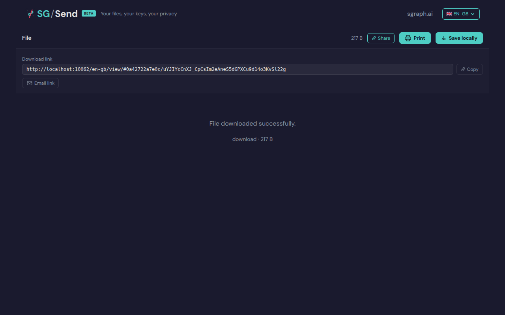

# Copy Url Contains Key

> Test source at commit [`ff564c02`](https://github.com/the-cyber-boardroom/SG_Send__QA/commit/ff564c02) · v0.2.40

The share URL shown in the panel contains the key (hash fragment).

---

## Screenshots

### 05 Url With Key

URL input with key

