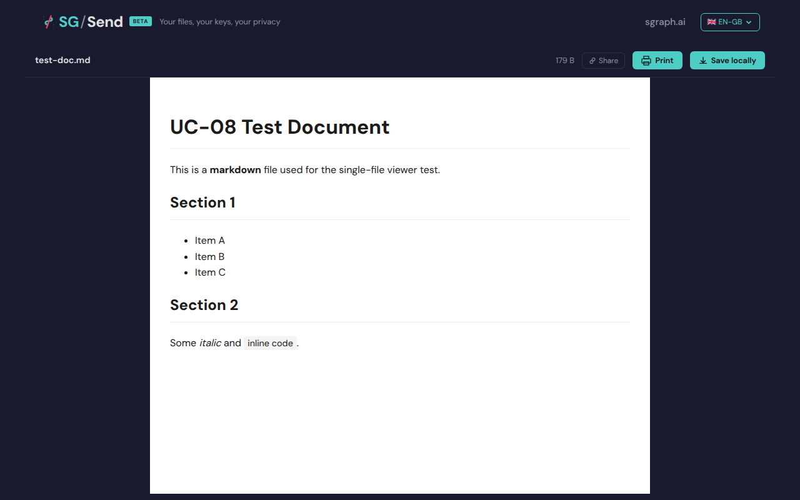
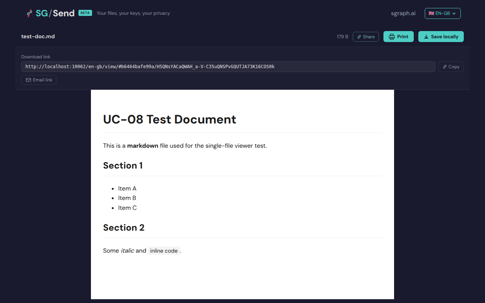

# Download  Viewer

> Generated at commit [`6e8ee11b`](https://github.com/the-cyber-boardroom/SG_Send__QA/commit/6e8ee11b) · v0.2.37 · 2026-03-26 01:41 UTC

UC-08: Single file viewer (P1).

Test flow:
  - Upload a markdown file via API, open the download/view link
  - Verify markdown renders (or content displays)
  - Verify Share button toggles share panel with download link
  - Verify Copy copies the URL with key intact
  - Verify Print button is present
  - Verify Save locally downloads the file

[View source on GitHub](https://github.com/the-cyber-boardroom/SG_Send__QA/blob/dev/tests/qa/v030/p1__download__viewer/test__download__viewer.py) — `tests/qa/v030/p1__download__viewer/test__download__viewer.py`

---

## Test Methods

| Method | Description | Screenshots |
|--------|-------------|:-----------:|
| `viewer_page_loads` | Single-file viewer loads without errors. | 1 |
| `markdown_content_displayed` | Markdown file content is decrypted and displayed. | 1 |
| `share_button_present` | Share button is present and toggles the share panel. | 2 |
| `copy_url_contains_key` | The share URL shown in the panel contains the key (hash fragment). | 1 |
| `save_locally_button_present` | Save locally button is present in the viewer. | 1 |
| `short_url_v_route` | Short URL /en-gb/v/ works the same as /en-gb/view/. | 1 |

## Screenshots

### 01 Viewer Loaded

Single file viewer loaded



### 02 Content

Decrypted markdown content


### 03 Before Share

Before share panel


### 04 Share Panel

Share panel opened



### 05 Url With Key

URL input with key


### 06 Save Button

Save locally button


### 07 Short Url V

Short /v/ route loads viewer


---

<details>
<summary>View test source — <code>tests/qa/v030/p1__download__viewer/test__download__viewer.py</code></summary>

```python
"""UC-08: Single file viewer (P1).

Test flow:
  - Upload a markdown file via API, open the download/view link
  - Verify markdown renders (or content displays)
  - Verify Share button toggles share panel with download link
  - Verify Copy copies the URL with key intact
  - Verify Print button is present
  - Verify Save locally downloads the file
"""

import pytest

from playwright.sync_api import expect
from tests.qa.v030.browser_helpers import goto

pytestmark = pytest.mark.p1

MARKDOWN_CONTENT = b"""# UC-08 Test Document

This is a **markdown** file used for the single-file viewer test.

## Section 1

- Item A
- Item B
- Item C

## Section 2

Some *italic* and `inline code`.
"""


class TestSingleFileViewer:
    """Verify the single-file viewer for a markdown upload."""

    def _open_viewer(self, page, ui_url, transfer_helper, route="view"):
        tid, key_b64 = transfer_helper.upload_encrypted(MARKDOWN_CONTENT, "test-doc.md")
        view_url = f"{ui_url}/en-gb/{route}/#{tid}/{key_b64}"
        goto(page, view_url)
        # Wait for page content to be present — JS decryption takes a moment
        expect(page.locator("body")).not_to_be_empty(timeout=10_000)
        return tid, key_b64

    def test_viewer_page_loads(self, page, ui_url, transfer_helper, screenshots):
        """Single-file viewer loads without errors."""
        tid, key_b64 = self._open_viewer(page, ui_url, transfer_helper)
        screenshots.capture(page, "01_viewer_loaded", "Single file viewer loaded")

        page_text = page.text_content("body") or ""
        assert "error" not in page_text.lower() or len(page_text) > 100, \
            "Viewer page shows error or is empty"

    def test_markdown_content_displayed(self, page, ui_url, transfer_helper, screenshots):
        """Markdown file content is decrypted and displayed."""
        self._open_viewer(page, ui_url, transfer_helper)
        screenshots.capture(page, "02_content", "Decrypted markdown content")

        page_text = page.text_content("body") or ""
        # The document heading or content should appear
        assert "UC-08 Test Document" in page_text or "Section 1" in page_text, \
            f"Markdown content not found in viewer. Page text: {page_text[:300]}"

    def test_share_button_present(self, page, ui_url, transfer_helper, screenshots):
        """Share button is present and toggles the share panel."""
        tid, key_b64 = self._open_viewer(page, ui_url, transfer_helper)
        screenshots.capture(page, "03_before_share", "Before share panel")

        share_btn = page.locator(
            "button:has-text('Share'), [class*='share-btn'], [title*='share']"
        ).first
        if share_btn.is_visible(timeout=5000):
            share_btn.click()
            # Wait for share panel content to appear
            page.locator("body").wait_for(state="visible")
            screenshots.capture(page, "04_share_panel", "Share panel opened")

            page_text = page.text_content("body") or ""
            assert any(kw in page_text.lower() for kw in ["copy", "link", "email", "url"]), \
                "Share panel does not show link/copy options"

    def test_copy_url_contains_key(self, page, ui_url, transfer_helper, screenshots):
        """The share URL shown in the panel contains the key (hash fragment)."""
        tid, key_b64 = self._open_viewer(page, ui_url, transfer_helper)

        share_btn = page.locator(
            "button:has-text('Share'), [class*='share-btn']"
        ).first
        if share_btn.is_visible(timeout=5000):
            share_btn.click()
            page.locator("body").wait_for(state="visible")

        # URL input in share panel
        url_input = page.locator("input[readonly], input[value*='#']").first
        if url_input.is_visible(timeout=3000):
            url_value = url_input.get_attribute("value") or ""
            screenshots.capture(page, "05_url_with_key", "URL input with key")
            assert "#" in url_value, \
                f"Share URL missing hash (key not included): {url_value}"
            assert tid in url_value, \
                f"Share URL missing transfer ID: {url_value}"

    def test_save_locally_button_present(self, page, ui_url, transfer_helper, screenshots):
        """Save locally button is present in the viewer."""
        self._open_viewer(page, ui_url, transfer_helper)
        screenshots.capture(page, "06_save_button", "Save locally button")

        page_text = page.text_content("body") or ""
        assert any(kw in page_text.lower() for kw in ["save", "download"]), \
            "No save/download button found in single-file viewer"

    def test_short_url_v_route(self, page, ui_url, transfer_helper, screenshots):
        """Short URL /en-gb/v/ works the same as /en-gb/view/."""
        tid, key_b64 = self._open_viewer(page, ui_url, transfer_helper, route="v")
        screenshots.capture(page, "07_short_url_v", "Short /v/ route loads viewer")

        page_text = page.text_content("body") or ""
        assert "error" not in page_text.lower() or len(page_text) > 100, \
            "/v/ short route shows error or is empty"

```

</details>

