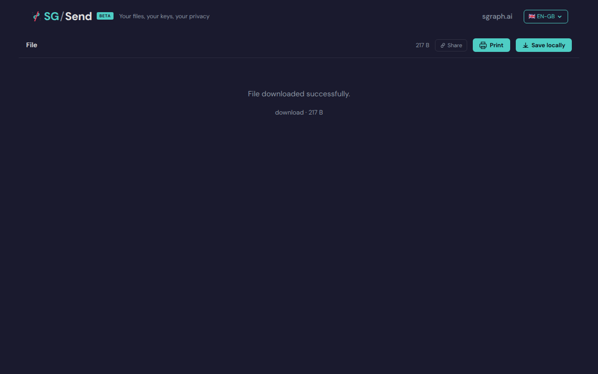

# Save Locally Button Present

> Generated at commit [`6e8ee11b`](https://github.com/the-cyber-boardroom/SG_Send__QA/commit/6e8ee11b) · v0.2.37 · 2026-03-26 01:41 UTC

Save locally button is present in the viewer.

---

## Screenshots

### 06 Save Button

Save locally button

