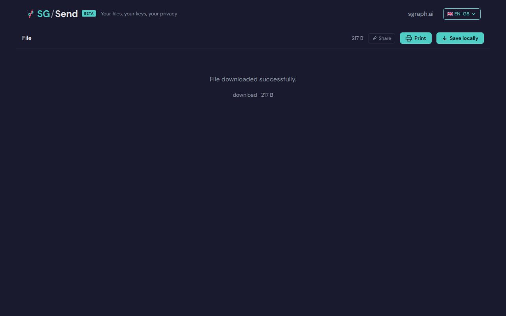

# Save Locally Button Present

> Test source at commit [`d7917483`](https://github.com/the-cyber-boardroom/SG_Send__QA/commit/d7917483) · v0.2.51

Save locally button is present in the viewer.

---

## Screenshots

### 06 Save Button

Save locally button

