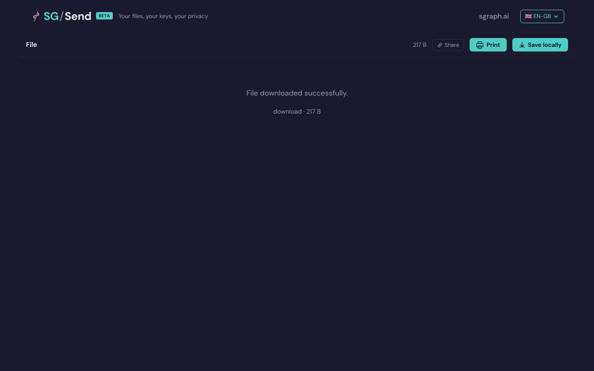

# Viewer Page Loads

> Test source at commit [`d7917483`](https://github.com/the-cyber-boardroom/SG_Send__QA/commit/d7917483) · v0.2.51

Single-file viewer loads without errors.

---

## Screenshots

### 01 Viewer Loaded

Single file viewer loaded

