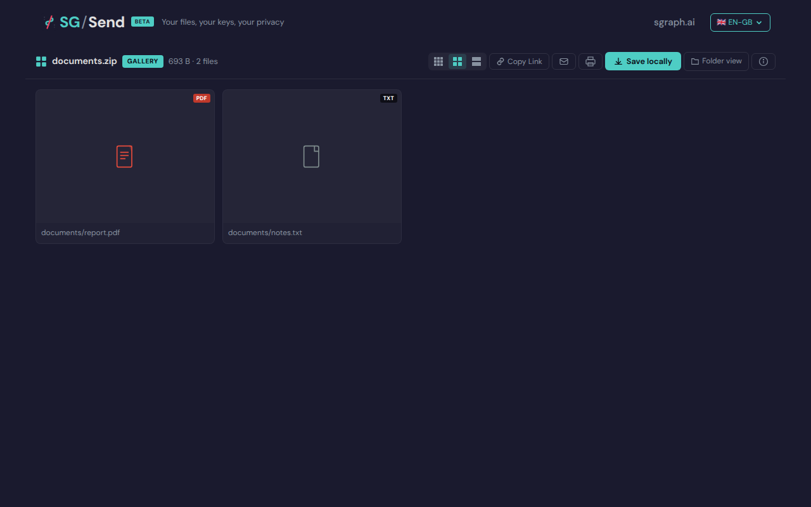
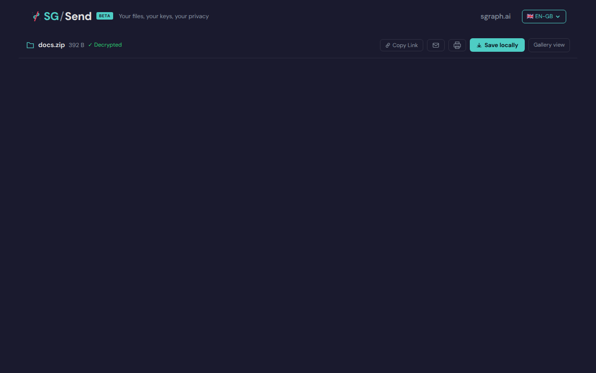

# Pdf Present

UC-06 (P2): PDF lightbox — Present mode and 'f' fullscreen shortcut.

Test flow:
  - Upload a minimal valid PDF as part of a zip
  - Open the gallery view
  - Click the PDF thumbnail to open it in the lightbox
  - Verify a "Present" button appears (PDF-specific control)
  - Click Present and verify the viewer enters present/fullscreen mode
  - Verify the 'f' keyboard shortcut also triggers the present mode
  - Verify the 's' keyboard shortcut saves / downloads the current file

These tests are P2 — they verify progressive-enhancement behaviour and do not
block deployment if failing.

---

## Test Methods

| Method | Description | Screenshots |
|--------|-------------|:-----------:|
| `pdf_lightbox_opens` | Clicking the PDF thumbnail opens the lightbox without error. | 1 |
| `present_button_visible_for_pdf` | A 'Present' button appears in the lightbox when viewing a PDF. | 1 |
| `present_button_click_enters_fullscreen` | Clicking the Present button enters full-screen / presentation mode. | 0 |
| `f_shortcut_triggers_present` | The 'f' keyboard shortcut triggers present / fullscreen mode. | 2 |
| `s_key_triggers_save` | Pressing 's' when a file is selected triggers save/download. | 2 |
| `j_key_moves_selection_down` | 'j' key moves file selection down in browse view. | 0 |
| `k_key_moves_selection_up` | 'k' key moves file selection up in browse view. | 0 |

## Screenshots

### 01 Pdf Lightbox

PDF opened in lightbox

### 02 Present Button

Present button in PDF lightbox

### 05 Before F Shortcut

Before 'f' shortcut

### 06 After F Shortcut

After 'f' shortcut

### 01 File Selected

File selected in browse

### 02 S Key Pressed

's' key pressed (no download dialog)

