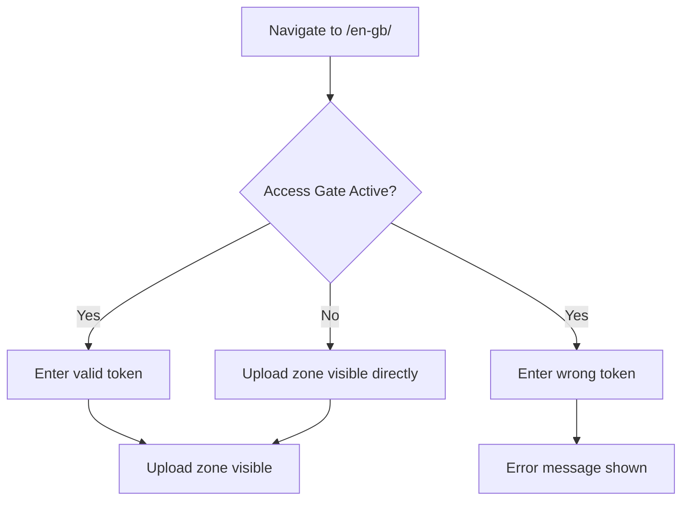

# Access Token Gate (UC-10)

Verifies the full access-token gate lifecycle: entering a valid token grants access, entering a wrong token shows an error, and ungated deployments show the upload zone directly.

**Priority:** P1 — requires human sign-off if failing

---

## Overview

SG/Send protects file sharing behind an **access token gate**. This use case tests the complete gate flow using the real SG/Send API (in-memory) and a headless browser.

| Property | Value |
|----------|-------|
| **Test file** | `tests/qa/v030/test__access_gate.py` |
| **Target** | Local test server (in-memory API + static UI) |
| **Fixtures** | `send_server`, `ui_server`, `page`, `screenshots` |
| **Priority** | P1 |

## Why This Test Matters

The access gate is SG/Send's **authentication boundary**. These tests verify:

- **Valid token accepted** — entering the correct token reveals the upload zone
- **Wrong token rejected** — bad tokens produce visible error feedback
- **Ungated fallback** — if no gate is configured, the upload zone appears immediately
- **Token counter** — server-side token persistence (documented bug tracking)

## Test Scenarios



### 1. Valid Token Grants Access

Navigates to the upload page, enters the real access token, and verifies the upload zone becomes visible (file input or upload-related text).

**Screenshots produced:**
- `01_landing.png` — Landing page (gate or upload zone)
- `02_after_token.png` — After entering the access token

### 2. Wrong Token Shows Error

Enters `wrong-token-12345-xxxxx` and verifies the UI shows an error indication or the gate remains visible.

**Screenshots produced:**
- `03_wrong_token.png` — Response to invalid token

### 3. Upload Zone Without Gate

If no access gate is configured, the upload zone should be immediately visible without token entry.

**Screenshots produced:**
- `04_no_gate.png` — Upload zone without gate (skipped if gate is active)

### 4. Token Counter (Bug Tracking)

Documents the server-side token counter behaviour. Hits the `/info/health` endpoint to verify the API is responsive. This test tracks a known area of interest around token persistence.

---

## Technical Details

```
Viewport:   1280 x 800
Browser:    Chromium (headless)
Screenshot: CDP Page.captureScreenshot
API:        In-memory SG/Send User Lambda (no network)
```

Unlike the v0.2.0 integration tests that hit production, v0.3.0 tests run against a **fully local stack** — the real SG/Send API running in-memory with a local static UI server. This makes tests deterministic and fast.

---

## Related Use Cases

| Use Case | Relationship |
|----------|-------------|
| [Landing Page Loads](../landing_page_loads/) | Earlier version of the same entry-point test |
| [Access Gate Present](../landing_page_has_access_gate/) | Earlier version — gate presence only |
| [Invalid Token Rejected](../invalid_token_rejected/) | Earlier version — rejection flow only |
| [Route Handling](../route_handling/) | Tests what happens after the gate is passed |
