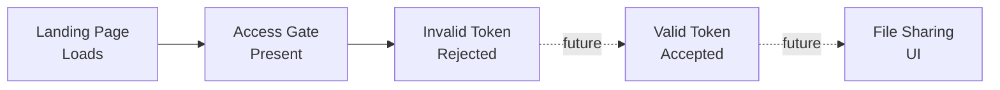

# Use Cases

All documented user workflows for SG/Send, each verified by automated browser tests.

---

## Landing & Authentication

These tests verify the initial user experience — from page load through access gate authentication.

| # | Use Case | Description | Screenshots |
|:-:|----------|-------------|:-----------:|
| 1 | [Landing Page Loads](landing_page_loads/landing_page_loads) | SG/Send loads and renders the Beta Access UI | 1 |
| 2 | [Access Gate Present](landing_page_has_access_gate/landing_page_has_access_gate) | Token input field and Go button are visible | 1 |
| 3 | [Invalid Token Rejected](invalid_token_rejected/invalid_token_rejected) | Invalid tokens are rejected with error feedback | 3 |

---

## Coming Next

Future use cases planned for the test suite:

- **Valid token accepted** — enter a real token, verify access is granted
- **File upload flow** — upload a file through the sharing UI
- **File download flow** — retrieve a shared file via link
- **Token expiry handling** — verify expired tokens are rejected
- **Admin panel access** — admin login and dashboard
