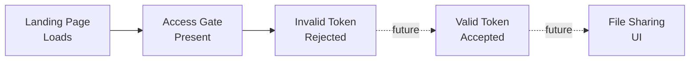
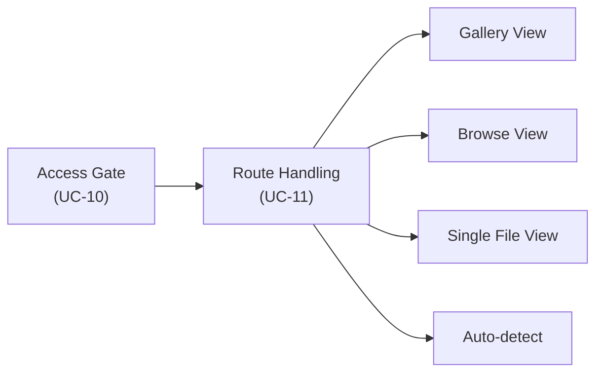

# Use Cases

All documented user workflows for SG/Send, each verified by automated browser tests.

---

## Landing & Authentication

These tests verify the initial user experience — from page load through access gate authentication.

```mermaid
flowchart LR
    A["Landing Page\nLoads"] --> B["Access Gate\nPresent"]
    B --> C["Invalid Token\nRejected"]
    C -.->|future| D["Valid Token\nAccepted"]
    D -.->|future| E["File Sharing\nUI"]
```

| # | Use Case | Description | Screenshots |
|:-:|----------|-------------|:-----------:|
| 1 | [Landing Page Loads](landing_page_loads/) | SG/Send loads and renders the Beta Access UI | 1 |
| 2 | [Access Gate Present](landing_page_has_access_gate/) | Token input field and Go button are visible | 1 |
| 3 | [Invalid Token Rejected](invalid_token_rejected/) | Invalid tokens are rejected with error feedback | 3 |

---

## v0.3.0 — Local Stack Tests

These tests run against a **fully local stack** (in-memory API + static UI server) for deterministic, fast results. They use real encryption matching the browser's Web Crypto implementation.

```mermaid
flowchart LR
    A["Access Gate\n(UC-10)"] --> B["Route Handling\n(UC-11)"]
    B --> C["Gallery View"]
    B --> D["Browse View"]
    B --> E["Single File View"]
    B --> F["Auto-detect"]
```

| # | Use Case | Description | Priority |
|:-:|----------|-------------|:--------:|
| 10 | [Access Token Gate](access_gate/) | Full gate lifecycle: valid token, wrong token, ungated fallback | P1 |
| 11 | [Route Handling & Mode Switching](route_handling/) | All download routes, hash preservation, mode switching | P1 |

> These are the first two v0.3.0 use cases wired into the QA site. More will follow as tests are validated.

---

## Coming Next

Remaining v0.3.0 tests to integrate:

- **Single file upload** (UC-01) — upload a file through the UI
- **Folder upload** (UC-02) — upload a folder/zip
- **Download: Browse** (UC-03) — browse view for multi-file transfers
- **Download: Gallery** (UC-04) — image gallery view
- **Download: Viewer** (UC-05) — single file viewer
- **Manual entry** (UC-06) — enter transfer ID + key manually
- **Separate key** (UC-07) — key delivered separately from link
- **Combined link** (UC-08) — link with embedded key
- **Friendly token** (UC-09) — human-readable token format
- **Zero knowledge** (UC-12) — verify server never sees plaintext
