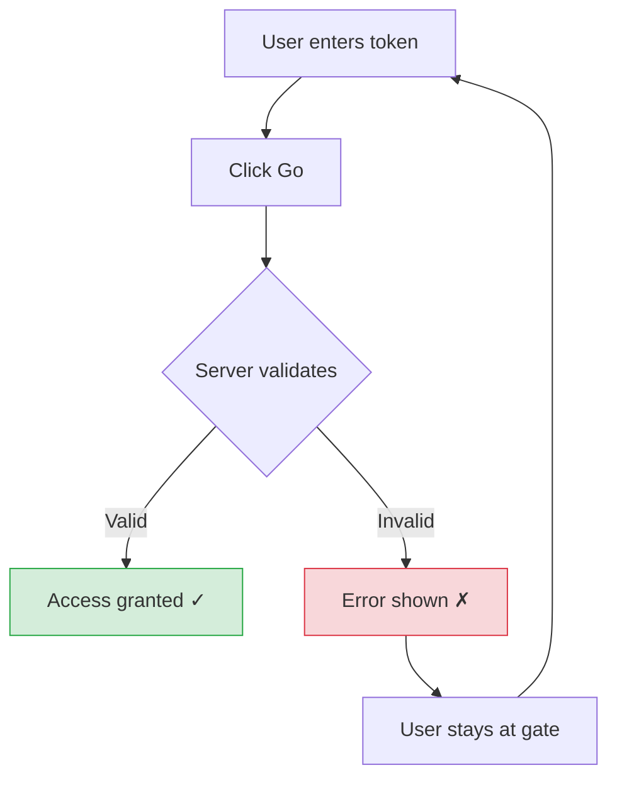
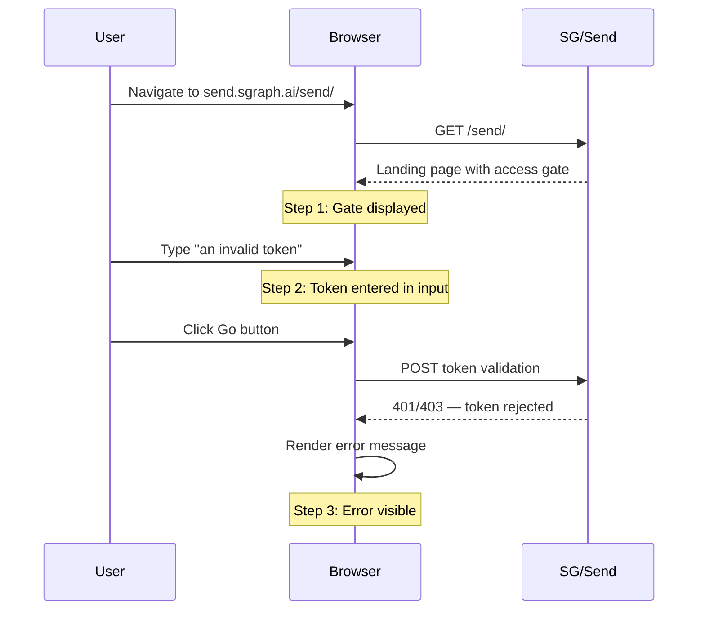

# Invalid Token Rejected

Verifies that SG/Send correctly rejects invalid access tokens and displays appropriate error feedback to the user.

---

## Overview

This is the most **security-critical** test in the current suite. It exercises the full token validation flow: entering an invalid token, submitting it, and confirming the system rejects it with a visible error. A failure here could indicate that the authentication gate is bypassable.

| Property | Value |
|----------|-------|
| **Test file** | `tests/integration/user/test_landing_page.py::test_invalid_token_rejected` |
| **Target URL** | `https://send.sgraph.ai/send/` |
| **Test input** | `"an invalid token"` |
| **Wait strategy** | `domcontentloaded` + 3s settle per step |
| **Steps** | 3 (before token, token entered, token rejected) |
| **Assertion** | Multi-step — page loads, input found, button clicked |

## Why This Test Matters

Token validation is the **security boundary** of SG/Send. This test catches:

- **Bypass vulnerabilities** — invalid tokens are accepted (critical security failure)
- **Missing error feedback** — token is rejected server-side but the user sees no indication
- **Broken form submission** — the Go button doesn't work, input field is unresponsive
- **Client-side validation gaps** — token is rejected locally without server validation
- **UX regressions** — error message is present but unreadable or poorly positioned

> If invalid tokens are accepted, the access gate is effectively **disabled** and the platform is open to anyone. This test is the most important guard against that scenario.

## Security Context



The token validation flow has several important security properties:

1. **Server-side validation** — tokens are checked against the backend, not client-side
2. **No information leakage** — the error does not reveal whether the token exists, is expired, or is malformed
3. **No rate-limit bypass** — repeated invalid attempts should not eventually succeed
4. **State preserved** — after rejection, the user remains at the access gate (not redirected to an error page)

## User Flow



---

## Step-by-Step Screenshots

### Step 1: Before Token Entry

The test begins at the landing page with an empty access gate. This establishes the **baseline state** before any user interaction.


**What to observe:**
- Token input field is **empty** and ready for input
- Go button is visible and appears clickable
- No error messages are displayed (clean initial state)

---

### Step 2: Invalid Token Entered

The test types `"an invalid token"` into the access field. This screenshot captures the state **after input but before submission** — confirming the form accepts user input.


**What to observe:**
- The input field shows the typed text `"an invalid token"`
- The Go button remains available for clicking
- No premature validation — the UI does not reject the token before submission

---

### Step 3: Token Rejected

After clicking Go, the server validates the token and rejects it. The UI should display a clear error message while keeping the user at the access gate.


**What to observe:**
- An **error indication** is visible (text, colour change, or icon)
- The user **remains on the access gate** (not redirected away)
- The input field may be cleared or retain the invalid token
- The Go button is still accessible for retry

---

## Test Implementation Detail

The test uses a **progressive approach** — each step builds on the previous one:

```
Step 1:  Navigate to /send/
         └─ Capture: 01_before_token.png
         └─ Purpose: Establish baseline

Step 2:  Find first <input> element
         └─ Fill with "an invalid token"
         └─ Capture: 02_token_entered.png
         └─ Purpose: Verify input works

Step 3:  Find first <button> element
         └─ Click it
         └─ Wait 3 seconds for server response
         └─ Capture: 03_token_rejected.png
         └─ Purpose: Verify rejection + error display
```

The test uses `page.locator("input").first` and `page.locator("button").first` rather than specific selectors — this makes the test resilient to markup changes while still exercising the primary authentication flow.

## What Gets Verified

| Step | Assertion | Why |
|------|-----------|-----|
| 1 | Page loads successfully | Prerequisite for interaction |
| 2 | Input field is visible and fillable | Gate UI is functional |
| 3 | Button is visible and clickable | Submission mechanism works |
| 3+ | Screenshot captures post-submit state | Visual evidence of rejection |

## Technical Details

```
Viewport:     1280 x 720
Browser:      Chromium (headless)
Screenshot:   CDP Page.captureScreenshot (x3)
Format:       PNG
Test input:   "an invalid token"
Wait time:    3000ms per step (network + render)
```

---

## Related Use Cases

| Use Case | Relationship |
|----------|-------------|
| [Landing Page Loads](../landing_page_loads/) | Prerequisite — the page must load before tokens can be entered |
| [Access Gate Present](../landing_page_has_access_gate/) | Prerequisite — the gate must be visible for interaction |
