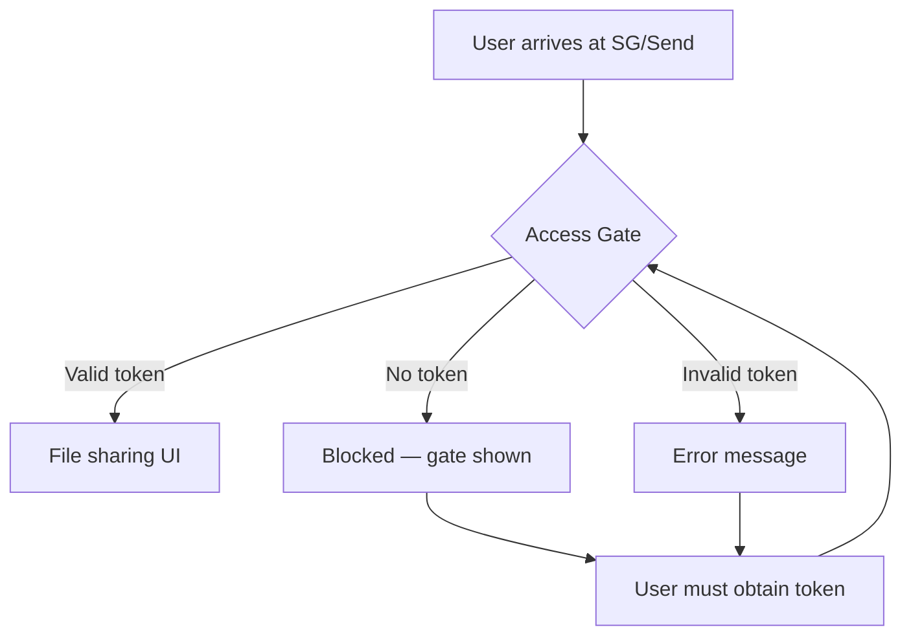
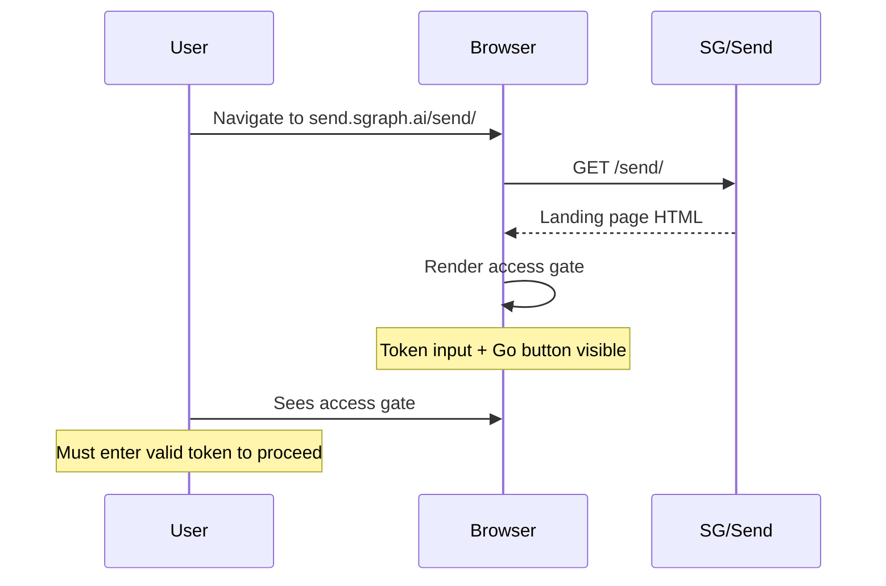

# Landing Page Has Access Gate

Verifies that the SG/Send landing page displays the Beta Access gate — the token-based authentication barrier that protects the file sharing functionality.

---

## Overview

SG/Send uses a **gated access model**: users cannot interact with any file sharing features until they provide a valid access token. This test confirms the gate is present and the authentication UI is rendered.

| Property | Value |
|----------|-------|
| **Test file** | `tests/integration/user/test_landing_page.py::test_landing_page_has_access_gate` |
| **Target URL** | `https://send.sgraph.ai/send/` |
| **Wait strategy** | `domcontentloaded` + 3s settle |
| **Assertion** | Page URL is valid (page loaded successfully) |

## Why This Test Matters

The access gate is SG/Send's **first line of defence**. Without it, anyone with the URL could access the file sharing platform. This test catches:

- **Missing access gate** — the authentication UI has been accidentally removed or bypassed
- **Broken gate rendering** — the form is present in the DOM but not visible to the user
- **Regression from updates** — a deployment changed the authentication flow

> The access gate enforces the principle that **no functionality is available without authentication**. If this test fails, the platform may be exposed to unauthenticated access.

## Security Model



The access gate implements a simple but effective pattern:

1. **All routes are protected** — there is no public area behind the gate
2. **Token is required** — the UI presents a single input field for the access token
3. **Immediate feedback** — invalid tokens produce a visible error (see [Invalid Token Rejected](../invalid_token_rejected/invalid_token_rejected))
4. **No enumeration** — the error message does not reveal whether a token exists or has expired

## User Flow



## What the User Sees

The access gate presents a clean, focused authentication interface:

### Screenshot: Beta Access Gate


**Key UI elements visible:**

- **Token input field** — where the user enters their access code
- **Go button** — submits the token for validation
- **Beta Access heading** — indicates the platform is in controlled access mode
- **Minimal distractions** — the gate focuses the user on a single action: enter the token

## Access Gate Anatomy

```
┌──────────────────────────────────────┐
│            SG/Send Header            │
├──────────────────────────────────────┤
│                                      │
│          Beta Access                 │
│                                      │
│    ┌────────────────────┐  ┌─────┐  │
│    │  Enter token...    │  │ Go  │  │
│    └────────────────────┘  └─────┘  │
│                                      │
│                                      │
└──────────────────────────────────────┘
```

The gate follows a deliberate design:

- **Single input** — reduces confusion, makes the required action obvious
- **Inline submit button** — "Go" is immediately adjacent to the input
- **No registration link** — tokens are distributed out-of-band (email, Slack, etc.)
- **No password recovery** — tokens are single-purpose, not user-managed credentials

## What Gets Verified

This test verifies the **presence** of the access gate. It does not test token validation (that is covered by [Invalid Token Rejected](../invalid_token_rejected/invalid_token_rejected)).

The assertion is deliberately minimal — checking that the page URL is valid confirms the page loaded. The **screenshot is the primary evidence** that the access gate rendered correctly.

## Technical Details

```
Viewport:   1280 x 720
Browser:    Chromium (headless)
Screenshot: CDP Page.captureScreenshot
Format:     PNG
```

---

## Related Use Cases

| Use Case | Relationship |
|----------|-------------|
| [Landing Page Loads](../landing_page_loads/landing_page_loads) | Prerequisite — the page must load before the gate can be checked |
| [Invalid Token Rejected](../invalid_token_rejected/invalid_token_rejected) | Tests the gate's response to invalid authentication attempts |
