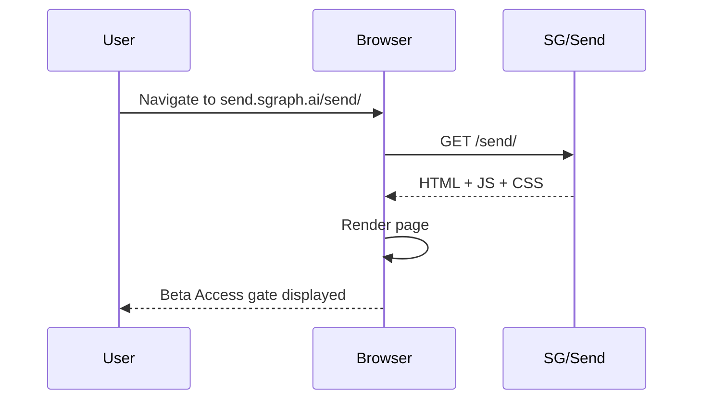
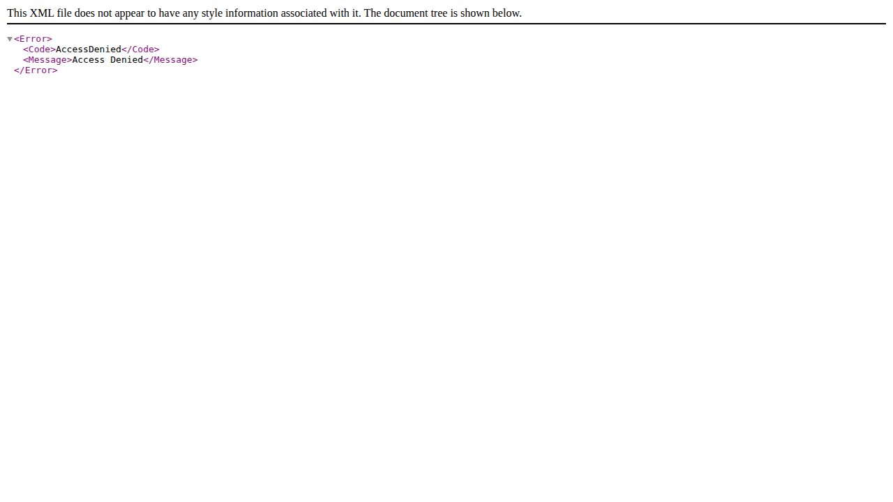

# Landing Page Loads

Verifies that the SG/Send application loads correctly and renders the initial Beta Access interface.

---

## Overview

This is the most fundamental test in the suite — if the landing page doesn't load, nothing else works. The test navigates to the SG/Send URL and confirms the page renders successfully.

| Property | Value |
|----------|-------|
| **Test file** | `tests/integration/user/test_landing_page.py::test_landing_page_loads` |
| **Target URL** | `https://send.sgraph.ai/send/` |
| **Wait strategy** | `domcontentloaded` + 3s settle |
| **Assertion** | Page has a title or valid URL |

## Why This Test Matters

The landing page is the **entry point** for every SG/Send user. This test catches:

- Deployment failures (server returns 500, blank page, or error)
- CDN/DNS issues (page unreachable)
- Critical JavaScript errors that prevent rendering
- Missing assets that break the initial layout

> If this test fails, all other tests are likely to fail too — it serves as the **canary** for the platform's availability.

## User Flow



## What the User Sees

When SG/Send loads correctly, the user is presented with the **Beta Access gate** — a clean interface asking for an access token before any file sharing features are available.

### Screenshot: Landing Page



**Key UI elements visible:**

- SG/Send branding and header
- "Beta Access" heading or access prompt
- Token input field (for entering the access code)
- Go / Submit button
- Clean, responsive layout at 1280x720 viewport

## What Gets Verified

The test makes a minimal assertion — the page has rendered (has a title or valid URL). This is intentionally lightweight because:

1. **The screenshot is the real verification** — visual evidence of what rendered
2. **Brittle selectors break tests** — asserting on specific text risks breaking on copy changes
3. **This test is a gate** — more specific assertions happen in downstream tests

## Technical Details

```
Viewport:   1280 x 720
Browser:    Chromium (headless)
Screenshot: CDP Page.captureScreenshot (bypasses Playwright font-wait)
Format:     PNG
```

The screenshot is captured via Chrome DevTools Protocol (CDP) directly rather than Playwright's built-in `page.screenshot()`. This bypasses Playwright's font-readiness detection, which can timeout in headless CI environments where system fonts differ from local development.

---

## Related Use Cases

| Use Case | Relationship |
|----------|-------------|
| [Access Gate Present](../landing_page_has_access_gate/landing_page_has_access_gate) | Checks the specific UI elements of the access gate |
| [Invalid Token Rejected](../invalid_token_rejected/invalid_token_rejected) | Tests what happens when a user enters a bad token |
